<div align="center">
  
  <h1>PromptX · AI-native Professional Capability Enhancement System</h1>
  <p>Provides specialized roles, memory management, and knowledge systems for AI applications through MCP protocol. One command to transform any AI client into a professional powerhouse.</p>

  <!-- Badges -->
  <p>
    <a href=" "></a>
    <a href="https://www.npmjs.com/package/dpml-prompt"></a>
    <a href="LICENSE"></a>
    <a href="https://github.com/Deepractice/PromptX/actions"></a>
  </p>
  
  <p>
    <a href="README.md">中文</a> | 
    <strong><a href="README_EN.md">English</a></strong> | 
    <a href="https://github.com/Deepractice/PromptX/issues">Issues</a>
  </p>
</div>

---

### ✨ **Understanding PromptX at a Glance**

What can PromptX do? Simply put, it gives your AI assistant a "brain" and "memory," and transforms you from user to creator.

- **🎭 Professional Role-Playing**: Provides expert roles across different domains, making AI responses more professional and in-depth.
- **🧠 Long-term Memory & Knowledge Base**: AI can remember key information and your preferences, providing coherent and personalized support in ongoing conversations and work.
- **✨ AI Role Creation Workshop**: **Create professional AI assistants in 2 minutes** - Transform your ideas into reality, evolving from user to creator.
- **🔌 Easy Integration**: With just one command, seamlessly enable these powerful features for dozens of mainstream AI applications (like Claude, Cursor).

<br/>

### 📸 **Usage Effects After Configuration**

#### **1. Discover and Activate Professional Roles**
*Use `promptx_hello` to discover available roles, then `promptx_action` to activate them, instantly transforming your AI into a domain expert.*


#### **2. Intelligent Memory**
*Use `promptx_remember` to save key information, and AI will proactively apply this knowledge in subsequent interactions.*


---

## ⚠️ **Project Status Notice**

PromptX is currently in the **early development stage**, and we are actively improving features and fixing issues. Before reaching the official stable version, you may encounter some usage issues or instability.

**We sincerely ask for your understanding and support!** 🙏

### 📞 **Need Help? Get Support!**

If you encounter any issues during usage, please contact us through:

- 🐛 **Submit Issue**: [GitHub Issues](https://github.com/Deepractice/PromptX/issues) - Describe the problem in detail, we'll respond promptly
- 💬 **Direct Contact**: Add developer WeChat `deepracticex` for immediate assistance
- 📧 **Email Contact**: Send email to `sean@deepracticex.com` for technical support
- 📱 **Tech Community**: Scan the QR code below to join our technical discussion group

Your feedback is invaluable to us and helps us improve product quality rapidly! ✨

---

## 🚀 **Quick Start - 30-Second Setup**

Open your configuration file and copy the `promptx` configuration code below. This is the simplest **zero-configuration mode**, where PromptX automatically handles everything for you.

```json
{
  "mcpServers": {
    "promptx": {
      // Use npx to run promptx service
      "command": "npx",
      // Startup parameters configuration
      "args": [
        "-y",                               // Auto-confirm
        "-f",                               // Force refresh cache
        "--registry",                       // Specify registry
        "https://registry.npmjs.org",       // Use official registry
        "dpml-prompt@beta",                 // Use stable beta version
        "mcp-server"                        // Start service
      ]
    }
  }
}
```

**🎯 It's that simple!** Save the file and restart your AI application, and PromptX is successfully activated.

> **💡 Tip:** The configuration specifically uses the official registry `registry.npmjs.org` to avoid installation issues caused by unofficial mirrors. If you find the installation slow, it's recommended to use a proxy tool for acceleration rather than switching to alternative mirrors.

### 🌐 **Advanced Configuration: HTTP Mode Support**

In addition to the local mode above, PromptX also supports **HTTP mode**, suitable for remote deployment or special network environments:

```bash
# Start HTTP mode server
npx -f -y dpml-prompt@beta mcp-server --transport http --port 3000
```

Then use in client configuration:
```json
{
  "mcpServers": {
    "promptx": {
      "url": "http://localhost:3000/mcp"
    }
  }
}
```

📖 **[Complete Installation & Configuration Guide](https://github.com/Deepractice/PromptX/wiki/PromptX-MCP-Install)** - Detailed configuration methods for various clients and troubleshooting


### New to MCP? [Watch MCP Tutorial on BiliBili](https://www.bilibili.com/video/BV1HFd6YhErb)

Currently, all AI clients that support the MCP protocol can use PromptX. This mainly includes: **Claude Desktop**, **Cursor**, **Windsurf**, **Cline**, **Zed**, **Continue**, and other mainstream AI programming tools, as well as more applications that are in the process of being integrated.

---

### ⚙️ **How It Works**

PromptX acts as a "professional capability middleware" between you and your AI application, communicating through the standard [MCP protocol](https://github.com/metacontroller/mcp).

```mermaid
graph TD
    subgraph "Your AI App (Claude,Cursor,etc.)"
        A[👨‍💻 User Interaction]
    end

    subgraph "PromptX MCP Server"
        C{PromptX Engine}
        D[🎭 Role Library]
        E[🧠 Memory & Knowledge]
    end

    A -- "Calls 'promptx_...' tools" --> B(MCP Protocol)
    B --> C
    C -- "Accesses" --> D
    C -- "Accesses" --> E

    subgraph "Enhanced Response"
        F[✨ Professional Output]
    end
    C --> F
```



When you call the `promptx_...` series of tools, your AI application sends the request via the MCP protocol to PromptX. The PromptX engine loads the appropriate professional roles, retrieves relevant memories, and then returns a professionally enhanced result to your AI application, which is ultimately presented to you.

---

**🎯 After configuration, your AI application will automatically gain 6 professional tools:**
- `promptx_init`: 🏗️ **System Initialization** - Automatically prepares the working environment.
- `promptx_hello`: 👋 **Role Discovery** - Browse all available expert roles.
- `promptx_action`: ⚡ **Role Activation** - Transform into an expert in a specific domain with one click. **(Includes Nuwa🎨 Role Creation Consultant)**
- `promptx_learn`: 📚 **Knowledge Learning** - Have AI learn specific knowledge or skills.
- `promptx_recall`: 🔍 **Memory Retrieval** - Look up historical information from the memory repository.
- `promptx_remember`: 💾 **Experience Saving** - Store important information in long-term memory.

📖 **[Complete MCP Integration Guide](docs/mcp-integration-guide.md)**

---

## 🎨 **Nuwa Creation Workshop - Let everyone become an AI role designer**

<div align="center">
  
</div>

#### **💫 From Idea to Reality, in Just 2 Minutes**

Have you ever thought: What if I could customize a professional AI assistant for a specific work scenario? **Nuwa makes this idea a reality.**

> *"Every idea deserves its own dedicated AI assistant. Technical barriers should not limit the flight of creativity."*

#### **🎯 Core Value Transformation**

- **🚀 Zero-Barrier Creation**: No need to learn complex technologies, just describe your needs in natural language.
- **⚡ Lightning-Fast Delivery**: From idea to a usable role, the whole process takes 2 minutes.
- **🎭 Professional Quality**: Automatically generates professional AI roles that comply with DPML standards.
- **🔄 Plug-and-Play**: Can be activated and used immediately after creation.
- **💝 Sense of Control**: A magnificent turn from a user to a creator.

#### **✨ Usage Scenarios Examples**

<div align="center">

| 🎯 **User Need** | ⚡ **Nuwa Generated** | 🚀 **Ready to Use** |
|---|---|---|
| 👩‍💼 "I need an AI assistant who understands Xiaohongshu marketing" | Xiaohongshu Marketing Expert Role | `Activate Xiaohongshu Marketing Expert` |
| 👨‍💻 "I want a Python asynchronous programming expert" | Python Asynchronous Programming Tutor Role | `Activate Python Asynchronous Programming Tutor` |
| 🎨 "Give me a UI/UX design consultant" | UI/UX Design Expert Role | `Activate UI/UX Design Expert` |
| 📊 "I need a data analyst assistant" | Data Analysis Expert Role | `Activate Data Analysis Expert` |

</div>

#### **🎪 Experience Nuwa's Creativity - 4 Steps to Create a Custom AI Assistant**

<div align="center">
  <div align="center">
  
  
  
  
</div>
</div>

```bash
# 1️⃣ Activate the Nuwa Role Creation Consultant
"I want Nuwa to help me create a role"

# 2️⃣ Describe your needs (natural language is fine)
"I need a professional assistant in [domain], mainly for [specific scenario]"

# 3️⃣ Wait 2 minutes for Nuwa to generate a professional role for you
# Nuwa will create the role file, register it with the system, and complete quality checks

# 4️⃣ Immediately activate and use your custom AI assistant
"Activate the role just created"
```

#### **🌟 Nuwa's Design Philosophy**

- **🎯 Boundless Creation**: Allows anyone with an idea to create an AI assistant, breaking down technical barriers.
- **⚡ Instant Gratification**: Meets the demand for immediacy in the digital age.
- **🧠 Guided Growth**: It's not just about using a tool, but also guiding users to understand the boundaries of AI capabilities.
- **🌱 Ecosystem Co-creation**: The roles created by each user can become a source of inspiration for others.

---

## 📋 **Practice Cases: Legacy Lands Library**

<div align="center">
  
</div>

#### 📖 Project Overview

**Project Name:** Legacy Lands Library  
**Project URL:** https://github.com/LegacyLands/legacy-lands-library  
**Project Description:** legacy-lands-library is a development toolkit library for modern Minecraft server plugin development. It aims to provide developers with a cross-platform, production-ready infrastructure.

#### 🏢 Organization Information

**Organization Name:** Legacy Lands  
**Official Website:** https://www.legacylands.cn/  
**Organization Description:** Legacy Lands is an innovative team focused on building large-scale Minecraft civilization simulation experiences. They participate in the open-source community, providing elegant, efficient, and reliable solutions for areas such as Minecraft server plugins.

> #### **💡 Core Developer's Experience**
> "The development experience with PromptX is truly different. Our team, using Claude Code combined with PromptX, had **one developer complete over 11,000 lines of high-quality Java code in just three days.**
>
> The value of this workflow is fully demonstrated in actual development. PromptX solves many pain points of using AI, ensuring consistent code style and quality standards at all times, which greatly reduces the learning curve for new members. Best practices that used to require repeated communication and reliance on documentation are now naturally integrated into every code generation."
> 
> ---
>
> "I experienced the role creation process as Nuwa, and I have a few deep impressions: Nuwa's biggest highlight is its ability to simplify complexity, standardizing the intricate process of AI role design. What was once a role definition requiring deep thought has been transformed into a concise process of 'requirement identification → pattern matching → rapid generation' through a design pattern library and templated workflow."
> 
> The true value of Nuwa is not in "creating" roles, but in "unleashing" the user's creativity—allowing anyone to quickly obtain a professional AI assistant. This ability to lower barriers and increase efficiency is exactly what is needed in the AI era. Nuwa let me experience the charm of "making professional things simple"!
>
> *-- 🎭 Nuwa Role Experience Feedback*

#### **📚 Related Resources**

- **AI Integration Standards & Practice Guide:** https://github.com/LegacyLands/legacy-lands-library/blob/main/AI_CODE_STANDARDS_ZHCN.md

---

## ⭐ **Star Growth Trend**

[](https://star-history.com/#Deepractice/PromptX&Date)

---

### **🤝 Contribution & Communication**

We welcome any form of contribution and feedback!

- 🌿 **[Branching Strategy](docs/BRANCHING.md)** - Branching and release process
- 🚀 **[Release Process](docs/RELEASE.md)** - Version management and release documentation

Scan the QR code to join our tech community group:


---

## 📄 **License**

[MIT License](LICENSE) - Making professional AI capabilities accessible.

---

**🚀 Get Started Now: Launch PromptX MCP Server and enhance your AI application with professional capabilities!**