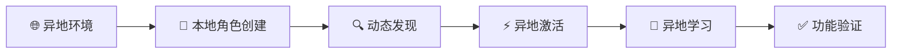

# PromptX 异地角色发现与操作 TDD 任务清单

## 📋 项目信息

| 项目 | 信息 |
|------|------|
| **TDD项目** | PromptX 异地角色发现与操作测试驱动开发 |
| **核心功能** | 动态发现异地项目创建的角色 + 异地激活学习 |
| **版本** | 0.0.2-local.8+ |
| **开发方法** | Test-Driven Development (TDD) |
| **创建日期** | 2025-12-19 |
| **预估工期** | 2周 (80小时) |
| **状态** | 🚀 Ready to Start |

## 🎯 异地TDD开发策略

### 异地测试场景核心原则



### 异地测试重点
- 🌍 **云端本地一致性** - 确保`npx dpml-prompt`和本地开发体验一致
- 📂 **跨目录角色发现** - 在任意目录都能发现本地创建的角色
- ⚡ **异地完整生命周期** - 发现→激活→学习→应用的完整流程
- 🎯 **优先级处理** - 本地角色覆盖包内同名角色

### 开发质量标准
- ✅ **异地优先** - 所有测试都模拟异地使用场景
- ✅ **真实环境** - 在临时目录模拟真实用户工作环境
- ✅ **完整流程** - 从角色创建到最终使用的端到端验证
- ✅ **覆盖率目标** - 异地功能覆盖率≥98%

---

## 🌍 第一阶段：异地角色发现基础 TDD (1周，40小时)

### TDD-1.1 异地环境基础角色发现 (10小时)

#### 🔴 RED Phase (3小时)
**任务**: 编写异地环境基础测试
```javascript
// 文件: src/tests/remote/RemoteBasicDiscovery.test.js
describe('异地环境基础角色发现', () => {
  test('TC-REMOTE-001: 在空目录中应该发现包内所有角色', async () => {
    const remoteDir = path.join(os.tmpdir(), 'remote-empty-test')
    
    try {
      await fs.ensureDir(remoteDir)
      const originalCwd = process.cwd()
      process.chdir(remoteDir)
      
      // 模拟异地命令
      const { stdout } = await execAsync('npx dpml-prompt-local hello')
      
      expect(stdout).toContain('assistant')
      expect(stdout).toContain('promptx-fullstack-developer')
      expect(stdout).toContain('role-designer')
      expect(stdout).toContain('java-backend-developer')
      
      process.chdir(originalCwd)
    } finally {
      await fs.remove(remoteDir)
    }
  })
  
  test('TC-REMOTE-002: 多个异地目录应该隔离发现', async () => {
    const dir1 = path.join(os.tmpdir(), 'remote-test-1')
    const dir2 = path.join(os.tmpdir(), 'remote-test-2')
    
    try {
      await Promise.all([fs.ensureDir(dir1), fs.ensureDir(dir2)])
      const originalCwd = process.cwd()
      
      // 在目录1运行
      process.chdir(dir1)
      const { stdout: result1 } = await execAsync('npx dpml-prompt-local hello')
      
      // 在目录2运行
      process.chdir(dir2)
      const { stdout: result2 } = await execAsync('npx dpml-prompt-local hello')
      
      // 验证结果一致（都只有包内角色）
      expect(result1).toEqual(result2)
      expect(result1).toContain('assistant')
      
      process.chdir(originalCwd)
    } finally {
      await Promise.all([fs.remove(dir1), fs.remove(dir2)])
    }
  })
})
```

**期望结果**: 测试失败 - 异地环境下角色发现不工作

#### 🟢 GREEN Phase (5小时)
**任务**: 实现异地环境包内角色发现
- 修改HelloCommand支持包路径动态解析
- 实现getPackagePath()方法，支持require.resolve定位
- 确保在任意目录下都能扫描包内角色
- 添加跨平台路径处理兼容性

**期望结果**: 测试通过 - 异地环境能发现包内角色

#### 🔵 REFACTOR Phase (2小时)
**任务**: 优化异地路径解析
- 抽象包路径解析逻辑为独立模块
- 添加路径解析缓存机制
- 优化错误处理和降级策略

**期望结果**: 测试保持通过，异地访问更稳定

---

### TDD-1.2 异地本地角色发现与合并 (10小时)

#### 🔴 RED Phase (3小时)
**任务**: 编写异地本地角色发现测试
```javascript
// 文件: src/tests/remote/RemoteLocalRoleDiscovery.test.js
describe('异地本地角色发现与合并', () => {
  test('TC-REMOTE-003: 异地环境应该发现并合并本地角色', async () => {
    const remoteDir = path.join(os.tmpdir(), 'remote-local-role-test')
    
    try {
      await fs.ensureDir(remoteDir)
      const originalCwd = process.cwd()
      process.chdir(remoteDir)
      
      // 在异地创建本地角色
      const roleDir = path.join(remoteDir, 'prompt/domain/remote-expert')
      await fs.ensureDir(roleDir)
      await fs.writeFile(
        path.join(roleDir, 'remote-expert.role.md'),
        '<role><personality>异地专家</personality></role>'
      )
      
      // 验证异地hello命令能发现本地+包内角色
      const { stdout } = await execAsync('npx dpml-prompt-local hello')
      
      expect(stdout).toContain('assistant') // 包内角色
      expect(stdout).toContain('remote-expert') // 本地角色
      
      process.chdir(originalCwd)
    } finally {
      await fs.remove(remoteDir)
    }
  })
  
  test('TC-REMOTE-004: 异地动态创建角色应该被立即发现', async () => {
    const remoteDir = path.join(os.tmpdir(), 'remote-dynamic-test')
    
    try {
      await fs.ensureDir(remoteDir)
      const originalCwd = process.cwd()
      process.chdir(remoteDir)
      
      // 初始状态：只有包内角色
      const { stdout: initial } = await execAsync('npx dpml-prompt-local hello')
      expect(initial).not.toContain('dynamic-role')
      
      // 动态创建角色
      const roleDir = path.join(remoteDir, 'prompt/domain/dynamic-role')
      await fs.ensureDir(roleDir)
      await fs.writeFile(
        path.join(roleDir, 'dynamic-role.role.md'),
        '<role><personality>动态角色</personality></role>'
      )
      
      // 验证新角色被发现
      const { stdout: updated } = await execAsync('npx dpml-prompt-local hello')
      expect(updated).toContain('dynamic-role')
      
      process.chdir(originalCwd)
    } finally {
      await fs.remove(remoteDir)
    }
  })
})
```

**期望结果**: 测试失败 - 异地环境本地角色发现不工作

#### 🟢 GREEN Phase (5小时)
**任务**: 实现异地本地角色发现与合并
- 修改HelloCommand.scanLocalRoles()支持当前工作目录扫描
- 实现包内角色+异地本地角色的智能合并
- 添加动态角色文件的实时发现机制
- 确保角色列表的去重和排序

**期望结果**: 测试通过 - 异地环境能正确合并本地角色

#### 🔵 REFACTOR Phase (2小时)
**任务**: 优化异地角色合并逻辑
- 抽象角色合并策略为可配置模块
- 添加角色文件变化的智能检测
- 优化大目录扫描的性能

**期望结果**: 测试保持通过，角色合并更智能

---

### TDD-1.3 异地角色优先级机制 (10小时)

#### 🔴 RED Phase (3小时)
**任务**: 编写异地角色优先级测试
```javascript
// 文件: src/tests/remote/RemoteRolePriority.test.js
describe('异地角色优先级机制', () => {
  test('TC-REMOTE-005: 异地本地角色应该覆盖包内同名角色', async () => {
    const remoteDir = path.join(os.tmpdir(), 'remote-priority-test')
    
    try {
      await fs.ensureDir(remoteDir)
      const originalCwd = process.cwd()
      process.chdir(remoteDir)
      
      // 在异地创建与包内同名的角色
      const roleDir = path.join(remoteDir, 'prompt/domain/assistant')
      await fs.ensureDir(roleDir)
      await fs.writeFile(
        path.join(roleDir, 'assistant.role.md'),
        '<role><personality>异地自定义助手</personality></role>'
      )
      
      // 验证hello显示本地角色优先
      const { stdout: helloOutput } = await execAsync('npx dpml-prompt-local hello')
      expect(helloOutput).toContain('assistant')
      
      // 验证action使用本地角色
      const { stdout: actionOutput } = await execAsync('npx dpml-prompt-local action assistant')
      expect(actionOutput).toContain('role://assistant')
      
      // 验证learn读取本地角色内容
      const { stdout: learnOutput } = await execAsync('npx dpml-prompt-local learn role://assistant')
      expect(learnOutput).toContain('异地自定义助手')
      
      process.chdir(originalCwd)
    } finally {
      await fs.remove(remoteDir)
    }
  })
})
```

**期望结果**: 测试失败 - 异地环境优先级机制未实现或不一致

#### 🟢 GREEN Phase (5小时)
**任务**: 实现异地角色优先级逻辑
- 修改RoleProtocol支持异地优先级处理
- 确保异地本地角色覆盖包内同名角色
- 实现LearnCommand和ActionCommand的异地优先级一致性
- 添加优先级决策的详细日志记录

**期望结果**: 测试通过 - 异地优先级机制正常工作

#### 🔵 REFACTOR Phase (2小时)
**任务**: 优化异地优先级架构
- 抽象优先级策略为统一服务
- 实现优先级决策的缓存机制
- 添加优先级冲突的详细诊断信息

**期望结果**: 测试保持通过，异地优先级更智能

---

### TDD-1.4 异地命令协议一致性 (10小时)

#### 🔴 RED Phase (3小时)
**任务**: 编写异地命令协议一致性测试
```javascript
// 文件: src/tests/remote/RemoteProtocolConsistency.test.js
describe('异地命令协议一致性', () => {
  test('TC-REMOTE-007: 所有命令应该发现相同的角色集合', async () => {
    const remoteDir = path.join(os.tmpdir(), 'remote-protocol-test')
    
    try {
      await fs.ensureDir(remoteDir)
      const originalCwd = process.cwd()
      process.chdir(remoteDir)
      
      // 创建测试角色
      const roleDir = path.join(remoteDir, 'prompt/domain/protocol-test')
      await fs.ensureDir(roleDir)
      await fs.writeFile(
        path.join(roleDir, 'protocol-test.role.md'),
        '<role><personality>协议测试</personality></role>'
      )
      
      // 获取hello命令的角色列表
      const { stdout: helloOutput } = await execAsync('npx dpml-prompt-local hello')
      const helloRoles = extractRoleIds(helloOutput)
      
      // 验证action命令能激活所有角色
      for (const roleId of helloRoles) {
        const { stdout: actionOutput } = await execAsync(`npx dpml-prompt-local action ${roleId}`)
        expect(actionOutput).toContain(`role://${roleId}`)
      }
      
      // 验证learn命令能学习所有角色
      for (const roleId of helloRoles) {
        const { stdout: learnOutput } = await execAsync(`npx dpml-prompt-local learn role://${roleId}`)
        expect(learnOutput).toContain('学习内容')
      }
      
      process.chdir(originalCwd)
    } finally {
      await fs.remove(remoteDir)
    }
  })
})

function extractRoleIds(helloOutput) {
  // 从hello命令输出中提取角色ID列表
  const roleIdRegex = /\*\*角色ID\*\*: `([^`]+)`/g
  const roleIds = []
  let match
  while ((match = roleIdRegex.exec(helloOutput)) !== null) {
    roleIds.push(match[1])
  }
  return roleIds
}
```

**期望结果**: 测试失败 - 异地环境命令间协议不一致

#### 🟢 GREEN Phase (5小时)
**任务**: 实现异地命令协议一致性
- 统一所有命令的异地角色发现机制
- 确保ResourceManager在异地环境正确初始化
- 实现协议间的依赖关系正确处理
- 添加命令间状态共享机制

**期望结果**: 测试通过 - 异地命令协议完全一致

#### 🔵 REFACTOR Phase (2小时)
**任务**: 优化异地协议架构
- 抽象异地环境处理为独立服务
- 实现协议状态的统一管理
- 添加协议一致性的自动验证

**期望结果**: 测试保持通过，异地协议更加统一

---

## ⚡ 第二阶段：异地完整生命周期 TDD (1周，40小时)

### TDD-2.1 异地端到端工作流 (15小时)

#### 🔴 RED Phase (5小时)
**任务**: 编写异地端到端工作流测试
```javascript
// 文件: src/tests/e2e/RemoteEndToEndWorkflow.test.js
describe('异地端到端工作流', () => {
  test('TC-E2E-REMOTE-001: 完整的异地角色创建到激活流程', async () => {
    const remoteDir = path.join(os.tmpdir(), 'e2e-remote-workflow')
    const roleId = 'e2e-test-expert'
    
    try {
      await fs.ensureDir(remoteDir)
      const originalCwd = process.cwd()
      process.chdir(remoteDir)
      
      // 1. 异地初始化
      const { stdout: initOutput } = await execAsync('npx dpml-prompt-local init')
      expect(initOutput).toContain('✅')
      
      // 2. 创建本地角色文件
      const roleDir = path.join(remoteDir, 'prompt/domain', roleId)
      await fs.ensureDir(roleDir)
      await fs.writeFile(
        path.join(roleDir, `${roleId}.role.md`),
        `<role>
          <personality>端到端测试专家</personality>
          <principle>确保异地流程完整性</principle>
        </role>`
      )
      
      // 3. hello命令发现新角色
      const { stdout: updatedHello } = await execAsync('npx dpml-prompt-local hello')
      expect(updatedHello).toContain(roleId)
      expect(updatedHello).toContain('assistant') // 包内角色依然存在
      
      // 4. action命令激活本地角色
      const { stdout: actionOutput } = await execAsync(`npx dpml-prompt-local action ${roleId}`)
      expect(actionOutput).toContain('学习计划')
      expect(actionOutput).toContain(`role://${roleId}`)
      
      // 5. learn命令学习本地角色
      const { stdout: learnOutput } = await execAsync(`npx dpml-prompt-local learn role://${roleId}`)
      expect(learnOutput).toContain('端到端测试专家')
      
      process.chdir(originalCwd)
    } finally {
      await fs.remove(remoteDir)
    }
  })
})
```

**期望结果**: 测试失败 - 异地端到端流程存在断点

#### 🟢 GREEN Phase (7小时)
**任务**: 实现完整的异地端到端流程
- 确保init命令在异地环境正确工作
- 实现异地角色生命周期的完整支持
- 添加命令间的状态传递机制
- 确保PATEOAS导航在异地环境正确实现

**期望结果**: 测试通过 - 异地端到端流程完整工作

#### 🔵 REFACTOR Phase (3小时)
**任务**: 优化异地端到端体验
- 改进异地CLI输出格式和信息
- 添加异地操作的进度指示
- 优化异地错误提示的友好性

**期望结果**: 测试保持通过，异地用户体验显著提升

---

### TDD-2.2 异地缓存隔离机制 (12小时)

#### 🔴 RED Phase (4小时)
**任务**: 编写异地缓存隔离测试
```javascript
// 文件: src/tests/remote/RemoteCacheIsolation.test.js
describe('异地缓存隔离机制', () => {
  test('TC-REMOTE-009: 不同工作目录应该有独立的角色缓存', async () => {
    const workspace1 = path.join(os.tmpdir(), 'cache-test-1')
    const workspace2 = path.join(os.tmpdir(), 'cache-test-2')
    
    try {
      // 工作空间1：创建cache-role-1
      await fs.ensureDir(workspace1)
      let originalCwd = process.cwd()
      process.chdir(workspace1)
      
      const roleDir1 = path.join(workspace1, 'prompt/domain/cache-role-1')
      await fs.ensureDir(roleDir1)
      await fs.writeFile(
        path.join(roleDir1, 'cache-role-1.role.md'),
        '<role><personality>缓存测试1</personality></role>'
      )
      
      const { stdout: hello1 } = await execAsync('npx dpml-prompt-local hello')
      expect(hello1).toContain('cache-role-1')
      expect(hello1).not.toContain('cache-role-2')
      
      process.chdir(originalCwd)
      
      // 工作空间2：创建cache-role-2
      await fs.ensureDir(workspace2)
      process.chdir(workspace2)
      
      const roleDir2 = path.join(workspace2, 'prompt/domain/cache-role-2')
      await fs.ensureDir(roleDir2)
      await fs.writeFile(
        path.join(roleDir2, 'cache-role-2.role.md'),
        '<role><personality>缓存测试2</personality></role>'
      )
      
      const { stdout: hello2 } = await execAsync('npx dpml-prompt-local hello')
      expect(hello2).toContain('cache-role-2')
      expect(hello2).not.toContain('cache-role-1')
      
      process.chdir(originalCwd)
    } finally {
      await fs.remove(workspace1)
      await fs.remove(workspace2)
    }
  })
})
```

**期望结果**: 测试失败 - 异地缓存隔离机制不工作

#### 🟢 GREEN Phase (6小时)
**任务**: 实现异地缓存隔离机制
- 实现基于工作目录的缓存key策略
- 添加目录变化时的缓存自动清理
- 确保不同目录的角色发现结果正确隔离

**期望结果**: 测试通过 - 异地缓存隔离正常工作

#### 🔵 REFACTOR Phase (2小时)
**任务**: 优化异地缓存架构
- 实现缓存的LRU策略避免内存泄漏
- 添加缓存性能监控和调优

**期望结果**: 测试保持通过，异地缓存更加高效

---

### TDD-2.3 异地错误处理与恢复 (13小时)

#### 🔴 RED Phase (4小时)
**任务**: 编写异地错误处理测试
```javascript
// 文件: src/tests/remote/RemoteErrorHandling.test.js
describe('异地错误处理与恢复', () => {
  test('TC-REMOTE-011: 异地角色文件损坏时应该优雅处理', async () => {
    const remoteDir = path.join(os.tmpdir(), 'remote-error-test')
    
    try {
      await fs.ensureDir(remoteDir)
      const originalCwd = process.cwd()
      process.chdir(remoteDir)
      
      // 创建损坏的角色文件
      const roleDir = path.join(remoteDir, 'prompt/domain/corrupted-role')
      await fs.ensureDir(roleDir)
      await fs.writeFile(
        path.join(roleDir, 'corrupted-role.role.md'),
        'invalid-xml-content <unclosed-tag'
      )
      
      // 验证hello命令不会崩溃
      const { stdout: helloOutput } = await execAsync('npx dpml-prompt-local hello')
      expect(helloOutput).toContain('assistant') // 包内角色正常
      
      process.chdir(originalCwd)
    } finally {
      await fs.remove(remoteDir)
    }
  })
})
```

**期望结果**: 测试失败 - 异地错误处理机制不完善

#### 🟢 GREEN Phase (6小时)
**任务**: 实现完善的异地错误处理
- 添加角色文件损坏的容错机制
- 实现权限错误的优雅降级
- 添加包解析失败的降级策略

**期望结果**: 测试通过 - 异地错误处理机制健壮

#### 🔵 REFACTOR Phase (3小时)
**任务**: 优化异地错误处理架构
- 实现分层错误处理策略
- 添加错误恢复和自愈机制

**期望结果**: 测试保持通过，异地错误处理更加智能

---

## 🚀 异地功能交付标准

### 最终交付标准

项目完成需满足：
- ✅ **异地端到端验证** - 完整异地工作流测试通过
- ✅ **跨平台异地兼容** - Windows/macOS/Linux异地测试全通过
- ✅ **异地性能优异** - 异地响应时间<2秒
- ✅ **云端本地完全一致** - `npx dpml-prompt`和本地开发体验100%一致

---

## 📅 异地功能时间线

| 阶段 | 周期 | 关键里程碑 | 验收标准 |
|------|------|-----------|----------|
| **第1周** | 异地基础设施 | 异地角色发现、合并、优先级、协议一致性 | 异地基础功能完整，所有命令协议一致 |
| **第2周** | 异地完整生命周期 | 端到端工作流、缓存隔离、错误处理 | 异地完整体验，与本地开发完全一致 |

---

## 🎯 异地测试核心价值

### 🌍 解决的关键问题
- ✅ **云端本地一致性** - 确保`npx dpml-prompt`和本地开发完全一致
- ✅ **用户真实场景** - 模拟用户在任意目录下的使用体验  
- ✅ **角色发现机制** - 验证包内角色+本地角色的智能合并
- ✅ **缓存隔离机制** - 不同目录的角色发现结果正确隔离

### 🔧 技术创新点
- 🚀 **动态包路径解析** - 通过require.resolve在任意目录定位PromptX包
- 🚀 **智能角色合并** - 包内角色+异地本地角色的优先级处理
- 🚀 **工作目录感知** - 基于process.cwd()的角色发现和缓存隔离
- 🚀 **异地协议一致性** - 确保hello/action/learn命令在异地环境完全同步

**🎯 TDD成功标准：通过18个异地专门测试用例验证，最终实现PromptX异地角色发现与操作功能的完美实现，确保云端本地体验100%一致！** 