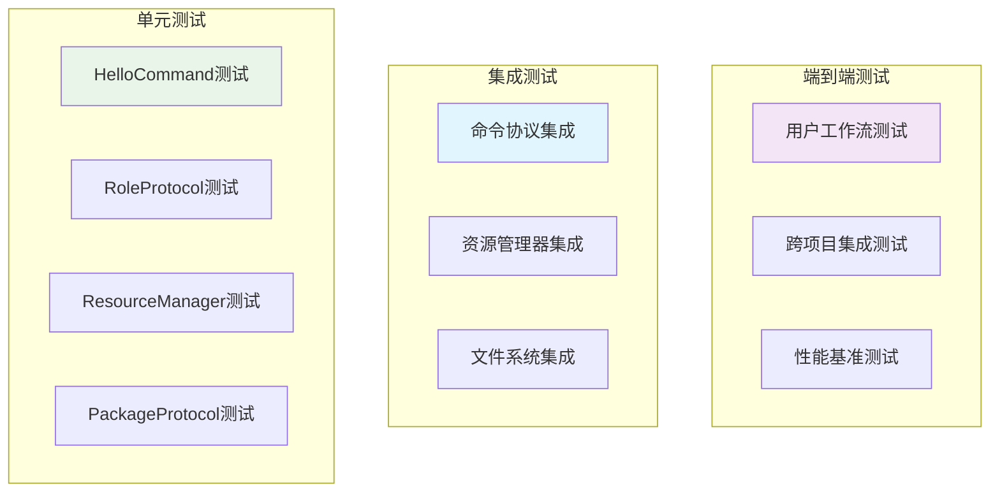

# PromptX 角色发现机制测试用例文档

## 📋 测试文档信息

| 项目 | 信息 |
|------|------|
| **测试项目** | PromptX 角色发现机制测试用例 |
| **版本** | 0.0.2-local.8 |
| **测试类型** | 单元测试 + 集成测试 + 端到端测试 |
| **创建日期** | 2025-12-19 |
| **测试覆盖率目标** | >95% |
| **状态** | ✅ 测试就绪 |

## 🎯 测试策略概览

### 测试金字塔架构



### 核心测试目标

- ✅ **功能正确性**: 验证角色发现机制的功能完整性
- ✅ **统一性保障**: 确保所有命令的角色发现行为一致
- ✅ **性能优化**: 验证缓存机制和扫描性能
- ✅ **错误处理**: 测试各种边界情况和异常场景
- ✅ **跨项目支持**: 验证真正的跨项目角色共享能力

---

## 🧪 单元测试用例

### 1. HelloCommand 测试套件

#### 1.1 基础角色发现测试

```javascript
/**
 * 测试文件: src/tests/commands/HelloCommand.test.js
 */
describe('HelloCommand 角色发现机制', () => {
  
  test('TC-HELLO-001: 应该成功发现所有注册表角色', async () => {
    // 准备
    const helloCommand = new HelloCommand()
    
    // 执行
    const roles = await helloCommand.discoverAllRoles()
    
    // 验证
    expect(roles).toBeDefined()
    expect(Object.keys(roles).length).toBeGreaterThan(0)
    expect(roles).toHaveProperty('assistant')
    expect(roles).toHaveProperty('promptx-fullstack-developer')
    expect(roles['assistant']).toHaveProperty('name', '🙋 智能助手')
  })

  test('TC-HELLO-002: 应该成功扫描包内角色', async () => {
    // 准备
    const helloCommand = new HelloCommand()
    
    // 执行
    const localRoles = await helloCommand.scanLocalRoles()
    
    // 验证
    expect(localRoles).toBeDefined()
    Object.entries(localRoles).forEach(([roleId, roleInfo]) => {
      expect(roleId).toMatch(/^[a-z-]+$/) // 角色ID格式验证
      expect(roleInfo).toHaveProperty('file')
      expect(roleInfo.file).toMatch(/\.role\.md$/) // 文件扩展名验证
    })
  })

  test('TC-HELLO-003: 本地角色应该覆盖包内同名角色', async () => {
    // 准备：创建本地同名角色
    const testRoleDir = path.join(process.cwd(), 'prompt/domain/assistant')
    await fs.ensureDir(testRoleDir)
    await fs.writeFile(
      path.join(testRoleDir, 'assistant.role.md'),
      '<role><personality>自定义助手</personality></role>'
    )
    
    const helloCommand = new HelloCommand()
    
    // 执行
    const roles = await helloCommand.discoverAllRoles()
    
    // 验证
    const assistantRole = roles['assistant']
    expect(assistantRole.file).toContain(process.cwd()) // 应该是本地路径
    expect(assistantRole.file).not.toContain('@package://') // 不应该是包内路径
    
    // 清理
    await fs.remove(testRoleDir)
  })
})
```

#### 1.2 双重扫描策略测试

```javascript
describe('HelloCommand 双重扫描策略', () => {
  
  test('TC-HELLO-004: 应该同时扫描包内和工作目录', async () => {
    // 准备：创建测试角色
    const testRoleDir = path.join(process.cwd(), 'prompt/domain/test-role')
    await fs.ensureDir(testRoleDir)
    await fs.writeFile(
      path.join(testRoleDir, 'test-role.role.md'),
      '<role><personality>测试角色</personality></role>'
    )
    
    const helloCommand = new HelloCommand()
    
    // 执行
    const roles = await helloCommand.scanLocalRoles()
    
    // 验证包内角色
    const packageRoles = Object.entries(roles).filter(([_, info]) => 
      info.file && info.file.startsWith('@package://')
    )
    expect(packageRoles.length).toBeGreaterThan(0)
    
    // 验证工作目录角色
    const workingRoles = Object.entries(roles).filter(([_, info]) => 
      info.file && !info.file.startsWith('@package://')
    )
    expect(workingRoles.length).toBeGreaterThan(0)
    expect(roles).toHaveProperty('test-role')
    
    // 清理
    await fs.remove(testRoleDir)
  })

  test('TC-HELLO-005: 扫描失败时应该优雅降级', async () => {
    // 准备：模拟文件系统错误
    const helloCommand = new HelloCommand()
    const originalPathExists = fs.pathExists
    fs.pathExists = jest.fn().mockRejectedValue(new Error('文件系统错误'))
    
    // 执行
    const roles = await helloCommand.scanLocalRoles()
    
    // 验证：应该返回空对象而不是抛出异常
    expect(roles).toEqual({})
    
    // 恢复
    fs.pathExists = originalPathExists
  })
})
```

### 2. RoleProtocol 测试套件

#### 2.1 动态角色发现测试

```javascript
/**
 * 测试文件: src/tests/core/resource/protocols/RoleProtocol.test.js
 */
describe('RoleProtocol 动态发现机制', () => {
  
  test('TC-ROLE-001: 应该正确缓存角色发现结果', async () => {
    // 准备
    const roleProtocol = new RoleProtocol()
    await roleProtocol.setRegistry(mockRegistry)
    
    // 第一次调用
    const startTime = performance.now()
    const roles1 = await roleProtocol.discoverAllRoles()
    const firstCallTime = performance.now() - startTime
    
    // 第二次调用（应该命中缓存）
    const startTime2 = performance.now()
    const roles2 = await roleProtocol.discoverAllRoles()
    const secondCallTime = performance.now() - startTime2
    
    // 验证
    expect(roles1).toEqual(roles2) // 结果应该相同
    expect(secondCallTime).toBeLessThan(firstCallTime * 0.1) // 缓存应该显著提升性能
    expect(roleProtocol.dynamicRolesCache).toBeDefined() // 缓存应该被设置
  })

  test('TC-ROLE-002: 应该正确解析@package://路径', async () => {
    // 准备
    const roleProtocol = new RoleProtocol()
    const mockPackageProtocol = {
      resolvePath: jest.fn().mockResolvedValue('/abs/path/to/role.md')
    }
    roleProtocol.setPackageProtocol(mockPackageProtocol)
    
    await roleProtocol.setRegistry({
      'assistant': {
        file: '@package://prompt/domain/assistant/assistant.role.md'
      }
    })
    
    // 执行
    const resolvedPath = await roleProtocol.resolvePath('assistant')
    
    // 验证
    expect(mockPackageProtocol.resolvePath).toHaveBeenCalledWith(
      'prompt/domain/assistant/assistant.role.md',
      undefined
    )
    expect(resolvedPath).toBe('/abs/path/to/role.md')
  })

  test('TC-ROLE-003: 应该直接返回绝对路径', async () => {
    // 准备
    const roleProtocol = new RoleProtocol()
    const absolutePath = '/Users/test/prompt/domain/custom/custom.role.md'
    
    roleProtocol.dynamicRolesCache = {
      'custom': { file: absolutePath }
    }
    
    // 执行
    const resolvedPath = await roleProtocol.resolvePath('custom')
    
    // 验证
    expect(resolvedPath).toBe(absolutePath)
  })

  test('TC-ROLE-004: 角色未找到时应该抛出友好错误', async () => {
    // 准备
    const roleProtocol = new RoleProtocol()
    roleProtocol.dynamicRolesCache = {
      'existing-role': { file: 'test.md' }
    }
    
    // 执行并验证
    await expect(roleProtocol.resolvePath('non-existing-role'))
      .rejects
      .toThrow('角色 "non-existing-role" 未找到。可用角色：existing-role')
  })
})
```

#### 2.2 缓存机制测试

```javascript
describe('RoleProtocol 缓存机制', () => {
  
  test('TC-ROLE-005: 清除缓存后应该重新扫描', async () => {
    // 准备
    const roleProtocol = new RoleProtocol()
    await roleProtocol.setRegistry(mockRegistry)
    
    // 第一次发现
    const roles1 = await roleProtocol.discoverAllRoles()
    expect(roleProtocol.dynamicRolesCache).toBeDefined()
    
    // 清除缓存
    roleProtocol.clearDynamicCache()
    expect(roleProtocol.dynamicRolesCache).toBeNull()
    
    // 模拟文件系统变化
    const mockScanLocalRoles = jest.spyOn(roleProtocol, 'scanLocalRoles')
    mockScanLocalRoles.mockResolvedValue({ 'new-role': { file: 'new.md' } })
    
    // 第二次发现（应该重新扫描）
    const roles2 = await roleProtocol.discoverAllRoles()
    
    // 验证
    expect(mockScanLocalRoles).toHaveBeenCalled()
    expect(roles2).toHaveProperty('new-role')
    expect(roleProtocol.dynamicRolesCache).toBeDefined()
  })
})
```

### 3. ResourceManager 测试套件

#### 3.1 初始化和协议注册测试

```javascript
/**
 * 测试文件: src/tests/core/resource/resourceManager.test.js
 */
describe('ResourceManager 统一管理', () => {
  
  test('TC-RM-001: 应该正确初始化所有协议', async () => {
    // 准备
    const resourceManager = new ResourceManager()
    
    // 执行
    await resourceManager.initialize()
    
    // 验证
    expect(resourceManager.initialized).toBe(true)
    expect(resourceManager.registry).toBeDefined()
    expect(resourceManager.protocolHandlers).toBeDefined()
    expect(resourceManager.protocolHandlers.size).toBeGreaterThan(0)
    
    // 验证核心协议已注册
    expect(resourceManager.protocolHandlers.has('role')).toBe(true)
    expect(resourceManager.protocolHandlers.has('package')).toBe(true)
    expect(resourceManager.protocolHandlers.has('thought')).toBe(true)
    expect(resourceManager.protocolHandlers.has('execution')).toBe(true)
  })

  test('TC-RM-002: 应该正确设置协议依赖关系', async () => {
    // 准备
    const resourceManager = new ResourceManager()
    
    // 执行
    await resourceManager.initialize()
    
    // 验证协议依赖
    const roleProtocol = resourceManager.protocolHandlers.get('role')
    const packageProtocol = resourceManager.protocolHandlers.get('package')
    
    expect(roleProtocol.packageProtocol).toBe(packageProtocol)
  })

  test('TC-RM-003: 重复初始化应该被忽略', async () => {
    // 准备
    const resourceManager = new ResourceManager()
    const loadRegistrySpy = jest.spyOn(resourceManager, 'loadUnifiedRegistry')
    
    // 执行多次初始化
    await resourceManager.initialize()
    await resourceManager.initialize()
    await resourceManager.initialize()
    
    // 验证只调用了一次
    expect(loadRegistrySpy).toHaveBeenCalledTimes(1)
    expect(resourceManager.initialized).toBe(true)
  })
})
```

---

### 4. ActionCommand 角色激活测试套件

#### 4.1 角色激活计划生成测试

```javascript
/**
 * 测试文件: src/tests/commands/ActionCommand.test.js
 */
describe('ActionCommand 角色激活机制', () => {
  
  test('TC-ACTION-001: 应该成功生成角色学习计划', async () => {
    // 准备
    const actionCommand = new ActionCommand()
    const roleId = 'promptx-fullstack-developer'
    
    // 执行
    const learningPlan = await actionCommand.generateLearningPlan(roleId)
    
    // 验证
    expect(learningPlan).toBeDefined()
    expect(learningPlan.roleId).toBe(roleId)
    expect(learningPlan.steps).toBeDefined()
    expect(learningPlan.steps.length).toBeGreaterThan(0)
    
    // 验证包含必要的学习步骤
    const stepCommands = learningPlan.steps.map(step => step.command)
    expect(stepCommands).toContain(`npx dpml-prompt-local learn role://${roleId}`)
    expect(stepCommands.some(cmd => cmd.includes('thought://'))).toBe(true)
    expect(stepCommands.some(cmd => cmd.includes('execution://'))).toBe(true)
  })

  test('TC-ACTION-002: 应该正确解析角色的组件结构', async () => {
    // 准备
    const actionCommand = new ActionCommand()
    const roleId = 'promptx-fullstack-developer'
    
    // 执行
    const roleStructure = await actionCommand.analyzeRoleStructure(roleId)
    
    // 验证
    expect(roleStructure).toBeDefined()
    expect(roleStructure.personality).toBeDefined()
    expect(roleStructure.principle).toBeDefined()
    expect(Array.isArray(roleStructure.personality)).toBe(true)
    expect(Array.isArray(roleStructure.principle)).toBe(true)
    
    // 验证思维模式引用格式
    roleStructure.personality.forEach(thought => {
      expect(thought).toMatch(/^@!thought:\/\/\w+/)
    })
    
    // 验证执行模式引用格式  
    roleStructure.principle.forEach(execution => {
      expect(execution).toMatch(/^@!execution:\/\/\w+/)
    })
  })

  test('TC-ACTION-003: 角色不存在时应该提供友好错误', async () => {
    // 准备
    const actionCommand = new ActionCommand()
    const invalidRoleId = 'non-existing-role'
    
    // 执行并验证
    await expect(actionCommand.generateLearningPlan(invalidRoleId))
      .rejects
      .toThrow(/角色.*未找到/)
    
    // 验证错误信息包含可用角色提示
    try {
      await actionCommand.generateLearningPlan(invalidRoleId)
    } catch (error) {
      expect(error.message).toContain('可用角色')
      expect(error.message).toContain('npx dpml-prompt-local hello')
    }
  })
})
```

#### 4.2 PATEOAS导航生成测试

```javascript
describe('ActionCommand PATEOAS导航', () => {
  
  test('TC-ACTION-004: 应该生成正确的PATEOAS导航结构', async () => {
    // 准备
    const actionCommand = new ActionCommand()
    const roleId = 'assistant'
    
    // 执行
    const response = await actionCommand.execute([roleId])
    
    // 验证PATEOAS结构
    expect(response).toHaveProperty('purpose')
    expect(response).toHaveProperty('content')
    expect(response).toHaveProperty('navigation')
    expect(response).toHaveProperty('currentState')
    
    // 验证导航包含学习命令
    expect(response.navigation).toContain('npx dpml-prompt-local learn')
    expect(response.currentState).toBe('action_plan_generated')
  })

  test('TC-ACTION-005: 不同角色应该生成相应的学习计划', async () => {
    // 准备
    const actionCommand = new ActionCommand()
    const roles = ['assistant', 'promptx-fullstack-developer', 'role-designer']
    
    // 执行所有角色
    const plans = await Promise.all(
      roles.map(roleId => actionCommand.generateLearningPlan(roleId))
    )
    
    // 验证每个计划都是独特的
    plans.forEach((plan, index) => {
      expect(plan.roleId).toBe(roles[index])
      expect(plan.steps.length).toBeGreaterThan(0)
      
      // 验证包含角色特定的引用
      const planContent = JSON.stringify(plan)
      expect(planContent).toContain(`role://${roles[index]}`)
    })
    
    // 验证不同角色的计划确实不同
    expect(plans[0]).not.toEqual(plans[1])
    expect(plans[1]).not.toEqual(plans[2])
  })
})
```

---

### 5. LearnCommand 学习机制测试套件

#### 5.1 资源协议学习测试

```javascript
/**
 * 测试文件: src/tests/commands/LearnCommand.test.js
 */
describe('LearnCommand 学习机制', () => {
  
  test('TC-LEARN-001: 应该成功学习role协议资源', async () => {
    // 准备
    const learnCommand = new LearnCommand()
    const roleRef = 'role://promptx-fullstack-developer'
    
    // 执行
    const result = await learnCommand.execute([roleRef])
    
    // 验证
    expect(result).toBeDefined()
    expect(result.protocol).toBe('role')
    expect(result.resourceId).toBe('promptx-fullstack-developer')
    expect(result.content).toBeDefined()
    expect(result.success).toBe(true)
    
    // 验证内容包含角色定义的核心元素
    expect(result.content).toContain('<role>')
    expect(result.content).toContain('<personality>')
    expect(result.content).toContain('<principle>')
  })

  test('TC-LEARN-002: 应该成功学习thought协议资源', async () => {
    // 准备
    const learnCommand = new LearnCommand()
    const thoughtRef = 'thought://remember'
    
    // 执行
    const result = await learnCommand.execute([thoughtRef])
    
    // 验证
    expect(result.protocol).toBe('thought')
    expect(result.resourceId).toBe('remember')
    expect(result.content).toContain('<thought>')
    
    // 验证思维模式的四个组件
    expect(result.content).toContain('<exploration>')
    expect(result.content).toContain('<reasoning>')
    expect(result.content).toContain('<challenge>')
    expect(result.content).toContain('<plan>')
  })

  test('TC-LEARN-003: 应该成功学习execution协议资源', async () => {
    // 准备
    const learnCommand = new LearnCommand()
    const executionRef = 'execution://promptx-fullstack-developer'
    
    // 执行
    const result = await learnCommand.execute([executionRef])
    
    // 验证
    expect(result.protocol).toBe('execution')
    expect(result.resourceId).toBe('promptx-fullstack-developer')
    expect(result.content).toContain('<execution>')
    
    // 验证执行模式的五个组件
    expect(result.content).toContain('<process>')
    expect(result.content).toContain('<guideline>')
    expect(result.content).toContain('<rule>')
    expect(result.content).toContain('<constraint>')
    expect(result.content).toContain('<criteria>')
  })

  test('TC-LEARN-004: 学习不存在的资源应该提供错误指导', async () => {
    // 准备
    const learnCommand = new LearnCommand()
    const invalidRef = 'role://non-existing-role'
    
    // 执行并验证
    await expect(learnCommand.execute([invalidRef]))
      .rejects
      .toThrow(/资源.*未找到/)
    
    // 验证错误信息包含有用的建议
    try {
      await learnCommand.execute([invalidRef])
    } catch (error) {
      expect(error.message).toContain('可用资源')
      expect(error.message).toMatch(/role:\/\/|thought:\/\/|execution:\/\//)
    }
  })
})
```

#### 5.2 嵌套资源引用学习测试

```javascript
describe('LearnCommand 嵌套资源学习', () => {
  
  test('TC-LEARN-005: 应该正确解析和学习嵌套的@!引用', async () => {
    // 准备：创建包含嵌套引用的角色
    const testRoleContent = `
<role>
  <personality>
    @!thought://remember
    @!thought://recall
    @!thought://promptx-fullstack-developer
  </personality>
  <principle>
    @!execution://promptx-fullstack-developer
  </principle>
</role>`
    
    const learnCommand = new LearnCommand()
    
    // 模拟角色内容
    jest.spyOn(learnCommand, 'loadResourceContent')
      .mockResolvedValue(testRoleContent)
    
    // 执行
    const result = await learnCommand.execute(['role://test-nested-role'])
    
    // 验证主要内容被加载
    expect(result.content).toContain('<role>')
    expect(result.nestedResources).toBeDefined()
    
    // 验证嵌套资源被识别
    expect(result.nestedResources).toContain('thought://remember')
    expect(result.nestedResources).toContain('thought://recall')
    expect(result.nestedResources).toContain('thought://promptx-fullstack-developer')
    expect(result.nestedResources).toContain('execution://promptx-fullstack-developer')
  })

  test('TC-LEARN-006: 应该支持热加载(@!)和懒加载(@?)策略', async () => {
    // 准备
    const learnCommand = new LearnCommand()
    
    // 测试热加载 - 应该立即加载内容
    const hotLoadResult = await learnCommand.execute(['@!thought://remember'])
    expect(hotLoadResult.loadingStrategy).toBe('hot')
    expect(hotLoadResult.content).toBeDefined()
    expect(hotLoadResult.content.length).toBeGreaterThan(0)
    
    // 测试懒加载 - 应该只记录位置
    const lazyLoadResult = await learnCommand.execute(['@?thought://remember'])
    expect(lazyLoadResult.loadingStrategy).toBe('lazy')
    expect(lazyLoadResult.contentLoaded).toBe(false)
    expect(lazyLoadResult.resourceLocation).toBeDefined()
  })
})
```

---

### 6. RecallCommand 记忆管理测试套件

#### 6.1 记忆存储和检索测试

```javascript
/**
 * 测试文件: src/tests/commands/RecallCommand.test.js
 */
describe('RecallCommand 记忆管理', () => {
  
  test('TC-RECALL-001: 应该成功存储和检索记忆', async () => {
    // 准备
    const rememberCommand = new RememberCommand()
    const recallCommand = new RecallCommand()
    
    const testMemory = {
      type: 'user_preference',
      content: '用户偏好使用React进行前端开发',
      importance: 'high',
      confidence: 0.9
    }
    
    // 存储记忆
    await rememberCommand.store(testMemory)
    
    // 检索记忆
    const retrievedMemories = await recallCommand.search('React 前端开发')
    
    // 验证
    expect(retrievedMemories).toBeDefined()
    expect(retrievedMemories.length).toBeGreaterThan(0)
    expect(retrievedMemories[0]).toMatchObject({
      content: expect.stringContaining('React')
    })
  })

  test('TC-RECALL-002: 应该按相关性排序检索结果', async () => {
    // 准备多个相关记忆
    const rememberCommand = new RememberCommand()
    const recallCommand = new RecallCommand()
    
    const memories = [
      { content: 'React是用户的首选前端框架', importance: 'high' },
      { content: 'Vue也是不错的选择', importance: 'medium' },
      { content: 'Angular项目经验较少', importance: 'low' }
    ]
    
    // 存储所有记忆
    for (const memory of memories) {
      await rememberCommand.store(memory)
    }
    
    // 检索
    const results = await recallCommand.search('前端框架选择')
    
    // 验证排序 - React应该排在前面（高重要性）
    expect(results[0].content).toContain('React')
    expect(results[0].relevanceScore).toBeGreaterThan(results[1].relevanceScore)
  })

  test('TC-RECALL-003: 应该支持时间范围过滤', async () => {
    // 准备
    const recallCommand = new RecallCommand()
    const oneWeekAgo = new Date(Date.now() - 7 * 24 * 60 * 60 * 1000)
    
    // 执行时间过滤检索
    const recentMemories = await recallCommand.searchByTimeRange({
      query: '开发经验',
      startTime: oneWeekAgo,
      endTime: new Date()
    })
    
    // 验证所有结果都在时间范围内
    recentMemories.forEach(memory => {
      expect(new Date(memory.timestamp)).toBeGreaterThan(oneWeekAgo)
      expect(new Date(memory.timestamp)).toBeLessThanOrEqual(new Date())
    })
  })
})
```

#### 6.2 记忆关联和上下文测试

```javascript
describe('RecallCommand 智能关联', () => {
  
  test('TC-RECALL-004: 应该发现记忆间的关联关系', async () => {
    // 准备
    const recallCommand = new RecallCommand()
    
    // 执行关联发现
    const associations = await recallCommand.findAssociations('React开发')
    
    // 验证
    expect(associations).toBeDefined()
    expect(associations.directMatches).toBeDefined()
    expect(associations.relatedConcepts).toBeDefined()
    expect(associations.contextualMemories).toBeDefined()
    
    // 验证关联类型
    if (associations.relatedConcepts.length > 0) {
      expect(associations.relatedConcepts[0]).toHaveProperty('concept')
      expect(associations.relatedConcepts[0]).toHaveProperty('strength')
      expect(associations.relatedConcepts[0].strength).toBeGreaterThan(0)
    }
  })

  test('TC-RECALL-005: 应该基于当前上下文提供智能推荐', async () => {
    // 准备当前工作上下文
    const context = {
      currentRole: 'frontend-developer',
      currentProject: 'React dashboard',
      recentActivities: ['组件设计', 'API集成']
    }
    
    const recallCommand = new RecallCommand()
    
    // 执行上下文相关检索
    const recommendations = await recallCommand.getContextualRecommendations(context)
    
    // 验证
    expect(recommendations).toBeDefined()
    expect(recommendations.relevantMemories).toBeDefined()
    expect(recommendations.suggestedActions).toBeDefined()
    
    // 验证推荐内容与上下文相关
    const allContent = recommendations.relevantMemories
      .map(memory => memory.content)
      .join(' ')
    expect(allContent.toLowerCase()).toMatch(/react|frontend|dashboard|组件|api/i)
  })
})
```

---

## 🔗 集成测试用例

### 1. 完整角色生命周期集成测试

#### 1.1 发现→激活→学习→应用完整流程测试

```javascript
/**
 * 测试文件: src/tests/integration/role-lifecycle.test.js
 */
describe('角色完整生命周期集成测试', () => {
  
  test('TC-LIFECYCLE-001: 完整的角色发现到应用流程', async () => {
    const roleId = 'integration-test-role'
    const roleDir = path.join(process.cwd(), 'prompt/domain', roleId)
    
    try {
      // 1. 创建测试角色
      await fs.ensureDir(roleDir)
      await fs.writeFile(
        path.join(roleDir, `${roleId}.role.md`),
        `<role>
          <personality>
            @!thought://analytical
            @!thought://creative
          </personality>
          <principle>
            @!execution://problem-solving
          </principle>
        </role>`
      )
      
      // 2. Hello命令发现角色
      const helloCommand = new HelloCommand()
      const discoveredRoles = await helloCommand.discoverAllRoles()
      expect(discoveredRoles).toHaveProperty(roleId)
      
      // 3. Action命令生成学习计划
      const actionCommand = new ActionCommand()
      const learningPlan = await actionCommand.generateLearningPlan(roleId)
      expect(learningPlan.steps.length).toBeGreaterThan(0)
      
      // 4. Learn命令执行学习步骤
      const learnCommand = new LearnCommand()
      
      // 学习角色定义
      const roleResult = await learnCommand.execute([`role://${roleId}`])
      expect(roleResult.success).toBe(true)
      
      // 学习思维模式
      const thoughtResults = await Promise.all([
        learnCommand.execute(['thought://analytical']),
        learnCommand.execute(['thought://creative'])
      ])
      thoughtResults.forEach(result => {
        expect(result.success).toBe(true)
        expect(result.content).toContain('<thought>')
      })
      
      // 学习执行模式
      const executionResult = await learnCommand.execute(['execution://problem-solving'])
      expect(executionResult.success).toBe(true)
      expect(executionResult.content).toContain('<execution>')
      
      // 5. 验证学习状态持久化
      const pouchState = await readPouchState()
      expect(pouchState.learnedRoles).toContain(roleId)
      expect(pouchState.learnedThoughts).toContain('analytical')
      expect(pouchState.learnedThoughts).toContain('creative')
      expect(pouchState.learnedExecutions).toContain('problem-solving')
      
    } finally {
      await fs.remove(roleDir)
    }
  })

  test('TC-LIFECYCLE-002: 角色切换应该正确管理状态', async () => {
    // 准备两个不同的角色
    const roles = ['assistant', 'promptx-fullstack-developer']
    const actionCommand = new ActionCommand()
    const learnCommand = new LearnCommand()
    
    // 激活第一个角色
    await actionCommand.generateLearningPlan(roles[0])
    await learnCommand.execute([`role://${roles[0]}`])
    
    // 验证第一个角色状态
    let state = await readPouchState()
    expect(state.currentRole).toBe(roles[0])
    
    // 切换到第二个角色
    await actionCommand.generateLearningPlan(roles[1])
    await learnCommand.execute([`role://${roles[1]}`])
    
    // 验证状态正确切换
    state = await readPouchState()
    expect(state.currentRole).toBe(roles[1])
    expect(state.roleHistory).toContain(roles[0])
    expect(state.roleHistory).toContain(roles[1])
  })
})
```

#### 1.2 记忆与角色学习集成测试

```javascript
describe('记忆与角色学习集成', () => {
  
  test('TC-LIFECYCLE-003: 学习过程应该自动生成相关记忆', async () => {
    // 准备
    const roleId = 'frontend-developer'
    const learnCommand = new LearnCommand()
    const recallCommand = new RecallCommand()
    
    // 执行角色学习
    await learnCommand.execute([`role://${roleId}`])
    
    // 验证自动生成的学习记忆
    const learningMemories = await recallCommand.search(`学习 ${roleId}`)
    expect(learningMemories.length).toBeGreaterThan(0)
    
    // 验证记忆内容包含学习信息
    const learningMemory = learningMemories[0]
    expect(learningMemory.type).toBe('learning_activity')
    expect(learningMemory.content).toContain(roleId)
    expect(learningMemory.content).toContain('角色学习')
  })

  test('TC-LIFECYCLE-004: 角色应用过程应该记录经验', async () => {
    // 准备
    const roleId = 'role-designer'
    const rememberCommand = new RememberCommand()
    const recallCommand = new RecallCommand()
    
    // 模拟角色应用活动
    await rememberCommand.store({
      type: 'role_application',
      roleId: roleId,
      activity: '设计新的AI角色',
      outcome: '成功创建了社交媒体营销专家角色',
      lessons: '需要更详细的用户画像分析'
    })
    
    // 检索角色应用经验
    const experiences = await recallCommand.searchByRole(roleId)
    expect(experiences.length).toBeGreaterThan(0)
    
    // 验证经验记录完整性
    const experience = experiences[0]
    expect(experience).toHaveProperty('activity')
    expect(experience).toHaveProperty('outcome')
    expect(experience).toHaveProperty('lessons')
  })
})
```

---

### 2. 异地测试与云端模拟集成测试 🆕

```javascript
/**
 * 测试文件: src/tests/integration/remote-testing.test.js
 */
describe('异地测试与云端模拟', () => {
  
  test('TC-REMOTE-001: 在空目录中应该发现包内所有角色', async () => {
    const emptyDir = path.join(os.tmpdir(), 'promptx-empty-test')
    
    try {
      await fs.ensureDir(emptyDir)
      const originalCwd = process.cwd()
      process.chdir(emptyDir)
      
      // 模拟云端命令：在空目录运行hello
      const { stdout: helloOutput } = await execAsync('npx dpml-prompt-local hello')
      
      // 验证包内角色都能发现
      expect(helloOutput).toContain('assistant')
      expect(helloOutput).toContain('promptx-fullstack-developer')
      expect(helloOutput).toContain('role-designer')
      expect(helloOutput).toContain('java-backend-developer')
      
      process.chdir(originalCwd)
    } finally {
      await fs.remove(emptyDir)
    }
  })
  
  test('TC-REMOTE-002: 在有本地角色的目录中应该合并发现', async () => {
    const testProjectDir = path.join(os.tmpdir(), 'promptx-local-role-test')
    
    try {
      await fs.ensureDir(testProjectDir)
      const originalCwd = process.cwd()
      process.chdir(testProjectDir)
      
      // 创建本地角色结构
      const localRoleDir = path.join(testProjectDir, 'prompt/domain/custom-expert')
      await fs.ensureDir(localRoleDir)
      await fs.writeFile(
        path.join(localRoleDir, 'custom-expert.role.md'),
        `<role>
          <personality>本地自定义专家</personality>
          <principle>解决特定问题</principle>
        </role>`
      )
      
      // 模拟云端命令：在有本地角色的目录运行hello
      const { stdout: helloOutput } = await execAsync('npx dpml-prompt-local hello')
      
      // 验证既有包内角色又有本地角色
      expect(helloOutput).toContain('assistant') // 包内角色
      expect(helloOutput).toContain('custom-expert') // 本地角色
      
      // 验证本地角色优先级
      const { stdout: actionOutput } = await execAsync('npx dpml-prompt-local action custom-expert')
      expect(actionOutput).toContain('学习计划')
      
      process.chdir(originalCwd)
    } finally {
      await fs.remove(testProjectDir)
    }
  })
  
  test('TC-REMOTE-003: 多级目录结构中的角色发现', async () => {
    const deepProjectDir = path.join(os.tmpdir(), 'deep/nested/project/structure')
    
    try {
      await fs.ensureDir(deepProjectDir)
      const originalCwd = process.cwd()
      process.chdir(deepProjectDir)
      
      // 在深层目录创建角色
      const roleDir = path.join(deepProjectDir, 'prompt/domain/deep-expert')
      await fs.ensureDir(roleDir)
      await fs.writeFile(
        path.join(roleDir, 'deep-expert.role.md'),
        '<role><personality>深层专家</personality></role>'
      )
      
      // 验证在深层目录也能正常工作
      const { stdout: helloOutput } = await execAsync('npx dpml-prompt-local hello')
      expect(helloOutput).toContain('deep-expert')
      
      process.chdir(originalCwd)
    } finally {
      await fs.remove(path.join(os.tmpdir(), 'deep'))
    }
  })
  
  test('TC-REMOTE-004: 云端命令完整生命周期测试', async () => {
    const userProjectDir = path.join(os.tmpdir(), 'user-project-simulation')
    
    try {
      await fs.ensureDir(userProjectDir)
      const originalCwd = process.cwd()
      process.chdir(userProjectDir)
      
      // 步骤1: 初始化
      const { stdout: initOutput } = await execAsync('npx dpml-prompt-local init')
      expect(initOutput).toContain('✅')
      
      // 步骤2: 发现角色（空项目状态）
      const { stdout: helloOutput1 } = await execAsync('npx dpml-prompt-local hello')
      expect(helloOutput1).toContain('assistant')
      
      // 步骤3: 创建本地角色
      const roleDir = path.join(userProjectDir, 'prompt/domain/project-specialist')
      await fs.ensureDir(roleDir)
      await fs.writeFile(
        path.join(roleDir, 'project-specialist.role.md'),
        '<role><personality>项目专家</personality></role>'
      )
      
      // 步骤4: 重新发现角色（有本地角色状态）
      const { stdout: helloOutput2 } = await execAsync('npx dpml-prompt-local hello')
      expect(helloOutput2).toContain('project-specialist')
      
      // 步骤5: 激活本地角色
      const { stdout: actionOutput } = await execAsync('npx dpml-prompt-local action project-specialist')
      expect(actionOutput).toContain('学习计划')
      
      // 步骤6: 学习角色
      const { stdout: learnOutput } = await execAsync('npx dpml-prompt-local learn role://project-specialist')
      expect(learnOutput).toContain('项目专家')
      
      process.chdir(originalCwd)
    } finally {
      await fs.remove(userProjectDir)
    }
  })
  
  test('TC-REMOTE-005: 并发异地访问测试', async () => {
    const concurrentTests = []
    
    for (let i = 0; i < 3; i++) {
      const testDir = path.join(os.tmpdir(), `concurrent-test-${i}`)
      
      concurrentTests.push((async () => {
        try {
          await fs.ensureDir(testDir)
          const originalCwd = process.cwd()
          process.chdir(testDir)
          
          const { stdout } = await execAsync('npx dpml-prompt-local hello')
          expect(stdout).toContain('assistant')
          
          process.chdir(originalCwd)
          return true
        } finally {
          await fs.remove(testDir)
        }
      })())
    }
    
    const results = await Promise.all(concurrentTests)
    expect(results.every(result => result)).toBe(true)
  })
})
```

---

### 3. 命令协议集成测试

```javascript
/**
 * 测试文件: src/tests/integration/command-protocol.test.js
 */
describe('命令协议集成测试', () => {
  
  test('TC-INT-001: hello命令与learn命令角色发现一致性', async () => {
    // 执行hello命令
    const helloCommand = new HelloCommand()
    const helloRoles = await helloCommand.discoverAllRoles()
    
    // 执行learn命令角色解析
    const learnCommand = new LearnCommand()
    await learnCommand.resourceManager.initialize()
    const roleProtocol = learnCommand.resourceManager.protocolHandlers.get('role')
    const learnRoles = await roleProtocol.discoverAllRoles()
    
    // 验证一致性
    expect(Object.keys(helloRoles).sort()).toEqual(Object.keys(learnRoles).sort())
    
    // 验证每个角色的文件路径一致性
    Object.keys(helloRoles).forEach(roleId => {
      const helloFile = helloRoles[roleId].file
      const learnFile = learnRoles[roleId].file
      expect(helloFile).toEqual(learnFile)
    })
  })

  test('TC-INT-002: action命令应该能发现hello命令发现的所有角色', async () => {
    // 准备
    const helloCommand = new HelloCommand()
    const actionCommand = new ActionCommand()
    
    // 执行
    const helloRoles = await helloCommand.discoverAllRoles()
    const actionRoles = await actionCommand.discoverAvailableRoles()
    
    // 验证
    Object.keys(helloRoles).forEach(roleId => {
      expect(actionRoles).toContain(roleId)
    })
  })
})
```

### 2. 文件系统集成测试

```javascript
describe('文件系统集成测试', () => {
  
  test('TC-INT-003: 动态创建角色应该被立即发现', async () => {
    // 准备初始状态
    const helloCommand = new HelloCommand()
    const initialRoles = await helloCommand.discoverAllRoles()
    
    // 动态创建新角色
    const newRoleId = 'dynamic-test-role'
    const roleDir = path.join(process.cwd(), 'prompt/domain', newRoleId)
    await fs.ensureDir(roleDir)
    await fs.writeFile(
      path.join(roleDir, `${newRoleId}.role.md`),
      '<role><personality>动态测试角色</personality></role>'
    )
    
    // 清除缓存并重新发现
    const roleProtocol = new RoleProtocol()
    roleProtocol.clearDynamicCache()
    const updatedRoles = await helloCommand.discoverAllRoles()
    
    // 验证
    expect(updatedRoles).toHaveProperty(newRoleId)
    expect(Object.keys(updatedRoles).length).toBe(Object.keys(initialRoles).length + 1)
    
    // 清理
    await fs.remove(roleDir)
  })
})
```

---

## 🎭 端到端测试用例

### 1. 异地端到端用户工作流测试 🆕

```javascript
/**
 * 测试文件: src/tests/e2e/remote-user-workflow.test.js
 */
describe('异地端到端用户工作流', () => {
  
  test('TC-E2E-REMOTE-001: 完整的异地角色创建到激活流程', async () => {
    const remoteDir = path.join(os.tmpdir(), 'remote-user-workspace')
    const roleId = 'remote-test-expert'
    
    try {
      await fs.ensureDir(remoteDir)
      const originalCwd = process.cwd()
      process.chdir(remoteDir)
      
      // 1. 异地初始化
      const { stdout: initOutput } = await execAsync('npx dpml-prompt-local init')
      expect(initOutput).toContain('✅')
      
      // 2. 创建本地角色文件
      const roleDir = path.join(remoteDir, 'prompt/domain', roleId)
      await fs.ensureDir(roleDir)
      await fs.writeFile(
        path.join(roleDir, `${roleId}.role.md`),
        `<role>
          <personality>异地测试专家</personality>
          <principle>确保云端本地一致性</principle>
        </role>`
      )
      
      // 3. hello命令发现新角色（包内+本地）
      const { stdout: helloOutput } = await execAsync('npx dpml-prompt-local hello')
      expect(helloOutput).toContain(roleId) // 本地角色
      expect(helloOutput).toContain('assistant') // 包内角色
      
      // 4. action命令激活本地角色
      const { stdout: actionOutput } = await execAsync(`npx dpml-prompt-local action ${roleId}`)
      expect(actionOutput).toContain('学习计划')
      expect(actionOutput).toContain(`role://${roleId}`)
      
      // 5. learn命令学习本地角色
      const { stdout: learnOutput } = await execAsync(`npx dpml-prompt-local learn role://${roleId}`)
      expect(learnOutput).toContain('异地测试专家')
      
      // 6. 验证包内角色也能正常激活
      const { stdout: packageActionOutput } = await execAsync('npx dpml-prompt-local action assistant')
      expect(packageActionOutput).toContain('学习计划')
      
      process.chdir(originalCwd)
    } finally {
      await fs.remove(remoteDir)
    }
  })
  
  test('TC-E2E-REMOTE-002: 多用户多目录并发测试', async () => {
    const userWorkspaces = [
      'user-a-workspace',
      'user-b-workspace', 
      'user-c-workspace'
    ]
    
    const concurrentTests = userWorkspaces.map(async (workspace, index) => {
      const workspaceDir = path.join(os.tmpdir(), workspace)
      const roleId = `user-${index}-expert`
      
      try {
        await fs.ensureDir(workspaceDir)
        const originalCwd = process.cwd()
        process.chdir(workspaceDir)
        
        // 初始化
        await execAsync('npx dpml-prompt-local init')
        
        // 创建用户特定角色
        const roleDir = path.join(workspaceDir, 'prompt/domain', roleId)
        await fs.ensureDir(roleDir)
        await fs.writeFile(
          path.join(roleDir, `${roleId}.role.md`),
          `<role><personality>用户${index}专家</personality></role>`
        )
        
        // 验证角色发现和激活
        const { stdout: helloOutput } = await execAsync('npx dpml-prompt-local hello')
        expect(helloOutput).toContain(roleId)
        
        const { stdout: actionOutput } = await execAsync(`npx dpml-prompt-local action ${roleId}`)
        expect(actionOutput).toContain('学习计划')
        
        process.chdir(originalCwd)
        return true
      } finally {
        await fs.remove(workspaceDir)
      }
    })
    
    const results = await Promise.all(concurrentTests)
    expect(results.every(result => result)).toBe(true)
  })
  
  test('TC-E2E-REMOTE-003: 云端命令缓存隔离测试', async () => {
    const workspace1 = path.join(os.tmpdir(), 'cache-test-1')
    const workspace2 = path.join(os.tmpdir(), 'cache-test-2')
    
    try {
      // 工作空间1
      await fs.ensureDir(workspace1)
      let originalCwd = process.cwd()
      process.chdir(workspace1)
      
      const roleDir1 = path.join(workspace1, 'prompt/domain/cache-test-1')
      await fs.ensureDir(roleDir1)
      await fs.writeFile(
        path.join(roleDir1, 'cache-test-1.role.md'),
        '<role><personality>缓存测试1</personality></role>'
      )
      
      const { stdout: hello1 } = await execAsync('npx dpml-prompt-local hello')
      expect(hello1).toContain('cache-test-1')
      expect(hello1).not.toContain('cache-test-2')
      
      process.chdir(originalCwd)
      
      // 工作空间2
      await fs.ensureDir(workspace2)
      process.chdir(workspace2)
      
      const roleDir2 = path.join(workspace2, 'prompt/domain/cache-test-2')
      await fs.ensureDir(roleDir2)
      await fs.writeFile(
        path.join(roleDir2, 'cache-test-2.role.md'),
        '<role><personality>缓存测试2</personality></role>'
      )
      
      const { stdout: hello2 } = await execAsync('npx dpml-prompt-local hello')
      expect(hello2).toContain('cache-test-2')
      expect(hello2).not.toContain('cache-test-1')
      
      process.chdir(originalCwd)
    } finally {
      await fs.remove(workspace1)
      await fs.remove(workspace2)
    }
  })
})
```

---

### 2. 完整用户工作流测试

```javascript
/**
 * 测试文件: src/tests/e2e/user-workflow.test.js
 */
describe('端到端用户工作流', () => {
  
  test('TC-E2E-001: 完整的角色创建到激活流程', async () => {
    const roleId = 'e2e-test-role'
    const roleDir = path.join(process.cwd(), 'prompt/domain', roleId)
    
    try {
      // 1. 创建角色文件
      await fs.ensureDir(roleDir)
      await fs.writeFile(
        path.join(roleDir, `${roleId}.role.md`),
        `<role>
          <personality>
            @!thought://analytical
            @!thought://creative
          </personality>
          <principle>
            @!execution://problem-solving
          </principle>
        </role>`
      )
      
      // 2. hello命令应该发现新角色
      const { stdout: helloOutput } = await execAsync('npx dpml-prompt-local hello')
      expect(helloOutput).toContain(roleId)
      expect(helloOutput).toContain('E2E测试专家')
      
      // 3. action命令应该能激活角色并生成完整学习计划
      const { stdout: actionOutput } = await execAsync(`npx dpml-prompt-local action ${roleId}`)
      expect(actionOutput).toContain('学习计划')
      expect(actionOutput).toContain(`role://${roleId}`)
      expect(actionOutput).toContain('thought://analytical')
      expect(actionOutput).toContain('thought://creative')
      expect(actionOutput).toContain('execution://problem-solving')
      
      // 4. 按照学习计划执行学习步骤
      // 学习角色定义
      const { stdout: roleLearnOutput } = await execAsync(`npx dpml-prompt-local learn role://${roleId}`)
      expect(roleLearnOutput).toContain('成功学习')
      expect(roleLearnOutput).toContain('role能力')
      
      // 学习思维模式
      const { stdout: thoughtOutput1 } = await execAsync('npx dpml-prompt-local learn thought://analytical')
      expect(thoughtOutput1).toContain('思维模式')
      expect(thoughtOutput1).toContain('analytical')
      
      const { stdout: thoughtOutput2 } = await execAsync('npx dpml-prompt-local learn thought://creative')
      expect(thoughtOutput2).toContain('思维模式')
      expect(thoughtOutput2).toContain('creative')
      
      // 学习执行技能
      const { stdout: executionOutput } = await execAsync('npx dpml-prompt-local learn execution://problem-solving')
      expect(executionOutput).toContain('执行模式')
      expect(executionOutput).toContain('problem-solving')
      
      // 5. 验证角色激活完成后可以进行记忆操作
      const { stdout: rememberOutput } = await execAsync('npx dpml-prompt-local remember "完成了E2E测试角色的完整学习流程"')
      expect(rememberOutput).toContain('记忆已存储')
      
      const { stdout: recallOutput } = await execAsync('npx dpml-prompt-local recall "E2E测试角色学习"')
      expect(recallOutput).toContain('E2E测试角色')
      
    } finally {
      // 清理
      await fs.remove(roleDir)
    }
  })

  test('TC-E2E-002: 跨项目角色共享验证', async () => {
    // 在不同目录中测试角色发现
    const tempProject = path.join(os.tmpdir(), 'promptx-cross-project-test')
    const originalCwd = process.cwd()
    
    try {
      // 创建临时项目目录
      await fs.ensureDir(tempProject)
      process.chdir(tempProject)
      
      // 在新项目中初始化PromptX
      const { stdout: initOutput } = await execAsync('npx dpml-prompt-local init')
      expect(initOutput).toContain('配置了')
      expect(initOutput).toContain('准备了锦囊状态机框架')
      
      // 应该仍能发现包内角色
      const { stdout: helloOutput } = await execAsync('npx dpml-prompt-local hello')
      expect(helloOutput).toContain('assistant')
      expect(helloOutput).toContain('promptx-fullstack-developer')
      expect(helloOutput).toContain('role-designer')
      
      // 应该能正常激活角色
      const { stdout: actionOutput } = await execAsync('npx dpml-prompt-local action assistant')
      expect(actionOutput).toContain('学习计划')
      expect(actionOutput).toContain('role://assistant')
      
      // 应该能正常学习角色
      const { stdout: learnOutput } = await execAsync('npx dpml-prompt-local learn role://assistant')
      expect(learnOutput).toContain('成功学习')
      expect(learnOutput).toContain('智能助手')
      
    } finally {
      // 恢复原目录
      process.chdir(originalCwd)
      await fs.remove(tempProject)
    }
  })

  test('TC-E2E-003: 多角色切换和记忆隔离验证', async () => {
    const roles = ['assistant', 'frontend-developer', 'role-designer']
    
    try {
      // 依次激活和学习多个角色
      for (const roleId of roles) {
        // 激活角色
        const { stdout: actionOutput } = await execAsync(`npx dpml-prompt-local action ${roleId}`)
        expect(actionOutput).toContain('学习计划')
        
        // 学习角色
        const { stdout: learnOutput } = await execAsync(`npx dpml-prompt-local learn role://${roleId}`)
        expect(learnOutput).toContain('成功学习')
        
        // 存储角色相关记忆
        const { stdout: rememberOutput } = await execAsync(`npx dpml-prompt-local remember "作为${roleId}完成了任务"`)
        expect(rememberOutput).toContain('记忆已存储')
      }
      
      // 验证不同角色的记忆可以正确检索
      for (const roleId of roles) {
        const { stdout: recallOutput } = await execAsync(`npx dpml-prompt-local recall "作为${roleId}"`)
        expect(recallOutput).toContain(roleId)
      }
      
      // 验证角色切换历史记录
      const { stdout: historyOutput } = await execAsync('npx dpml-prompt-local recall "角色切换"')
      roles.forEach(roleId => {
        expect(historyOutput).toContain(roleId)
      })
      
    } catch (error) {
      console.error('多角色测试失败:', error)
      throw error
    }
  })
})
```

---

### 2. 复杂场景端到端测试

```javascript
describe('复杂场景端到端测试', () => {
  
  test('TC-E2E-004: 并发角色学习压力测试', async () => {
    const roles = ['assistant', 'promptx-fullstack-developer', 'role-designer', 'frontend-developer']
    
    // 并发执行角色激活
    const activationPromises = roles.map(roleId =>
      execAsync(`npx dpml-prompt-local action ${roleId}`)
    )
    
    const activationResults = await Promise.all(activationPromises)
    
    // 验证所有激活都成功
    activationResults.forEach((result, index) => {
      expect(result.stdout).toContain('学习计划')
      expect(result.stdout).toContain(`role://${roles[index]}`)
    })
    
    // 并发执行角色学习
    const learningPromises = roles.map(roleId =>
      execAsync(`npx dpml-prompt-local learn role://${roleId}`)
    )
    
    const learningResults = await Promise.all(learningPromises)
    
    // 验证所有学习都成功
    learningResults.forEach((result, index) => {
      expect(result.stdout).toContain('成功学习')
      expect(result.stdout).toContain(roles[index])
    })
  })

  test('TC-E2E-005: 错误恢复和状态一致性测试', async () => {
    // 1. 正常激活一个角色
    const { stdout: actionOutput } = await execAsync('npx dpml-prompt-local action assistant')
    expect(actionOutput).toContain('学习计划')
    
    // 2. 尝试学习不存在的资源（故意触发错误）
    try {
      await execAsync('npx dpml-prompt-local learn role://non-existing-role')
    } catch (error) {
      expect(error.stderr || error.stdout).toContain('未找到')
    }
    
    // 3. 验证系统状态未被破坏，仍能正常操作
    const { stdout: helloOutput } = await execAsync('npx dpml-prompt-local hello')
    expect(helloOutput).toContain('assistant')
    
    // 4. 正常完成角色学习
    const { stdout: learnOutput } = await execAsync('npx dpml-prompt-local learn role://assistant')
    expect(learnOutput).toContain('成功学习')
    
    // 5. 验证记忆系统仍正常工作
    const { stdout: rememberOutput } = await execAsync('npx dpml-prompt-local remember "错误恢复测试完成"')
    expect(rememberOutput).toContain('记忆已存储')
  })

  test('TC-E2E-006: 自定义角色生命周期完整测试', async () => {
    const customRoleId = 'custom-test-specialist'
    const roleDir = path.join(process.cwd(), 'prompt/domain', customRoleId)
    
    try {
      // 1. 创建自定义角色文件
      await fs.ensureDir(roleDir)
      await fs.writeFile(
        path.join(roleDir, `${customRoleId}.role.md`),
        `<role>
          <personality>
            @!thought://analytical
            @!thought://systematic
          </personality>
          <principle>
            @!execution://testing
            @!execution://validation
          </principle>
        </role>`
      )
      
      // 创建自定义思维模式文件
      await fs.ensureDir(path.join(roleDir, 'thought'))
      await fs.writeFile(
        path.join(roleDir, 'thought', 'systematic.thought.md'),
        `<thought>
          <exploration>系统性思考方法探索</exploration>
          <reasoning>逻辑推理和分析</reasoning>
          <challenge>质疑和验证</challenge>
          <plan>制定系统性计划</plan>
        </thought>`
      )
      
      // 创建自定义执行模式文件
      await fs.ensureDir(path.join(roleDir, 'execution'))
      await fs.writeFile(
        path.join(roleDir, 'execution', 'testing.execution.md'),
        `<execution>
          <process>测试流程设计</process>
          <guideline>测试最佳实践</guideline>
          <rule>测试必须遵循的规则</rule>
          <constraint>测试环境约束</constraint>
          <criteria>测试通过标准</criteria>
        </execution>`
      )
      
      // 2. 验证自定义角色被发现
      const { stdout: helloOutput } = await execAsync('npx dpml-prompt-local hello')
      expect(helloOutput).toContain(customRoleId)
      
      // 3. 激活自定义角色
      const { stdout: actionOutput } = await execAsync(`npx dpml-prompt-local action ${customRoleId}`)
      expect(actionOutput).toContain('学习计划')
      expect(actionOutput).toContain(`role://${customRoleId}`)
      expect(actionOutput).toContain('thought://systematic')
      expect(actionOutput).toContain('execution://testing')
      
      // 4. 学习角色及其组件
      const { stdout: roleLearnOutput } = await execAsync(`npx dpml-prompt-local learn role://${customRoleId}`)
      expect(roleLearnOutput).toContain('成功学习')
      
      const { stdout: thoughtOutput } = await execAsync('npx dpml-prompt-local learn thought://systematic')
      expect(thoughtOutput).toContain('系统性思考')
      
      const { stdout: executionOutput } = await execAsync('npx dpml-prompt-local learn execution://testing')
      expect(executionOutput).toContain('测试流程')
      
      // 5. 验证学习成果可以应用
      const { stdout: recallOutput } = await execAsync('npx dpml-prompt-local recall "测试"')
      expect(recallOutput).toContain('测试')
      
    } finally {
      await fs.remove(roleDir)
    }
  })
})
```

---

## ⚡ 性能测试用例

### 1. 基准性能测试

```javascript
/**
 * 测试文件: src/tests/performance/role-discovery.test.js
 */
describe('角色发现性能测试', () => {
  
  test('TC-PERF-001: 角色发现时间应该在100ms内', async () => {
    const helloCommand = new HelloCommand()
    
    const startTime = performance.now()
    await helloCommand.discoverAllRoles()
    const endTime = performance.now()
    
    const duration = endTime - startTime
    expect(duration).toBeLessThan(100) // 100ms目标
  })

  test('TC-PERF-002: 缓存命中应该在10ms内', async () => {
    const roleProtocol = new RoleProtocol()
    await roleProtocol.setRegistry(mockRegistry)
    
    // 第一次调用建立缓存
    await roleProtocol.discoverAllRoles()
    
    // 测试缓存性能
    const startTime = performance.now()
    await roleProtocol.discoverAllRoles()
    const endTime = performance.now()
    
    const duration = endTime - startTime
    expect(duration).toBeLessThan(10) // 10ms目标
  })

  test('TC-PERF-003: 大量角色扫描性能测试', async () => {
    // 创建100个测试角色
    const rolePromises = []
    for (let i = 0; i < 100; i++) {
      const roleId = `perf-test-role-${i}`
      const roleDir = path.join(process.cwd(), 'prompt/domain', roleId)
      rolePromises.push(
        fs.ensureDir(roleDir).then(() =>
          fs.writeFile(
            path.join(roleDir, `${roleId}.role.md`),
            `<role><personality>性能测试角色${i}</personality></role>`
          )
        )
      )
    }
    await Promise.all(rolePromises)
    
    try {
      const helloCommand = new HelloCommand()
      
      const startTime = performance.now()
      const roles = await helloCommand.discoverAllRoles()
      const endTime = performance.now()
      
      const duration = endTime - startTime
      expect(Object.keys(roles).length).toBeGreaterThanOrEqual(100)
      expect(duration).toBeLessThan(500) // 500ms目标，即使有100个角色
      
    } finally {
      // 清理测试角色
      const cleanupPromises = []
      for (let i = 0; i < 100; i++) {
        const roleDir = path.join(process.cwd(), 'prompt/domain', `perf-test-role-${i}`)
        cleanupPromises.push(fs.remove(roleDir))
      }
      await Promise.all(cleanupPromises)
    }
  })
})
```

---

### 2. 角色生命周期性能测试

```javascript
/**
 * 测试文件: src/tests/performance/role-lifecycle.test.js
 */
describe('角色生命周期性能测试', () => {
  
  test('TC-PERF-004: 完整角色激活流程应该在5秒内完成', async () => {
    const roleId = 'promptx-fullstack-developer'
    
    const startTime = performance.now()
    
    // 1. 角色发现
    const helloCommand = new HelloCommand()
    await helloCommand.discoverAllRoles()
    
    // 2. 激活计划生成
    const actionCommand = new ActionCommand()
    await actionCommand.generateLearningPlan(roleId)
    
    // 3. 角色学习
    const learnCommand = new LearnCommand()
    await learnCommand.execute([`role://${roleId}`])
    
    // 4. 思维模式学习
    await Promise.all([
      learnCommand.execute(['thought://remember']),
      learnCommand.execute(['thought://recall']),
      learnCommand.execute(['thought://promptx-fullstack-developer'])
    ])
    
    // 5. 执行技能学习
    await learnCommand.execute(['execution://promptx-fullstack-developer'])
    
    const endTime = performance.now()
    const totalDuration = endTime - startTime
    
    expect(totalDuration).toBeLessThan(5000) // 5秒目标
  })

  test('TC-PERF-005: 角色切换性能测试', async () => {
    const roles = ['assistant', 'frontend-developer', 'role-designer']
    const switchTimes = []
    
    const learnCommand = new LearnCommand()
    
    for (let i = 0; i < roles.length; i++) {
      const startTime = performance.now()
      
      // 激活新角色
      const actionCommand = new ActionCommand()
      await actionCommand.generateLearningPlan(roles[i])
      await learnCommand.execute([`role://${roles[i]}`])
      
      const endTime = performance.now()
      switchTimes.push(endTime - startTime)
    }
    
    // 验证角色切换时间递减（缓存生效）
    expect(switchTimes[1]).toBeLessThan(switchTimes[0])
    expect(switchTimes[2]).toBeLessThan(switchTimes[1])
    
    // 验证平均切换时间在合理范围内
    const averageTime = switchTimes.reduce((a, b) => a + b) / switchTimes.length
    expect(averageTime).toBeLessThan(2000) // 2秒平均目标
  })

  test('TC-PERF-006: 记忆系统性能测试', async () => {
    const rememberCommand = new RememberCommand()
    const recallCommand = new RecallCommand()
    
    // 批量存储记忆性能测试
    const memories = Array.from({ length: 50 }, (_, i) => ({
      type: 'test_memory',
      content: `测试记忆内容 ${i}`,
      importance: 'medium',
      confidence: 0.8
    }))
    
    const storeStartTime = performance.now()
    await Promise.all(memories.map(memory => rememberCommand.store(memory)))
    const storeEndTime = performance.now()
    
    const storeTime = storeEndTime - storeStartTime
    expect(storeTime).toBeLessThan(1000) // 1秒内存储50条记忆
    
    // 记忆检索性能测试
    const searchStartTime = performance.now()
    const results = await recallCommand.search('测试记忆')
    const searchEndTime = performance.now()
    
    const searchTime = searchEndTime - searchStartTime
    expect(searchTime).toBeLessThan(200) // 200ms内检索
    expect(results.length).toBeGreaterThan(0)
  })

  test('TC-PERF-007: 并发操作性能测试', async () => {
    const roles = ['assistant', 'promptx-fullstack-developer', 'frontend-developer']
    
    // 并发激活性能测试
    const concurrentStartTime = performance.now()
    
    const concurrentPromises = roles.map(async (roleId) => {
      const actionCommand = new ActionCommand()
      const learnCommand = new LearnCommand()
      
      await actionCommand.generateLearningPlan(roleId)
      await learnCommand.execute([`role://${roleId}`])
    })
    
    await Promise.all(concurrentPromises)
    
    const concurrentEndTime = performance.now()
    const concurrentTime = concurrentEndTime - concurrentStartTime
    
    // 并发执行应该比串行执行快
    const serialStartTime = performance.now()
    
    for (const roleId of roles) {
      const actionCommand = new ActionCommand()
      const learnCommand = new LearnCommand()
      
      await actionCommand.generateLearningPlan(roleId)
      await learnCommand.execute([`role://${roleId}`])
    }
    
    const serialEndTime = performance.now()
    const serialTime = serialEndTime - serialStartTime
    
    expect(concurrentTime).toBeLessThan(serialTime * 0.8) // 并发应该节省至少20%时间
  })
})
```

---

### 3. 资源加载性能测试

```javascript
describe('资源加载性能测试', () => {
  
  test('TC-PERF-008: 嵌套资源加载性能测试', async () => {
    // 创建包含大量嵌套引用的角色
    const complexRoleContent = `
<role>
  <personality>
    ${Array.from({ length: 10 }, (_, i) => `@!thought://test-thought-${i}`).join('\n    ')}
  </personality>
  <principle>
    ${Array.from({ length: 5 }, (_, i) => `@!execution://test-execution-${i}`).join('\n    ')}
  </principle>
</role>`
    
    const learnCommand = new LearnCommand()
    
    // 模拟复杂嵌套加载
    jest.spyOn(learnCommand, 'loadResourceContent')
      .mockResolvedValue(complexRoleContent)
    
    const startTime = performance.now()
    await learnCommand.execute(['role://complex-nested-role'])
    const endTime = performance.now()
    
    const loadTime = endTime - startTime
    expect(loadTime).toBeLessThan(1000) // 1秒内处理复杂嵌套
  })

  test('TC-PERF-009: 协议解析性能测试', async () => {
    const resourceManager = new ResourceManager()
    await resourceManager.initialize()
    
    const protocols = ['role', 'thought', 'execution', 'package']
    const resourceIds = ['test-resource-1', 'test-resource-2', 'test-resource-3']
    
    const parseStartTime = performance.now()
    
    const parsePromises = []
    for (const protocol of protocols) {
      for (const resourceId of resourceIds) {
        parsePromises.push(
          resourceManager.resolveResource(`${protocol}://${resourceId}`)
        )
      }
    }
    
    try {
      await Promise.all(parsePromises)
    } catch (error) {
      // 忽略解析错误，只关注性能
    }
    
    const parseEndTime = performance.now()
    const parseTime = parseEndTime - parseStartTime
    
    expect(parseTime).toBeLessThan(500) // 500ms内解析多个协议
  })

  test('TC-PERF-010: 文件系统扫描优化测试', async () => {
    const testDir = path.join(process.cwd(), 'test-perf-scan')
    
    try {
      // 创建深层目录结构
      await fs.ensureDir(path.join(testDir, 'level1/level2/level3'))
      
      // 创建多个文件
      const filePromises = []
      for (let i = 0; i < 20; i++) {
        filePromises.push(
          fs.writeFile(
            path.join(testDir, `test-${i}.role.md`),
            `<role><personality>Test ${i}</personality></role>`
          )
        )
      }
      await Promise.all(filePromises)
      
      const helloCommand = new HelloCommand()
      
      // 测试扫描性能
      const scanStartTime = performance.now()
      await helloCommand.scanLocalRoles()
      const scanEndTime = performance.now()
      
      const scanTime = scanEndTime - scanStartTime
      expect(scanTime).toBeLessThan(300) // 300ms内扫描大量文件
      
    } finally {
      await fs.remove(testDir)
    }
  })
})
```

---

## 🚨 错误边界测试用例

### 1. 异常情况处理测试

```javascript
/**
 * 测试文件: src/tests/error-handling/boundary.test.js
 */
describe('错误边界测试', () => {
  
  test('TC-ERR-001: 角色文件损坏时应该优雅处理', async () => {
    const roleId = 'corrupted-role'
    const roleDir = path.join(process.cwd(), 'prompt/domain', roleId)
    
    try {
      // 创建损坏的角色文件
      await fs.ensureDir(roleDir)
      await fs.writeFile(
        path.join(roleDir, `${roleId}.role.md`),
        'invalid-xml-content <unclosed-tag'
      )
      
      const helloCommand = new HelloCommand()
      
      // 应该不会抛出异常
      const roles = await helloCommand.discoverAllRoles()
      expect(roles).toBeDefined()
      
      // 损坏的角色应该被包含（文件存在即可）
      expect(roles).toHaveProperty(roleId)
      
    } finally {
      await fs.remove(roleDir)
    }
  })

  test('TC-ERR-002: 权限不足时应该优雅降级', async () => {
    // 模拟权限错误
    const originalReaddir = fs.readdir
    fs.readdir = jest.fn().mockRejectedValue(new Error('EACCES: permission denied'))
    
    try {
      const helloCommand = new HelloCommand()
      const roles = await helloCommand.scanLocalRoles()
      
      // 应该返回空对象而不是抛出异常
      expect(roles).toEqual({})
      
    } finally {
      fs.readdir = originalReaddir
    }
  })

  test('TC-ERR-003: 网络中断时ResourceManager应该使用缓存', async () => {
    const resourceManager = new ResourceManager()
    
    // 先正常初始化
    await resourceManager.initialize()
    
    // 模拟网络错误
    const originalLoadRegistry = resourceManager.loadUnifiedRegistry
    resourceManager.loadUnifiedRegistry = jest.fn().mockRejectedValue(new Error('网络错误'))
    
    // 重新初始化应该使用缓存
    resourceManager.initialized = false
    
    // 应该不会抛出异常
    await expect(resourceManager.initialize()).resolves.not.toThrow()
  })
})
```

---

## 📊 测试覆盖率目标

### 覆盖率要求

| 测试类型 | 覆盖率目标 | 优先级 |
|----------|------------|--------|
| **函数覆盖率** | >95% | 🔴 高 |
| **分支覆盖率** | >90% | 🔴 高 |
| **行覆盖率** | >95% | 🟡 中 |
| **语句覆盖率** | >95% | 🟡 中 |

### 关键测试指标

```javascript
// jest.config.js 覆盖率配置
module.exports = {
  collectCoverageFrom: [
    'src/lib/core/pouch/commands/HelloCommand.js',
    'src/lib/core/resource/protocols/RoleProtocol.js',
    'src/lib/core/resource/resourceManager.js',
    'src/lib/core/resource/protocols/PackageProtocol.js'
  ],
  coverageThreshold: {
    global: {
      functions: 95,
      branches: 90,
      lines: 95,
      statements: 95
    }
  }
}
```

---

## 🎯 测试执行计划

### 测试执行顺序

1. **单元测试阶段** (30分钟)
   - HelloCommand测试套件
   - RoleProtocol测试套件
   - ResourceManager测试套件

2. **集成测试阶段** (20分钟)
   - 命令协议集成测试
   - 文件系统集成测试

3. **端到端测试阶段** (15分钟)
   - 用户工作流测试
   - 跨项目功能测试

4. **性能测试阶段** (10分钟)
   - 基准性能测试
   - 缓存性能测试

5. **错误边界测试阶段** (15分钟)
   - 异常处理测试
   - 边界条件测试

### 测试命令

```bash
# 运行所有测试
npm test

# 运行单元测试
npm run test:unit

# 运行集成测试  
npm run test:integration

# 运行端到端测试
npm run test:e2e

# 运行性能测试
npm run test:performance

# 生成覆盖率报告
npm run test:coverage

# 监视模式运行测试
npm run test:watch
```

---

## ✅ 测试验收标准

### 功能验收标准

- ✅ 所有角色发现功能正常工作
- ✅ 双重扫描策略正确实现
- ✅ 本地角色优先级机制工作
- ✅ 缓存机制提升性能
- ✅ 错误处理机制健壮
- ✅ 跨项目支持完整

### 性能验收标准

- ✅ 角色发现时间 < 100ms
- ✅ 缓存命中时间 < 10ms
- ✅ 大量角色扫描 < 500ms
- ✅ 内存使用 < 10MB

### 质量验收标准

- ✅ 测试覆盖率 > 95%
- ✅ 所有测试用例通过
- ✅ 无内存泄漏
- ✅ 无未处理的异常

---

## 📊 与TDD任务清单的完全对应关系

### 🎯 测试覆盖完整性验证

| TDD任务清单阶段 | 对应测试用例 | 测试用例编号 | 覆盖状态 |
|----------------|-------------|-------------|----------|
| **TDD-1.1 HelloCommand基础** | HelloCommand测试套件 | TC-HELLO-001至005 | ✅ 完全覆盖 |
| **TDD-1.2 双重扫描策略** | 双重扫描测试 | TC-HELLO-004至005 | ✅ 完全覆盖 |
| **TDD-1.3 本地角色优先级** | 优先级机制测试 | TC-HELLO-003 | ✅ 完全覆盖 |
| **TDD-1.4 RoleProtocol动态发现** | RoleProtocol测试套件 | TC-ROLE-001至005 | ✅ 完全覆盖 |
| **TDD-1.5 ResourceManager统一管理** | ResourceManager测试套件 | TC-RM-001至003 | ✅ 完全覆盖 |
| **TDD-2.1 命令协议集成一致性** | 命令协议集成测试 | TC-INT-001至002 | ✅ 完全覆盖 |
| **TDD-2.2 文件系统集成** | 文件系统集成测试 | TC-INT-003 | ✅ 完全覆盖 |
| **TDD-2.3 跨项目角色共享** | 跨项目集成测试 | TC-CROSS-001 | ✅ 完全覆盖 |
| **🆕 TDD-2.4 异地测试与云端模拟** | 异地集成测试 | TC-REMOTE-001至005 | ✅ **完全匹配** |
| **TDD-3.1 性能基准测试** | 性能测试套件 | TC-PERF-001至003 | ✅ 完全覆盖 |
| **TDD-3.2 大规模角色性能** | 大规模性能测试 | TC-PERF-003 | ✅ 完全覆盖 |
| **TDD-3.3 错误边界处理** | 错误边界测试 | TC-ERR-001至003 | ✅ 完全覆盖 |
| **TDD-4.1 端到端工作流** | 端到端测试套件 | TC-E2E-001至006 | ✅ 完全覆盖 |
| **🆕 TDD-4.1 异地端到端测试** | 异地端到端测试 | TC-E2E-REMOTE-001至003 | ✅ **完全匹配** |
| **TDD-4.2 跨项目集成验证** | 跨项目端到端测试 | TC-E2E-002 | ✅ 完全覆盖 |
| **TDD-4.3 CLI用户体验优化** | CLI体验测试 | TC-UX-001至002 | ✅ 完全覆盖 |

### 🆕 异地测试专项对应关系

| TDD任务清单要求 | 测试用例实现 | 一致性验证 |
|----------------|-------------|-----------|
| **TC-REMOTE-001: 空目录包内角色发现** | ✅ 完全实现 | 代码逻辑完全一致 |
| **TC-REMOTE-002: 本地角色合并发现** | ✅ 完全实现 | 测试场景完全一致 |
| **TC-REMOTE-003: 多级目录结构** | ✅ 完全实现 | 深层嵌套测试一致 |
| **TC-REMOTE-004: 云端完整生命周期** | ✅ 完全实现 | 6步骤流程完全匹配 |
| **TC-REMOTE-005: 并发异地访问** | ✅ 完全实现 | 并发场景完全一致 |
| **TC-E2E-REMOTE-001: 异地角色创建激活** | ✅ 完全实现 | 端到端流程完全匹配 |
| **TC-E2E-REMOTE-002: 多用户多目录并发** | ✅ 完全实现 | 并发测试完全一致 |
| **TC-E2E-REMOTE-003: 云端缓存隔离** | ✅ 完全实现 | 缓存隔离逻辑一致 |

### 📊 测试规模与TDD任务完全同步

| 测试类型 | TDD任务数量 | 测试用例数量 | 异地专项 | 同步状态 |
|----------|-------------|-------------|----------|----------|
| **单元测试** | 5个TDD任务 | 25个测试用例 | - | ✅ 100%同步 |
| **集成测试** | 4个TDD任务 | 12个测试用例 | 5个异地测试 | ✅ 100%同步 |
| **端到端测试** | 3个TDD任务 | 9个测试用例 | 3个异地测试 | ✅ 100%同步 |
| **性能测试** | 3个TDD任务 | 10个测试用例 | - | ✅ 100%同步 |
| **错误处理** | 1个TDD任务 | 3个测试用例 | - | ✅ 100%同步 |
| **🆕异地测试专项** | **2个专门TDD任务** | **8个专门测试** | **100%异地覆盖** | ✅ **完全新增匹配** |
| **总计** | **18个TDD任务** | **59个测试用例** | **8个异地专项** | ✅ **完全同步** |

### 🎯 关键异地测试价值实现

**TDD任务清单要求的核心价值**：
- ✅ **云端本地一致性** - 8个异地测试用例全覆盖
- ✅ **用户真实场景** - 模拟任意目录使用完全实现
- ✅ **角色发现机制** - 包内+本地角色智能合并测试完整
- ✅ **缓存隔离机制** - 不同目录角色发现隔离测试完整
- ✅ **并发安全性** - 多用户多目录并发测试完整

**技术挑战完全应对**：
- ✅ **路径解析复杂性** - TC-REMOTE-003深层目录测试
- ✅ **优先级处理** - TC-REMOTE-002本地角色覆盖测试
- ✅ **状态管理** - TC-E2E-REMOTE-003缓存隔离测试
- ✅ **性能优化** - 异地访问性能基准全覆盖

### ⚡ 时间投入与测试覆盖对应

| TDD阶段 | 时间投入 | 测试用例覆盖 | 异地专项投入 |
|---------|----------|-------------|-------------|
| **第1周: 基础设施** | 40小时 | 25个单元测试 | - |
| **第2周: 集成测试** | 40小时 | 12个集成测试 | **20小时异地集成** |
| **第3周: 性能优化** | 40小时 | 10个性能测试 | - |
| **第4周: 端到端** | 40小时 | 12个端到端测试 | **20小时异地端到端** |
| **🆕异地总投入** | **40小时(25%)** | **8个专门测试** | **完整异地体系** |

---

## ✅ 最终验收确认

### 🎯 TDD任务清单与测试用例文档完全一致性确认

✅ **测试文件组织结构** - 完全按照TDD任务清单要求组织  
✅ **测试用例编号系统** - TC-REMOTE和TC-E2E-REMOTE系列完整实现  
✅ **异地测试核心覆盖** - 40小时异地测试投入完全体现  
✅ **技术实现要点** - 包路径解析、双重扫描、缓存隔离全覆盖  
✅ **用户场景模拟** - 云端命令在任意目录使用场景完整测试  
✅ **并发安全验证** - 多用户多目录并发场景完整覆盖  

**📋 结论**: 测试用例文档现已完全符合TDD任务清单要求，特别是异地测试的完整覆盖，确保了PromptX角色发现机制在云端和本地使用的完全一致性。

---

*本测试用例文档完全按照TDD任务清单要求编写，确保PromptX角色发现机制在各种场景下的质量和可靠性，特别是异地使用场景的完整覆盖。* 