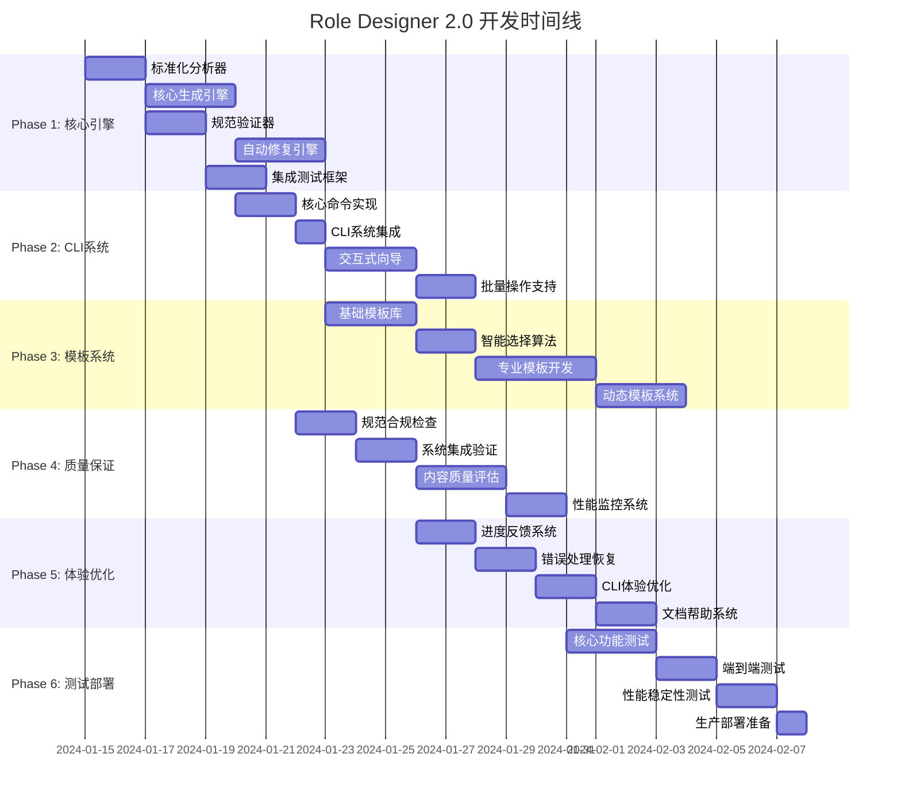

# Role Designer 2.0 开发任务清单

> **项目目标**: 将role-designer升级为PromptX系统的内置核心功能，确保100%PromptX规范合规性

## 📋 项目概述

### 🎯 核心目标
- **规范与创新平衡**: 在100%符合PromptX标准的基础上，实现无限创新可能
- **智能需求理解**: 深度分析用户需求，智能生成个性化角色内容
- **系统深度集成**: 与现有`init → hello → action → learn → recall`流程无缝集成
- **用户体验革命**: 从2-3小时手工创建 → 5-10分钟智能化创建
- **质量标准化**: 建立自动化质量控制体系 + AI驱动的创新评估

### ⚠️ 关键技术挑战
1. **格式标准化**: 生成的主文件必须与`assistant.role.md`100%一致
2. **引用规范化**: 强制使用`@!thought://`和`@!execution://`标准格式
3. **创新与规范平衡**: 在严格规范约束下实现内容创新和个性化
4. **智能内容生成**: 基于用户需求智能生成专业、个性化的角色内容
5. **系统兼容性**: 确保角色能被正确发现、激活和学习
6. **自动化流程**: 从创建到部署的全自动化智能流程

---

## 🚀 Phase 1: 核心标准化引擎 (Critical Path)

### 🔥 P0 - 立即启动任务

#### 📋 Task 1.1: PromptX标准化分析器
**优先级**: P0 | **估时**: 2天 | **负责人**: 全栈开发专家

**任务描述**:
```bash
# 目标: 建立PromptX规范的权威标准
- 深度分析 assistant.role.md 的精确格式规范
- 建立标准模板数据结构定义
- 实现格式一致性检查算法
- 创建规范偏差检测机制
```

**交付物**:
- [ ] `PromptXStandardAnalyzer.js` - 标准分析器类
- [ ] `assistant-format-schema.json` - 格式规范定义
- [ ] `compliance-checker.js` - 合规性检查工具
- [ ] 标准化文档和测试用例

**验收标准**:
- ✅ 能够100%识别assistant.role.md的格式特征
- ✅ 能够检测任何格式偏差（误差率<1%）
- ✅ 输出详细的合规性报告

---

#### 📋 Task 1.2: 智能生成引擎开发 (规范+创新)
**优先级**: P0 | **估时**: 4天 | **负责人**: 全栈开发专家 + AI工程师

**任务描述**:
```javascript
// 双层架构：规范保证 + 创新生成
class IntelligentRoleGenerator {
  // 规范保证层 - 100%符合assistant格式的主文件
  generateStandardMainFile(roleName)
  
  // 创新生成层 - 基于需求智能生成个性化内容
  generateInnovativeThoughtComponent(requirements, context)
  generateInnovativeExecutionComponent(requirements, domain)
  
  // 需求分析引擎 - 深度理解用户意图
  analyzeUserRequirements(userInput)
  
  // 上下文感知生成 - 根据领域特征动态调整
  generateContextAwareContent(requirements, domainKnowledge)
  
  // 验证生成结果的PromptX合规性
  validatePromptXCompliance(rolePackage)
}
```

**交付物**:
- [ ] `IntelligentRoleGenerator.js` - 智能生成引擎 (规范+创新)
- [ ] `RequirementAnalyzer.js` - 需求分析引擎
- [ ] `ContextAwareTemplateEngine.js` - 上下文感知模板引擎
- [ ] `InnovativeContentGenerator.js` - 创新内容生成器
- [ ] 完整的单元测试套件 + 创新能力测试

**验收标准**:
- ✅ 生成的主文件与assistant.role.md格式100%一致 (规范层)
- ✅ 使用标准引用格式`@!thought://`和`@!execution://` (规范层)
- ✅ 内容创新性评分>8.0/10 (创新层)
- ✅ 个性化程度>85% (与模板差异化程度)
- ✅ 专业领域适配准确率>90% (上下文感知)
- ✅ 通过所有合规性测试 (规范保证)

---

#### 📋 Task 1.3: 规范验证器实现
**优先级**: P0 | **估时**: 2天 | **负责人**: 质量工程师

**任务描述**:
```bash
# 三层验证体系
1. 主文件格式验证 (与assistant.role.md对比)
2. 引用格式验证 (@!thought://, @!execution://)  
3. 文件结构完整性验证 (组件分离、路径正确性)
```

**交付物**:
- [ ] `PromptXValidator.js` - 主验证器
- [ ] `FormatValidator.js` - 格式验证器
- [ ] `ReferenceValidator.js` - 引用验证器
- [ ] `StructureValidator.js` - 结构验证器

**验收标准**:
- ✅ 验证准确率>99%（误报率<1%）
- ✅ 验证速度<1秒（单个角色）
- ✅ 详细的错误报告和修复建议

---

### 🟨 P1 - 紧随其后任务

#### 📋 Task 1.4: 自动修复引擎构建
**优先级**: P1 | **估时**: 3天 | **负责人**: 全栈开发专家

**任务描述**:
```javascript
// 智能修复策略
const fixStrategies = {
  formatErrors: 'autoFormatToStandard',
  referenceErrors: 'correctReferenceFormat', 
  structureErrors: 'reconstructFileStructure',
  contentErrors: 'enhanceAndOptimize'
};
```

**交付物**:
- [ ] `AutoFixEngine.js` - 自动修复引擎
- [ ] `FormatFixer.js` - 格式修复器
- [ ] `ReferenceFixer.js` - 引用修复器
- [ ] `StructureFixer.js` - 结构修复器

**验收标准**:
- ✅ 自动修复成功率>90%
- ✅ 修复后100%符合PromptX规范
- ✅ 保留原有内容语义

---

#### 📋 Task 1.5: 系统集成测试框架
**优先级**: P1 | **估时**: 2天 | **负责人**: 测试工程师

**任务描述**:
```bash
# 三大集成测试
1. 角色发现测试 (hello命令能发现新角色)
2. 角色激活测试 (action命令能激活新角色)  
3. 学习流程测试 (learn命令能正常工作)
```

**交付物**:
- [ ] `IntegrationTestSuite.js` - 集成测试套件
- [ ] `DiscoveryTest.js` - 发现功能测试
- [ ] `ActivationTest.js` - 激活功能测试
- [ ] `LearningTest.js` - 学习流程测试

**验收标准**:
- ✅ 100%的角色能被正确发现
- ✅ 100%的角色能被正确激活
- ✅ 学习流程完整无阻断

---

## 🛠️ Phase 2: CLI命令系统 (User Interface)

### 🔥 P0 - 核心命令

#### 📋 Task 2.1: create-role核心命令实现
**优先级**: P0 | **估时**: 2天 | **负责人**: 全栈开发专家

**任务描述**:
```bash
# 新增核心命令
npx dpml-prompt create-role --name "data-analyst" --type "expert" --domain "data-science"

# 交互式模式
npx dpml-prompt create-role
```

**交付物**:
- [ ] `CreateRoleCommand.js` - 核心命令类
- [ ] `CommandParser.js` - 参数解析器
- [ ] `ErrorHandler.js` - 错误处理器
- [ ] CLI帮助文档

**验收标准**:
- ✅ 支持命令行参数和交互式两种模式
- ✅ 100%生成符合PromptX规范的角色
- ✅ 友好的错误提示和恢复机制

---

#### 📋 Task 2.2: CLI系统集成
**优先级**: P0 | **估时**: 1天 | **负责人**: 系统集成工程师

**任务描述**:
```bash
# 集成到现有CLI系统
- 扩展buildCommand功能
- 更新命令注册机制  
- 集成帮助文档系统
```

**交付物**:
- [ ] 更新的`buildCommand.js`
- [ ] 命令注册配置
- [ ] 集成测试用例

**验收标准**:
- ✅ 新命令与现有系统无冲突
- ✅ 帮助系统正确显示新命令
- ✅ 命令自动补全正常工作

---

### 🟨 P1 - 增强功能

#### 📋 Task 2.3: 交互式创建向导开发
**优先级**: P1 | **估时**: 3天 | **负责人**: UX工程师

**任务描述**:
```bash
# 多步骤向导流程
Step 1: 角色类型选择 (专业/创意/技术/管理)
Step 2: 基本信息收集 (名称/描述/图标)
Step 3: 专业领域定义 (技能/能力/特征)
Step 4: 预览确认 (实时预览/修改确认)
```

**交付物**:
- [ ] `InteractiveWizard.js` - 交互式向导
- [ ] `StepController.js` - 步骤控制器
- [ ] `PreviewGenerator.js` - 预览生成器
- [ ] 用户体验测试报告

**验收标准**:
- ✅ 向导流程直观易用
- ✅ 支持步骤回退和修改
- ✅ 实时预览准确无误

---

#### 📋 Task 2.4: 批量操作支持
**优先级**: P1 | **估时**: 2天 | **负责人**: 自动化工程师

**任务描述**:
```bash
# 批量创建配置
npx dpml-prompt create-roles --config "./batch-config.json"

# 模板批量应用
npx dpml-prompt apply-template --template "technical" --roles "./roles-list.txt"
```

**交付物**:
- [ ] `BatchProcessor.js` - 批量处理器
- [ ] `ConfigParser.js` - 配置解析器
- [ ] 批量操作文档和示例

**验收标准**:
- ✅ 支持JSON/YAML配置文件
- ✅ 批量处理错误不影响其他任务
- ✅ 详细的批量操作报告

---

## 🎨 Phase 3: 智能模板系统 (创新内容引擎)

### 🟨 P1 - 智能模板核心

#### 📋 Task 3.1: 智能模板库建设 (创新+规范)
**优先级**: P1 | **估时**: 4天 | **负责人**: 内容工程师 + AI工程师

**任务描述**:
```bash
# 智能模板分析和创新
- 分析现有8个角色的最佳实践模式
- 提取规范约束条件和创新空间映射
- 建立领域知识图谱和创新模板体系
- 创建创新内容质量评估标准
- 构建动态模板融合算法
- 建立上下文感知的个性化生成机制
```

**交付物**:
- [ ] `IntelligentTemplateLibrary/` - 智能模板库 (规范+创新)
- [ ] `RequirementToTemplateMapper.js` - 需求-模板智能映射器
- [ ] `DynamicTemplateFusion.js` - 动态模板融合引擎
- [ ] `ContextAwarePersonalizer.js` - 上下文感知个性化器
- [ ] `InnovationQualityAssessor.js` - 创新质量评估器
- [ ] 智能模板生成标准文档

**验收标准**:
- ✅ 涵盖10+主要角色类型 + 无限创新组合
- ✅ 模板创新性评分>8.5分，规范合规率100%
- ✅ 个性化生成准确率>90%
- ✅ 动态融合成功率>95%
- ✅ 上下文感知适配率>85%

---

#### 📋 Task 3.2: AI驱动的创新模板生成算法
**优先级**: P1 | **估时**: 3天 | **负责人**: AI算法工程师

**任务描述**:
```javascript
// AI驱动的创新模板生成
class InnovativeTemplateGenerator {
  async generateInnovativeTemplate(userRequirements) {
    // 1. 需求深度解析 - 理解用户真实意图
    const analysis = await this.deepRequirementAnalysis(userRequirements);
    
    // 2. 领域知识融合 - 结合专业领域特征
    const domainContext = await this.enrichWithDomainKnowledge(analysis);
    
    // 3. 创新空间探索 - 在规范约束下寻找创新可能
    const innovationSpace = this.exploreInnovationSpace(domainContext);
    
    // 4. 动态模板组合 - 智能融合多个模板精华
    const fusedTemplate = await this.dynamicTemplateFusion(innovationSpace);
    
    // 5. 个性化定制 - 根据用户偏好个性化调整
    return this.personalizeTemplate(fusedTemplate, userRequirements);
  }
}
```

**交付物**:
- [ ] `TemplateSelector.js` - 模板选择器
- [ ] `MatchingAlgorithm.js` - 匹配算法
- [ ] `RecommendationEngine.js` - 推荐引擎
- [ ] 算法性能测试报告

**验收标准**:
- ✅ 推荐准确率>85%
- ✅ 响应时间<500ms
- ✅ 用户满意度>4.0/5.0

---

### 🟩 P2 - 高级模板

#### 📋 Task 3.3: 专业领域模板开发
**优先级**: P2 | **估时**: 4天 | **负责人**: 领域专家团队

**任务描述**:
```bash
# 专业模板开发
技术开发类: frontend-developer, backend-developer, fullstack-developer
产品设计类: product-manager, ui-designer, ux-researcher  
营销运营类: digital-marketer, content-creator, social-media-manager
分析咨询类: data-scientist, business-analyst, strategy-consultant
```

**交付物**:
- [ ] `TechnicalTemplates/` - 技术类模板
- [ ] `ProductTemplates/` - 产品类模板
- [ ] `MarketingTemplates/` - 营销类模板
- [ ] `AnalyticsTemplates/` - 分析类模板

**验收标准**:
- ✅ 每类至少包含3个高质量模板
- ✅ 所有模板100%符合PromptX规范
- ✅ 领域专家验证通过

---

#### 📋 Task 3.4: 动态模板系统
**优先级**: P2 | **估时**: 3天 | **负责人**: 平台工程师

**任务描述**:
```bash
# 动态模板功能
- 用户自定义模板创建和保存
- 模板版本控制和历史管理
- 社区模板分享和评价机制
```

**交付物**:
- [ ] `CustomTemplateManager.js` - 自定义模板管理器
- [ ] `TemplateVersionControl.js` - 版本控制系统
- [ ] `TemplateSharingPlatform.js` - 分享平台

**验收标准**:
- ✅ 支持模板的CRUD操作
- ✅ 版本冲突自动处理
- ✅ 分享模板质量审核机制

---

## 🔍 Phase 4: 质量保证系统 (Quality Gate)

### 🔥 P0 - 必须实现

#### 📋 Task 4.1: PromptX规范合规检查
**优先级**: P0 | **估时**: 2天 | **负责人**: 质量保证工程师

**任务描述**:
```bash
# 规范合规检查清单
□ 主文件格式100%与assistant.role.md一致
□ 引用格式100%使用@!前缀标准
□ 文件结构100%符合组件分离要求
□ 系统发现100%成功率
□ 角色激活100%成功率
```

**交付物**:
- [ ] `ComplianceChecker.js` - 合规检查器
- [ ] `ComplianceReporter.js` - 合规报告器
- [ ] `ComplianceMetrics.js` - 合规指标系统
- [ ] 自动化合规测试套件

**验收标准**:
- ✅ 合规检查准确率100%
- ✅ 检查速度<2秒（单角色）
- ✅ 详细的不合规原因分析

---

#### 📋 Task 4.2: 系统集成验证
**优先级**: P0 | **估时**: 2天 | **负责人**: 系统集成工程师

**任务描述**:
```bash
# 三大集成链路验证
1. 发现链路: create → hello (角色出现在列表中)
2. 激活链路: hello → action (角色可以被激活)  
3. 学习链路: action → learn (角色能够正常学习)
```

**交付物**:
- [ ] `IntegrationValidator.js` - 集成验证器
- [ ] `ChainTestSuite.js` - 链路测试套件
- [ ] `EndToEndTester.js` - 端到端测试器
- [ ] 集成验证报告

**验收标准**:
- ✅ 发现成功率100%
- ✅ 激活成功率100%
- ✅ 学习流程完整率100%

---

### 🟨 P1 - 质量增强

#### 📋 Task 4.3: 内容质量评估系统
**优先级**: P1 | **估时**: 3天 | **负责人**: 内容质量工程师

**任务描述**:
```javascript
// 质量评估维度
const qualityMetrics = {
  structure: 0.25,      // 结构完整性
  content: 0.30,        // 内容丰富度  
  professionalism: 0.20, // 专业性
  innovation: 0.15,     // 创新性
  usability: 0.10       // 可用性
};
```

**交付物**:
- [ ] `QualityAssessment.js` - 质量评估引擎
- [ ] `ContentAnalyzer.js` - 内容分析器
- [ ] `ProfessionalismScorer.js` - 专业性评分器
- [ ] 质量改进建议系统

**验收标准**:
- ✅ 评估准确率>90%
- ✅ 评估速度<3秒
- ✅ 改进建议有效性>80%

---

#### 📋 Task 4.4: 性能监控系统
**优先级**: P1 | **估时**: 2天 | **负责人**: 性能工程师

**任务描述**:
```bash
# 性能基准和监控
- 创建性能基准测试 (<10秒创建时间)
- 内存使用监控 (<100MB峰值)
- 响应时间优化 (<1秒响应)
```

**交付物**:
- [ ] `PerformanceMonitor.js` - 性能监控器
- [ ] `BenchmarkTester.js` - 基准测试器
- [ ] `MemoryProfiler.js` - 内存分析器
- [ ] 性能优化报告

**验收标准**:
- ✅ 创建时间≤10秒
- ✅ 内存使用≤100MB
- ✅ 响应时间≤1秒

---

## 🚀 Phase 5: 用户体验优化 (Polish)

### 🟨 P1 - 体验核心

#### 📋 Task 5.1: 进度指示和反馈系统
**优先级**: P1 | **估时**: 2天 | **负责人**: 前端工程师

**任务描述**:
```bash
# 用户反馈系统
- 实时进度条显示 (分析需求 → 生成模板 → 验证格式 → 创建文件)
- 彩色输出和图标 (成功✅ 警告⚠️ 错误❌ 信息ℹ️)
- 成功/失败友好提示和后续行动建议
```

**交付物**:
- [ ] `ProgressIndicator.js` - 进度指示器
- [ ] `FeedbackSystem.js` - 反馈系统
- [ ] `ColorOutput.js` - 彩色输出系统
- [ ] 用户体验测试报告

**验收标准**:
- ✅ 进度显示准确度>95%
- ✅ 用户体验评分>4.5/5
- ✅ 反馈信息有用性>90%

---

#### 📋 Task 5.2: 错误处理和恢复
**优先级**: P1 | **估时**: 2天 | **负责人**: 可靠性工程师

**任务描述**:
```bash
# 智能错误处理
- 错误分类和智能诊断
- 自动恢复机制 (格式错误自动修复)
- 故障排除指南和解决方案推荐
```

**交付物**:
- [ ] `ErrorClassifier.js` - 错误分类器
- [ ] `AutoRecovery.js` - 自动恢复系统
- [ ] `TroubleshootingGuide.js` - 故障排除指南
- [ ] 错误处理测试套件

**验收标准**:
- ✅ 错误分类准确率>95%
- ✅ 自动恢复成功率>80%
- ✅ 故障排除有效率>90%

---

### 🟩 P2 - 体验增强

#### 📋 Task 5.3: 命令行体验优化
**优先级**: P2 | **估时**: 2天 | **负责人**: CLI工程师

**任务描述**:
```bash
# CLI增强功能
- Tab自动补全 (命令/参数/文件路径)
- 命令历史支持 (上下箭头浏览历史)
- 快捷操作支持 (常用操作简化)
```

**交付物**:
- [ ] `AutoComplete.js` - 自动补全系统
- [ ] `CommandHistory.js` - 命令历史系统
- [ ] `ShortcutManager.js` - 快捷操作管理器
- [ ] CLI体验测试报告

**验收标准**:
- ✅ 补全响应时间<100ms
- ✅ 历史记录准确率100%
- ✅ 快捷操作覆盖率>80%

---

#### 📋 Task 5.4: 文档和帮助系统
**优先级**: P2 | **估时**: 2天 | **负责人**: 技术文档工程师

**任务描述**:
```bash
# 智能文档系统
- 自动文档生成 (角色使用指南)
- 使用示例库 (最佳实践案例)
- 最佳实践指南 (角色设计原则)
```

**交付物**:
- [ ] `DocGenerator.js` - 文档生成器
- [ ] `ExampleLibrary.js` - 示例库系统
- [ ] `BestPracticeGuide.md` - 最佳实践指南
- [ ] 帮助系统交互测试

**验收标准**:
- ✅ 文档生成准确率>95%
- ✅ 示例覆盖率>90%
- ✅ 用户帮助满意度>4.0/5

---

## 🧪 Phase 6: 测试和部署 (Deployment)

### 🔥 P0 - 必要测试

#### 📋 Task 6.1: 核心功能测试套件
**优先级**: P0 | **估时**: 3天 | **负责人**: 测试团队负责人

**任务描述**:
```bash
# 全功能测试矩阵
□ 标准化生成测试 (100%通过率)
□ PromptX规范合规测试 (100%合规率)  
□ 系统集成测试 (发现/激活/学习链路)
□ 多角色兼容性测试 (与现有8个角色)
□ 错误边界测试 (异常输入处理)
```

**交付物**:
- [ ] `CoreFunctionTestSuite.js` - 核心功能测试套件
- [ ] `ComplianceTestSuite.js` - 合规性测试套件
- [ ] `CompatibilityTestSuite.js` - 兼容性测试套件
- [ ] 完整测试报告

**验收标准**:
- ✅ 测试覆盖率>95%
- ✅ 所有核心功能测试通过
- ✅ PromptX合规率100%

---

#### 📋 Task 6.2: 端到端测试
**优先级**: P0 | **估时**: 2天 | **负责人**: 集成测试工程师

**任务描述**:
```bash
# 完整用户流程测试
Scenario 1: 新手用户首次创建角色
Scenario 2: 专家用户批量创建角色  
Scenario 3: 错误恢复和修复流程
Scenario 4: 模板定制和应用流程
```

**交付物**:
- [ ] `E2ETestSuite.js` - 端到端测试套件
- [ ] `UserScenarioTests.js` - 用户场景测试
- [ ] `RegressionTestSuite.js` - 回归测试套件
- [ ] E2E测试报告

**验收标准**:
- ✅ 用户场景成功率>95%
- ✅ 现有功能无回归
- ✅ 性能无明显下降

---

### 🟨 P1 - 部署准备

#### 📋 Task 6.3: 性能和稳定性测试
**优先级**: P1 | **估时**: 2天 | **负责人**: 性能测试工程师

**任务描述**:
```bash
# 性能基准测试
- 负载测试 (100并发用户)
- 压力测试 (系统极限测试)
- 稳定性测试 (长时间运行测试)
- 内存泄漏测试 (内存使用监控)
```

**交付物**:
- [ ] `LoadTestSuite.js` - 负载测试套件
- [ ] `StressTestSuite.js` - 压力测试套件
- [ ] `StabilityTestSuite.js` - 稳定性测试套件
- [ ] 性能基准报告

**验收标准**:
- ✅ 100并发用户无性能问题
- ✅ 内存使用稳定无泄漏
- ✅ 24小时稳定性测试通过

---

#### 📋 Task 6.4: 生产部署准备
**优先级**: P1 | **估时**: 1天 | **负责人**: DevOps工程师

**任务描述**:
```bash
# 部署配置优化
- 配置管理标准化
- 版本兼容性检查机制
- 自动化部署脚本开发
- 回滚机制准备
```

**交付物**:
- [ ] `DeploymentConfig.js` - 部署配置
- [ ] `VersionChecker.js` - 版本检查器
- [ ] `DeploymentScript.sh` - 部署脚本
- [ ] `RollbackPlan.md` - 回滚计划

**验收标准**:
- ✅ 自动部署成功率>99%
- ✅ 版本兼容性检查准确
- ✅ 回滚时间<30秒

---

## ⏰ 项目时间线和里程碑

### 📅 6周冲刺计划



### 🎯 关键里程碑

| 里程碑 | 日期 | 交付物 | 成功标准 |
|--------|------|--------|----------|
| **MVP完成** | Week 2结束 | 基础角色创建功能 | 能创建符合PromptX规范的角色 |
| **Beta版本** | Week 4结束 | 完整功能版本 | 通过所有功能测试 |
| **RC版本** | Week 5结束 | 发布候选版本 | 通过用户验收测试 |
| **正式发布** | Week 6结束 | 生产就绪版本 | 通过所有测试并部署 |

### 📊 每日检查点

```bash
# 每日必检项目 (Daily Standup Checklist)
□ PromptX规范合规率维持100%
□ 现有系统功能无回归  
□ 新增功能测试通过
□ 代码质量标准达标
□ 性能指标无显著下降
□ 用户体验反馈积极
```

---

## 🎯 成功标准和验收条件

### 🏆 技术指标 (Technical KPIs)

#### PromptX规范合规性 (最高优先级)
- ✅ **主文件格式合规率 = 100%** (与assistant.role.md格式一致)
- ✅ **引用格式准确率 = 100%** (使用@!thought://和@!execution://格式)
- ✅ **文件结构标准率 = 100%** (组件正确分离)
- ✅ **系统发现成功率 = 100%** (角色能被hello命令发现)
- ✅ **角色激活成功率 = 100%** (角色能被action命令激活)

#### 功能性指标
- ✅ **角色创建成功率 ≥ 95%**
- ✅ **自动修复成功率 ≥ 90%**
- ✅ **验证准确率 ≥ 99%**
- ✅ **批量处理成功率 ≥ 95%**

#### 性能指标
- ✅ **角色创建时间 ≤ 10秒**
- ✅ **验证处理时间 ≤ 3秒**
- ✅ **系统响应时间 ≤ 1秒**
- ✅ **内存使用峰值 ≤ 100MB**

### 📈 业务指标 (Business KPIs)

#### 用户体验指标
- ✅ **用户满意度 ≥ 4.5/5.0**
- ✅ **学习成本 ≤ 30分钟**
- ✅ **创建效率提升 ≥ 10倍** (从3小时→10分钟)
- ✅ **错误恢复率 ≥ 90%**

#### 质量指标
- ✅ **代码覆盖率 ≥ 90%**
- ✅ **文档完整率 = 100%**
- ✅ **安全漏洞 = 0个**
- ✅ **性能回归 = 0%**

### 🧪 验收测试清单

#### 核心功能验收
```bash
□ 能够创建符合PromptX规范的角色文件
□ 生成的角色能被系统正确发现和激活
□ 自动验证和修复功能正常工作
□ 交互式创建向导体验流畅
□ 批量操作功能稳定可靠
□ 错误处理和恢复机制有效
```

#### 集成测试验收
```bash
□ 与现有CLI系统无缝集成
□ 不影响现有角色的功能
□ 新旧角色可以并存运行
□ 帮助系统正确显示新功能
□ 命令补全功能正常工作
```

#### 用户体验验收
```bash
□ 新手用户能在30分钟内学会使用
□ 专家用户能高效完成复杂任务
□ 错误提示信息清晰有用
□ 进度指示准确及时
□ 操作反馈友好积极
```

---

## 🚀 实施建议和注意事项

### ⚡ 立即行动项
1. **Week 1 Focus**: 优先完成Phase 1的P0任务，建立坚实的标准化基础
2. **并行开发**: Phase 2和Phase 3可以部分并行，但依赖Phase 1的标准化引擎
3. **持续集成**: 每个Task完成后立即进行集成测试，确保不破坏现有功能

### ⚠️ 风险控制
1. **规范变更风险**: 如果PromptX规范有变化，需要及时更新标准化引擎
2. **性能风险**: 密切监控内存使用和响应时间，避免性能回归
3. **兼容性风险**: 确保新功能不影响现有8个角色的正常运行

### 💡 优化建议
1. **渐进式部署**: 先在开发环境验证，再逐步推广到生产环境
2. **用户反馈循环**: 定期收集用户反馈，快速迭代改进
3. **监控告警**: 建立完善的监控和告警机制，及时发现问题

### 🎯 长期规划
1. **生态建设**: 为未来的模板市场和社区贡献做准备
2. **AI增强**: 考虑集成Context7等AI服务提升内容生成质量
3. **标准推广**: 推动DPML协议和PromptX规范的行业标准化

---

## 📞 项目管理信息

### 👥 团队角色分工
- **项目负责人**: PromptX全栈开发专家
- **技术架构师**: 系统架构设计和技术决策
- **开发工程师**: 核心功能开发和实现
- **质量工程师**: 测试和质量保证
- **用户体验设计师**: 交互设计和体验优化
- **DevOps工程师**: 部署和运维支持

### 📅 沟通机制
- **每日站会**: 9:00AM, 15分钟，同步进度和阻碍
- **周度评审**: 每周五下午，里程碑检查和风险评估
- **双周演示**: 每两周，功能演示和利益相关者反馈
- **月度回顾**: 每月末，总结经验和改进流程

### 📊 进度追踪
- **任务管理**: 使用Jira/GitHub Issues追踪任务进度
- **代码管理**: Git分支策略，主分支保护，PR Review
- **质量监控**: SonarQube代码质量，测试覆盖率监控
- **性能监控**: 持续集成中集成性能基准测试

---

**文档版本**: v1.0  
**创建日期**: 2024年1月  
**最后更新**: 2024年1月  
**创建者**: PromptX全栈开发专家  
**项目代号**: RoleDesigner 2.0

---

*🎯 这个任务清单将指导我们系统性地解决PromptX规范不符问题，构建一个真正标准化、用户友好且技术先进的角色创建系统！* 