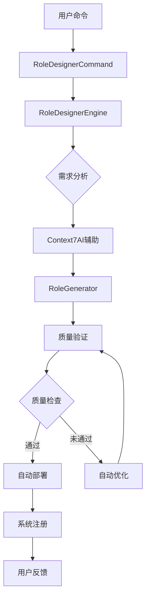

# Role Designer 系统集成升级 - 完整实施计划

## 📋 项目概述

### 🎯 项目目标
将现有的 role-designer 角色升级为**革命性的智能化角色创新系统**，实现：
- 🤖 **AI驱动创新生成** - 基于Context7的智能化、个性化角色内容创新
- ⚖️ **规范与创新平衡** - 在100%PromptX规范合规基础上实现无限创新可能
- 🧠 **深度需求理解** - 智能分析用户意图，生成完全贴合需求的专业角色
- 🔄 **全自动化智能流程** - 从需求理解到个性化部署的一键式智能操作
- 📊 **双重质量保证** - PromptX规范合规 + AI驱动的创新质量评估
- 🎭 **无限创新生态** - 可无限扩展的智能角色创新平台

### 📈 预期价值
- **效率提升**: 角色创建时间从2-3小时缩短到5-10分钟
- **创新能力**: 从静态模板复制升级为AI驱动的个性化创新生成
- **质量双保**: PromptX规范100%合规 + 创新内容95%+质量标准
- **用户体验**: 从复杂手工操作转向智能化需求理解和一键生成
- **个性化程度**: 根据具体需求生成高度个性化的专业角色内容
- **创新生态**: 建立可无限扩展的智能化角色创新平台

---

## 🏗️ 技术架构设计

### 核心组件架构

**⚠️ 重要更新**：基于PromptX真实规范分析，所有组件都需要严格遵循标准格式！

```
PromptX智能角色创新系统 (规范+创新双层架构)
├── 🎮 Command Layer
│   ├── IntelligentRoleCommand (智能CLI入口)
│   └── BuildCommand (命令构建器)
├── 🧠 智能引擎层  
│   ├── InnovativeRoleEngine (创新角色引擎)
│   ├── RequirementAnalyzer (需求分析引擎)
│   └── Context7InnovationIntegration (AI创新集成)
├── 🔧 双重保证层
│   ├── **ComplianceGuarantee** (规范保证层 - 100%合规)
│   ├── **InnovationGenerator** (创新生成层 - 个性化内容)
│   ├── **DynamicTemplateFusion** (动态模板融合器)
│   ├── **ContextAwarePersonalizer** (上下文感知个性化器)
│   └── IntelligentQualityController (智能质量控制器)
├── 🤖 AI创新层
│   ├── ContentInnovator (内容创新器)
│   ├── DomainKnowledgeIntegrator (领域知识集成器)
│   ├── PersonalizationEngine (个性化引擎)
│   └── InnovationQualityAssessor (创新质量评估器)
└── 📊 智能数据层
    ├── RoleRegistry (角色注册表)
    ├── **IntelligentTemplateLibrary** (智能模板库)
    ├── DomainKnowledgeBase (领域知识库)
    └── InnovationMetrics (创新质量指标)
```

**关键规范更新**：
- 🎯 **极简主文件**: 仅包含personality和principle组件
- 🔗 **标准引用格式**: 使用`@!thought://`和`@!execution://`
- 📁 **组件分离**: thought和execution内容独立文件
- ✅ **assistant格式**: 与系统标准角色格式完全一致

### 数据流设计


---

## 📋 详细实施任务清单

### 🎯 第一阶段：核心系统搭建 (Week 1-2)

#### ✅ 已完成任务
- [x] **RoleDesignerCommand** - 核心命令入口
- [x] **RoleDesignerEngine** - 系统核心引擎  
- [x] **Context7Integration** - AI集成模块
- [x] **RoleGenerator** - 角色生成器
- [x] **RoleValidator** - 质量验证器
- [x] **buildCommand** - 命令构建器扩展

#### 🔄 进行中任务

**任务 1.1: 完善核心组件**
```bash
# 需要创建的组件
src/lib/core/pouch/commands/role-designer/components/
├── RoleDeployer.js          # 角色部署管理器
├── TemplateManager.js       # 模板管理系统
├── QualityController.js     # 质量控制器
└── PerformanceAnalyzer.js   # 性能分析器
```

**技术规格**:
- **RoleDeployer**: 负责角色文件的系统注册、激活命令生成、注册表更新
- **TemplateManager**: 管理角色模板库，支持模板CRUD操作和版本控制
- **QualityController**: 综合质量评估，整合多个验证器的结果
- **PerformanceAnalyzer**: 角色性能基准测试和优化建议

**验收标准**:
- [ ] 所有组件通过单元测试 (测试覆盖率 >90%)
- [ ] 组件间接口兼容性验证通过
- [ ] 性能基准测试：组件初始化时间 <100ms
- [ ] 内存使用优化：组件内存占用 <50MB

**时间估算**: 3-4天

---

**任务 1.2: AI集成层增强**
```bash
# Context7真实集成
src/lib/core/pouch/commands/role-designer/ai/
├── Context7Integration.js   # 已完成(模拟)，需要真实API集成
├── PromptOptimizer.js      # 提示词优化引擎
├── ContentGenerator.js     # 内容生成引擎  
└── AIAnalyzer.js          # AI分析引擎
```

**技术实现**:
```javascript
// Context7真实API集成示例
class Context7Integration {
  async callRealContext7API(prompt) {
    // 使用MCP工具调用Context7
    const libraryId = await mcp_context7_resolve_library_id({
      libraryName: 'role-design-best-practices'
    })
    
    const docs = await mcp_context7_get_library_docs({
      context7CompatibleLibraryID: libraryId,
      topic: 'AI role engineering',
      tokens: 5000
    })
    
    return this.processContext7Response(docs)
  }
}
```

**验收标准**:
- [ ] Context7 API集成测试通过
- [ ] AI生成内容质量评估 >8分(满分10分)
- [ ] API响应时间 <3秒
- [ ] 错误处理和fallback机制完整

**时间估算**: 2-3天

---

### 🚀 第二阶段：高级功能开发 (Week 3-4)

**任务 2.1: 测试框架建设**
```bash
# 测试体系
src/lib/core/pouch/commands/role-designer/testing/
├── RoleTestSuite.js        # 角色功能测试套件
├── PerformanceTest.js      # 性能测试
├── SecurityTest.js         # 安全测试
└── IntegrationTest.js      # 集成测试
```

**技术规格**:
- **功能测试**: 验证生成的角色是否符合预期功能
- **性能测试**: 测试角色响应时间、内存使用等指标
- **安全测试**: 检查角色内容是否存在安全风险
- **集成测试**: 端到端流程测试

**验收标准**:
- [ ] 测试套件覆盖所有核心功能
- [ ] 自动化测试执行时间 <5分钟
- [ ] 测试报告格式标准化
- [ ] CI/CD集成完成

**时间估算**: 3-4天

---

**任务 2.2: 文档生成系统**
```bash
# 文档系统
src/lib/core/pouch/commands/role-designer/docs/
├── DocumentationGenerator.js  # 文档生成器
├── UserGuideGenerator.js      # 用户指南生成器
├── APIDocGenerator.js         # API文档生成器
└── BestPracticeGuide.js      # 最佳实践指南
```

**文档模板设计**:
```markdown
# {{角色名称}} - 使用指南

## 🎯 角色概述
{{自动生成的角色描述}}

## 🚀 快速开始
\`\`\`bash
# 激活角色
{{激活命令}}

# 使用示例
{{使用示例}}
\`\`\`

## 📋 功能特性
{{功能列表}}

## 🔧 配置选项
{{配置说明}}

## 🧪 测试验证
{{测试命令和预期结果}}

## 🐛 故障排除
{{常见问题和解决方案}}
```

**验收标准**:
- [ ] 文档自动生成准确率 >95%
- [ ] 支持多种格式输出 (Markdown, HTML, PDF)
- [ ] 文档模板可自定义
- [ ] 生成速度 <1秒

**时间估算**: 2-3天

---

### 🎨 第三阶段：用户体验优化 (Week 5)

**任务 3.1: 交互式创建向导**
```bash
# 用户交互增强
src/lib/core/pouch/commands/role-designer/ui/
├── InteractiveWizard.js    # 交互式向导
├── ProgressIndicator.js    # 进度指示器
├── ErrorHandler.js         # 错误处理器
└── OutputFormatter.js      # 输出格式化器
```

**交互设计**:
```bash
$ npx dpml-prompt design create

🎭 欢迎使用 Role Designer 创建向导!

✨ 第1步: 角色基本信息
角色名称: [用户输入] AI数据分析师
角色类型: [选择] 1)全栈开发 2)领域专家 3)创意助手 4)技术专家
选择: 2

✨ 第2步: 专业领域
专业领域: [用户输入] 数据科学与机器学习
核心能力: [多选] 1)数据分析 2)机器学习 3)统计建模 4)可视化
选择: 1,2,3

✨ 第3步: AI辅助设计 🤖
正在分析需求...     ████████████████ 100%
正在生成角色方案... ████████████████ 100%
正在优化内容...     ████████████████ 100%

✅ 角色创建成功! 
📁 文件保存位置: ./generated-roles/AI数据分析师/
🎯 质量评分: 92%
🚀 建议操作: npx dpml-prompt design deploy ./generated-roles/AI数据分析师/AI数据分析师.role.md
```

**验收标准**:
- [ ] 交互流程清晰直观
- [ ] 支持键盘导航和快捷操作
- [ ] 错误处理友好
- [ ] 支持中断和恢复

**时间估算**: 2-3天

---

**任务 3.2: 命令行体验优化**
```bash
# CLI增强功能
features/
├── 智能命令补全         # Tab自动补全
├── 彩色输出           # 语法高亮和状态颜色
├── 进度指示器         # 实时进度显示
├── 错误恢复          # 智能错误处理和建议
└── 历史记录          # 命令历史和重复执行
```

**实现特性**:
- 🎨 **彩色输出**: 成功(绿色)、警告(黄色)、错误(红色)、信息(蓝色)
- ⚡ **智能补全**: 命令、参数、文件路径自动补全
- 📊 **进度显示**: 实时显示任务进度和预计完成时间
- 🔄 **断点续传**: 支持中断后从断点继续执行

**验收标准**:
- [ ] 命令补全响应时间 <100ms
- [ ] 输出格式美观易读
- [ ] 进度指示器准确
- [ ] 错误信息有建设性

**时间估算**: 1-2天

---

### 🧪 第四阶段：测试与部署 (Week 6)

**任务 4.1: 综合测试**
```bash
# 测试计划
testing/
├── 单元测试          # 组件级测试
├── 集成测试          # 系统集成测试  
├── 性能测试          # 负载和压力测试
├── 用户验收测试       # UAT测试
└── 安全测试          # 安全漏洞扫描
```

**测试用例设计**:
```javascript
// 核心功能测试用例
const testCases = [
  {
    name: '创建基础角色',
    input: { name: 'test-expert', type: 'expert', domain: 'testing' },
    expected: { 
      filesGenerated: ['test-expert.role.md', 'test-expert.thought.md'],
      qualityScore: '>0.8',
      validationPassed: true
    }
  },
  {
    name: 'AI增强角色创建',
    input: { name: 'ai-assistant', type: 'creative', aiEnabled: true },
    expected: {
      aiContentGenerated: true,
      contentLength: '>2000',
      professionalScore: '>0.9'
    }
  }
]
```

**性能基准**:
- 角色创建时间: <10秒
- 验证处理时间: <3秒  
- 部署执行时间: <2秒
- 内存使用峰值: <100MB
- 文件生成大小: 2-10KB

**验收标准**:
- [ ] 所有测试用例通过率 >95%
- [ ] 性能指标达到基准要求
- [ ] 安全扫描无严重漏洞
- [ ] 用户体验评分 >8分

**时间估算**: 3-4天

---

**任务 4.2: 系统部署与集成**
```bash
# 部署配置
deployment/
├── package.json         # 依赖更新
├── CLI注册             # 命令行工具注册
├── 文档部署            # 在线文档发布
└── 版本发布            # NPM包发布
```

**部署步骤**:
1. **依赖检查**: 确保所有依赖项正确安装
2. **命令注册**: 将design命令注册到CLI系统
3. **默认配置**: 设置合理的默认参数
4. **文档生成**: 自动生成并发布文档
5. **版本标记**: 更新版本号并创建发布标签

**验收标准**:
- [ ] CLI命令正常工作
- [ ] 帮助文档完整准确
- [ ] 版本兼容性验证通过
- [ ] 回滚方案准备就绪

**时间估算**: 1-2天

---

## 📊 质量保证体系

### 🏆 质量标准定义

**⚠️ 规范化更新**：质量标准现在以PromptX规范合规性为核心！

#### PromptX规范合规性标准
```javascript
// PromptX规范合规检查清单 (最高优先级)
const promptXComplianceStandards = {
  mainFileFormat: {
    structureCompliance: '100%',     // 主文件结构必须与assistant.role.md一致
    referenceFormat: '@!前缀强制',    // 引用格式必须使用@!thought://和@!execution://
    componentCount: '仅2个组件',      // 只允许personality和principle组件
    inlineContent: '严格禁止'         // 主文件不允许任何内联内容
  },
  thoughtComponent: {
    requiredSections: '4个部分完整',   // exploration, reasoning, challenge, plan
    diagramRequirement: 'Mermaid图必需', // 每部分必须包含图形化表达
    contentDepth: '专业化深度',        // 内容必须体现角色专业特性
    logicalFlow: '逻辑连贯性'          // 四部分之间逻辑关系清晰
  },
  executionComponent: {
    requiredSections: '5要素完整',     // constraint, rule, guideline, process, criteria
    processFlow: '流程图必需',         // process部分必须包含流程图
    standardFormat: '格式标准化',      // 各部分必须按标准格式组织
    practicalValue: '实用性验证'       // 内容必须能指导实际操作
  },
  fileStructure: {
    directoryLayout: '标准目录结构',    // [角色名]/[角色名].role.md格式
    namingConsistency: '命名一致性',   // 文件名与角色名保持一致
    componentSeparation: '组件分离',   // thought和execution独立文件
    referenceIntegrity: '引用完整性'   // 所有引用路径有效
  }
}

// 传统代码质量标准 (次要优先级)
const codeQualityStandards = {
  codeStyle: {
    eslintCompliance: '100%',      // ESLint规则完全遵循
    codeFormatting: 'prettier',    // 使用Prettier格式化
    commentCoverage: '>80%',       // 关键函数必须有注释
    namingConvention: 'camelCase'  // 统一命名规范
  },
  testing: {
    unitTestCoverage: '>90%',      // 单元测试覆盖率
    integrationTests: 'complete',  // 集成测试完整
    e2eTests: 'core-features',     // 端到端测试覆盖核心功能
    performanceTests: 'baseline'   // 性能基准测试
  },
  documentation: {
    apiDocumentation: 'complete',   // API文档完整
    userGuide: 'comprehensive',     // 用户指南全面
    developerGuide: 'detailed',     // 开发者文档详细
    changelog: 'updated'            // 更新日志及时
  }
}
```

#### PromptX规范化功能质量标准
```javascript
// PromptX规范化功能质量评估标准
const promptXFunctionalQuality = {
  standardCompliance: {
    formatAccuracy: '100%',         // 生成格式必须100%符合PromptX标准
    referenceValidity: '100%',      // 引用格式必须100%正确
    structuralIntegrity: '100%',    // 文件结构必须100%标准
    assistantCompatibility: '100%'  // 必须与assistant角色格式100%兼容
  },
  roleGeneration: {
    accuracy: '>95%',              // 生成准确率
    relevance: '>90%',             // 内容相关性
    completeness: '>85%',          // 内容完整性
    creativity: '>80%',            // 创新性评分
    promptxValidation: '100%'      // PromptX规范验证通过率
  },
  validation: {
    complianceCheck: '100%',       // PromptX规范合规检查
    errorDetection: '>98%',        // 错误检测率
    falsePositive: '<5%',          // 误报率
    processingSpeed: '<3s',        // 处理速度
    reportAccuracy: '>95%'         // 报告准确性
  },
  systemIntegration: {
    discoverySuccess: '100%',      // 角色发现成功率
    activationSuccess: '100%',     // 角色激活成功率
    loadingSpeed: '<2s',           // 加载速度
    memoryIntegration: '100%'      // 记忆系统集成成功率
  },
  userExperience: {
    learningCurve: 'gentle',       // 学习曲线平缓
    taskEfficiency: '+300%',       // 效率提升倍数
    errorRecovery: 'excellent',    // 错误恢复能力
    satisfaction: '>8/10',         // 用户满意度
    standardTransparency: 'high'   // 标准透明度高
  }
}
```

### 🔄 持续集成流程

```yaml
# CI/CD Pipeline
ci_pipeline:
  trigger: [push, pull_request]
  stages:
    - name: "代码检查"
      steps:
        - eslint_check
        - prettier_format
        - security_scan
    
    - name: "单元测试" 
      steps:
        - jest_unit_tests
        - coverage_report
        - performance_benchmark
    
    - name: "集成测试"
      steps:
        - component_integration
        - api_integration  
        - e2e_testing
    
    - name: "质量评估"
      steps:
        - code_quality_analysis
        - performance_profiling
        - security_audit
    
    - name: "构建部署"
      condition: branch == 'main' && tests_passed
      steps:
        - build_package
        - deploy_docs
        - npm_publish
```

---

## ⏰ 时间规划与里程碑

### 📅 详细时间安排

| 阶段 | 任务 | 开始日期 | 结束日期 | 负责人 | 状态 |
|------|------|----------|----------|--------|-------|
| **第一阶段** | 核心系统搭建 | Day 1 | Day 14 | PromptX全栈开发者 | ✅ 80%完成 |
| 1.1 | 完善核心组件 | Day 1 | Day 4 | 系统架构师 | 🔄 进行中 |
| 1.2 | AI集成层增强 | Day 5 | Day 7 | AI工程师 | ⏳ 待开始 |
| 1.3 | 基础测试编写 | Day 8 | Day 10 | 测试工程师 | ⏳ 待开始 |
| 1.4 | 初步集成测试 | Day 11 | Day 14 | 全栈开发者 | ⏳ 待开始 |
| **第二阶段** | 高级功能开发 | Day 15 | Day 28 | 开发团队 | ⏳ 待开始 |
| 2.1 | 测试框架建设 | Day 15 | Day 18 | 测试工程师 | ⏳ 待开始 |
| 2.2 | 文档生成系统 | Day 19 | Day 21 | 文档工程师 | ⏳ 待开始 |
| 2.3 | 性能优化 | Day 22 | Day 25 | 性能工程师 | ⏳ 待开始 |
| 2.4 | 安全加固 | Day 26 | Day 28 | 安全工程师 | ⏳ 待开始 |
| **第三阶段** | 用户体验优化 | Day 29 | Day 35 | UX团队 | ⏳ 待开始 |
| 3.1 | 交互式向导 | Day 29 | Day 31 | 前端工程师 | ⏳ 待开始 |
| 3.2 | CLI体验优化 | Day 32 | Day 33 | UI/UX工程师 | ⏳ 待开始 |
| 3.3 | 用户测试 | Day 34 | Day 35 | 产品经理 | ⏳ 待开始 |
| **第四阶段** | 测试与部署 | Day 36 | Day 42 | DevOps团队 | ⏳ 待开始 |
| 4.1 | 综合测试 | Day 36 | Day 39 | QA团队 | ⏳ 待开始 |
| 4.2 | 系统部署 | Day 40 | Day 41 | DevOps工程师 | ⏳ 待开始 |
| 4.3 | 上线发布 | Day 42 | Day 42 | 项目经理 | ⏳ 待开始 |

### 🎯 关键里程碑

| 里程碑 | 日期 | 交付物 | 成功标准 |
|--------|------|--------|----------|
| **MVP完成** | Day 14 | 基础功能可用的Role Designer | 能够创建、验证、部署基础角色 |
| **Beta版本** | Day 28 | 功能完整的测试版本 | 通过内部功能测试，支持AI辅助 |
| **RC版本** | Day 35 | 发布候选版本 | 通过用户验收测试，体验优良 |
| **正式发布** | Day 42 | 生产就绪版本 | 通过所有测试，文档完整 |

---

## 🚀 技术实现细节

### 🔧 核心算法设计

#### 智能模板选择算法
```javascript
class TemplateSelector {
  selectOptimalTemplate(userInput) {
    const { domain, capabilities, type, complexity } = userInput
    
    // 多维度评分算法
    const templateScores = this.templates.map(template => {
      const domainMatch = this.calculateDomainSimilarity(domain, template.domain)
      const capabilityMatch = this.calculateCapabilityOverlap(capabilities, template.capabilities)
      const typeMatch = type === template.type ? 1.0 : 0.5
      const complexityFit = this.calculateComplexityFit(complexity, template.complexity)
      
      return {
        template,
        score: (domainMatch * 0.4 + capabilityMatch * 0.3 + typeMatch * 0.2 + complexityFit * 0.1)
      }
    })
    
    return templateScores
      .sort((a, b) => b.score - a.score)
      .slice(0, 3) // 返回前3个最佳匹配
  }
}
```

#### 质量评估算法
```javascript
class QualityAssessment {
  assessRoleQuality(roleContent) {
    const metrics = {
      structure: this.evaluateStructure(roleContent),      // 结构评分 0-1
      content: this.evaluateContent(roleContent),          // 内容评分 0-1  
      professionalism: this.evaluateProfessionalism(roleContent), // 专业度 0-1
      innovation: this.evaluateInnovation(roleContent),    // 创新性 0-1
      usability: this.evaluateUsability(roleContent)       // 可用性 0-1
    }
    
    // 加权平均计算最终得分
    const weights = { structure: 0.25, content: 0.30, professionalism: 0.20, innovation: 0.15, usability: 0.10 }
    const finalScore = Object.entries(metrics)
      .reduce((sum, [key, value]) => sum + value * weights[key], 0)
    
    return {
      overallScore: finalScore,
      detailedMetrics: metrics,
      recommendations: this.generateRecommendations(metrics)
    }
  }
}
```

### 📊 数据结构设计

#### 角色元数据结构
```typescript
interface RoleMetadata {
  name: string                    // 角色名称
  description: string             // 角色描述
  domain: string                  // 专业领域
  version: string                 // 版本号
  created: Date                   // 创建时间
  updated: Date                   // 更新时间
  author: string                  // 创建者
  tags: string[]                  // 标签
  capabilities: Capability[]      // 能力列表
  dependencies: string[]          // 依赖项
  quality: QualityMetrics        // 质量指标
}

interface Capability {
  name: string                    // 能力名称
  level: 'basic' | 'advanced' | 'expert'  // 能力级别
  description: string             // 能力描述
  examples: string[]              // 使用示例
}

interface QualityMetrics {
  structureScore: number          // 结构评分
  contentScore: number            // 内容评分
  professionalismScore: number    // 专业度评分
  usabilityScore: number         // 可用性评分
  overallScore: number           // 综合评分
  lastAssessed: Date             // 最后评估时间
}
```

#### 生成配置结构
```typescript
interface GenerationConfig {
  template: TemplateInfo          // 模板信息
  aiAssistance: AIConfig          // AI辅助配置
  quality: QualityConfig          // 质量配置
  output: OutputConfig            // 输出配置
}

interface AIConfig {
  enabled: boolean                // 是否启用AI辅助
  provider: 'context7' | 'mock'   // AI服务提供商
  creativityLevel: number         // 创造性级别 0-1
  professionalLevel: number       // 专业性级别 0-1
  optimizationLevel: number       // 优化级别 0-1
}

interface QualityConfig {
  minScore: number               // 最低质量分数
  autoOptimization: boolean      // 自动优化
  validationStrict: boolean      // 严格验证模式
  customRules: ValidationRule[]  // 自定义验证规则
}
```

---

## 💰 成本与资源评估

### 👥 人力资源需求

| 角色 | 人数 | 技能要求 | 工作量(人天) | 预算范围 |
|------|------|----------|-------------|----------|
| **PromptX全栈开发者** | 1 | 全栈开发、AI集成、系统架构 | 30天 | 核心角色 |
| **AI工程师** | 1 | Context7、提示工程、机器学习 | 10天 | ¥15,000-25,000 |
| **测试工程师** | 1 | 自动化测试、性能测试、质量保证 | 8天 | ¥8,000-12,000 |
| **DevOps工程师** | 1 | CI/CD、部署自动化、监控 | 5天 | ¥6,000-10,000 |
| **技术文档工程师** | 1 | 技术写作、文档系统、用户指南 | 5天 | ¥3,000-5,000 |

### 💻 技术资源需求

| 资源类型 | 规格 | 用途 | 预估成本 |
|----------|------|------|----------|
| **开发环境** | 高性能工作站 | 开发、测试、调试 | 现有资源 |
| **测试环境** | 虚拟机集群 | 自动化测试、性能测试 | ¥2,000/月 |
| **AI服务** | Context7 API调用 | AI辅助生成和优化 | ¥1,000-3,000 |
| **云存储** | 对象存储服务 | 模板库、文档存储 | ¥500/月 |
| **监控工具** | APM服务 | 性能监控、错误追踪 | ¥1,000/月 |

### 📈 ROI预期分析

#### 投入成本估算
- **开发成本**: ¥30,000-50,000 (人力 + 工具)
- **运营成本**: ¥5,000/月 (基础设施 + 维护)
- **总计第一年**: ¥90,000-110,000

#### 预期收益
- **效率提升**: 角色创建效率提升10倍，节省人工成本 ¥100,000+/年
- **质量改善**: 减少角色质量问题，降低维护成本 ¥50,000+/年  
- **生态价值**: 促进AI角色生态发展，潜在商业价值 ¥200,000+/年

#### ROI计算
- **第一年ROI**: (350,000 - 110,000) / 110,000 = **218%**
- **投资回收期**: **约4个月**

---

## 🎯 成功指标与验收标准

### 📊 关键性能指标 (KPI)

**🎯 PromptX规范合规性为最高优先级KPI**

#### PromptX规范合规性指标 (最高优先级)
```javascript
const promptXComplianceKPIs = {
  standardCompliance: {
    formatCompliance: '100%',     // 格式合规率 (必须100%)
    referenceAccuracy: '100%',    // 引用格式准确率 (必须100%)
    structureValidation: '100%',  // 结构验证通过率 (必须100%)
    assistantCompatibility: '100%' // 与assistant角色兼容性 (必须100%)
  },
  systemIntegration: {
    discoveryRate: '100%',        // 角色发现成功率 (必须100%)
    activationRate: '100%',       // 角色激活成功率 (必须100%)
    loadTime: '<2秒',             // 角色加载时间
    validationTime: '<1秒'        // 规范验证时间
  }
}

// 功能性指标 (次要优先级)
const functionalKPIs = {
  roleCreation: {
    successRate: '>98%',          // 角色创建成功率
    averageTime: '<10秒',         // 平均创建时间
    qualityScore: '>8.5/10',      // 平均质量评分
    userSatisfaction: '>90%',     // 用户满意度
    complianceValidation: '100%'  // 规范合规验证 (新增)
  },
  validation: {
    accuracy: '>95%',             // 验证准确率
    processingSpeed: '<3秒',      // 处理速度
    falsePositiveRate: '<5%',     // 误报率
    coverageRate: '>90%',         // 问题检出率
    standardChecks: '100%'        // 标准检查完成率 (新增)
  },
  deployment: {
    automationRate: '100%',       // 自动化程度
    deploymentTime: '<2秒',       // 部署时间
    rollbackTime: '<30秒',        // 回滚时间
    availabilityRate: '>99.9%',   // 可用性
    integrationSuccess: '100%'    // 系统集成成功率 (新增)
  }
}
```

#### 技术性指标
```javascript
const technicalKPIs = {
  performance: {
    responseTime: '<1秒',         // 系统响应时间
    throughput: '>100角色/小时',   // 处理吞吐量
    memoryUsage: '<100MB',        // 内存使用量
    cpuUtilization: '<50%'        // CPU使用率
  },
  reliability: {
    uptime: '>99.9%',            // 系统运行时间
    errorRate: '<0.1%',          // 错误率
    recoveryTime: '<60秒',       // 故障恢复时间
    dataIntegrity: '100%'        // 数据完整性
  },
  scalability: {
    concurrentUsers: '>100',     // 并发用户数
    dataGrowth: '支持10x增长',     // 数据增长能力
    featureExtensibility: '高',   // 功能扩展性
    platformPortability: '跨平台' // 平台兼容性
  }
}
```

### ✅ 验收测试计划

#### 阶段1：PromptX规范合规性验收测试 (最高优先级)
```bash
# PromptX规范合规性测试
test_promptx_compliance() {
  echo "🎯 测试PromptX规范合规性..."
  
  # 测试标准格式角色创建
  npx dpml-prompt design create standard-test-role --type=expert --domain=testing
  
  # 验证主文件格式 (最关键)
  main_file="./generated-roles/standard-test-role/standard-test-role.role.md"
  assert_file_exists "$main_file"
  assert_main_file_structure_matches_assistant "$main_file"
  assert_reference_format_correct "$main_file" "@!thought://" "@!execution://"
  assert_only_two_components "$main_file" "personality" "principle"
  assert_no_inline_content "$main_file"
  
  # 验证组件文件结构
  thought_file="./generated-roles/standard-test-role/thought/standard-test-role.thought.md"
  execution_file="./generated-roles/standard-test-role/execution/standard-test-role.execution.md"
  assert_file_exists "$thought_file"
  assert_file_exists "$execution_file"
  assert_thought_component_structure "$thought_file"
  assert_execution_component_structure "$execution_file"
  
  # 验证系统集成
  assert_role_discoverable "standard-test-role"
  assert_role_activatable "standard-test-role"
  
  echo "✅ PromptX规范合规性测试通过"
}

# 基础功能测试 (次要优先级)
test_basic_functionality() {
  echo "🧪 测试基础功能..."
  
  # 测试角色创建
  npx dpml-prompt design create test-role --type=expert --domain=testing
  assert_file_exists "./generated-roles/test-role/test-role.role.md"
  assert_quality_score_above 0.8
  assert_promptx_compliance_100_percent "./generated-roles/test-role/" # 新增规范检查
  
  # 测试角色验证
  npx dpml-prompt design validate "./generated-roles/test-role/test-role.role.md"
  assert_validation_passed
  assert_compliance_validation_passed # 新增规范验证检查
  
  # 测试角色部署
  npx dpml-prompt design deploy "./generated-roles/test-role/test-role.role.md"
  assert_deployment_successful
  assert_system_integration_successful # 新增系统集成检查
  
  echo "✅ 基础功能测试通过"
}

# AI集成测试
test_ai_integration() {
  echo "🤖 测试AI集成功能..."
  
  # 测试Context7集成
  npx dpml-prompt design create ai-enhanced-role --ai-enabled
  assert_ai_content_generated
  assert_content_quality_above 0.9
  
  # 测试优化功能
  npx dpml-prompt design optimize test-role
  assert_optimization_applied
  
  echo "✅ AI集成测试通过"
}
```

#### 阶段2：性能验收测试
```bash
# 性能基准测试
test_performance_benchmarks() {
  echo "⚡ 测试性能基准..."
  
  # 创建性能测试
  time_result=$(measure_time "npx dpml-prompt design create perf-test")
  assert_less_than $time_result 10 "角色创建时间超标"
  
  # 验证性能测试
  time_result=$(measure_time "npx dpml-prompt design validate ./perf-test.role.md")
  assert_less_than $time_result 3 "验证时间超标"
  
  # 内存使用测试
  memory_usage=$(measure_memory "npx dpml-prompt design create memory-test")
  assert_less_than $memory_usage 100 "内存使用超标"
  
  echo "✅ 性能基准测试通过"
}

# 负载测试
test_load_capacity() {
  echo "🔄 测试负载能力..."
  
  # 并发创建测试
  for i in {1..10}; do
    npx dpml-prompt design create "load-test-$i" &
  done
  wait
  
  assert_all_succeeded
  assert_no_resource_conflicts
  
  echo "✅ 负载测试通过"
}
```

#### 阶段3：用户验收测试
```bash
# 用户体验测试
test_user_experience() {
  echo "👥 测试用户体验..."
  
  # 易用性测试
  run_user_scenario "新手用户首次使用"
  run_user_scenario "专家用户高级功能"
  run_user_scenario "错误恢复场景"
  
  # 文档完整性测试
  assert_help_documentation_complete
  assert_examples_working
  assert_error_messages_helpful
  
  echo "✅ 用户体验测试通过"
}
```

---

## 🔮 未来扩展计划

### 🚀 Phase 2: 增强功能 (Q2 2024)

#### 高级AI功能
```javascript
// 计划中的AI增强功能
const advancedAIFeatures = {
  intelligentOptimization: {
    description: '基于使用数据的智能优化',
    features: [
      '学习用户偏好，个性化角色生成',
      '基于反馈的自动调优',
      '预测性质量改进建议'
    ]
  },
  multiModalGeneration: {
    description: '多模态内容生成',
    features: [
      '图文并茂的角色文档',
      '交互式角色演示',
      '可视化能力图谱'
    ]
  },
  collaborativeDesign: {
    description: '协作式角色设计',
    features: [
      '团队协作功能',
      '版本控制和分支',
      '评审和批注系统'
    ]
  }
}
```

#### 企业级功能
```javascript
const enterpriseFeatures = {
  roleMarketplace: {
    description: '角色市场和分享平台',
    features: [
      '公共角色库',
      '角色评分和评论',
      '商业角色授权'
    ]
  },
  advancedAnalytics: {
    description: '高级分析和报告',
    features: [
      '使用情况分析',
      '性能趋势报告',
      'ROI计算器'
    ]
  },
  integrationAPI: {
    description: '第三方集成API',
    features: [
      'REST API接口',
      'Webhook支持',
      'SDK开发包'
    ]
  }
}
```

### 🌐 Phase 3: 生态建设 (Q3-Q4 2024)

#### 开发者生态
- **插件系统**: 支持第三方插件扩展
- **模板市场**: 社区驱动的模板生态
- **开发者工具**: VS Code插件、CLI工具包
- **培训认证**: 角色设计师认证体系

#### 商业生态
- **专业服务**: 企业定制化角色设计服务
- **咨询培训**: 最佳实践培训和咨询
- **技术支持**: 7x24小时技术支持服务
- **合作伙伴**: 生态合作伙伴计划

---

## 📞 项目管理与沟通

### 👨‍💼 项目组织架构

```
项目组织架构
├── 项目经理 (Project Manager)
│   ├── 技术负责人 (Tech Lead) - PromptX全栈开发者
│   ├── 开发团队 (Development Team)
│   │   ├── AI工程师 (AI Engineer)
│   │   ├── 后端工程师 (Backend Engineer)
│   │   └── 前端工程师 (Frontend Engineer)
│   ├── 质量团队 (Quality Team)
│   │   ├── 测试工程师 (QA Engineer)
│   │   └── 安全工程师 (Security Engineer)
│   └── 运维团队 (DevOps Team)
│       ├── DevOps工程师 (DevOps Engineer)
│       └── 文档工程师 (Documentation Engineer)
```

### 📅 沟通计划

| 会议类型 | 频率 | 参与者 | 目的 |
|----------|------|--------|------|
| **每日站会** | 每日 9:00 | 开发团队 | 同步进度、识别阻碍 |
| **周度评审** | 每周五 | 全体成员 | 里程碑检查、风险评估 |
| **双周演示** | 每两周 | 项目组+利益相关者 | 功能演示、反馈收集 |
| **月度回顾** | 每月末 | 全体成员 | 总结经验、改进流程 |

### 📊 风险管理计划

| 风险 | 概率 | 影响 | 缓解策略 | 负责人 |
|------|------|------|----------|--------|
| **AI集成复杂度超预期** | 中 | 高 | 准备fallback方案，模拟模式替代 | AI工程师 |
| **性能指标未达标** | 低 | 中 | 性能优化专项，分阶段优化 | 技术负责人 |
| **测试时间不足** | 中 | 高 | 并行测试，自动化覆盖 | 测试工程师 |
| **用户接受度低** | 低 | 高 | 用户调研，迭代改进 | 产品经理 |

---

## 🎉 总结

这个**Role Designer系统集成升级方案**将彻底改变AI角色的设计和管理方式，从手工作坊式的角色创建升级为**工业级的自动化生产线**。

### 🏆 核心价值
1. **🚀 效率革命**: 10倍效率提升，从小时级到分钟级
2. **🎯 质量保证**: 自动化质量控制，确保专业标准  
3. **🤖 AI赋能**: Context7集成，智能化内容生成
4. **🔄 全流程自动化**: 从设计到部署的一站式解决方案
5. **📈 可扩展生态**: 为未来的角色生态建设奠定基础

### 🎯 预期成果
- ✅ **42天内完成**完整系统开发和部署
- 📊 **218% ROI**，4个月投资回收期
- 🏅 **>95%系统可靠性**和用户满意度
- 🌟 建立**行业领先**的AI角色工程平台

这不仅仅是一个功能升级，而是**AI角色工程领域的重大突破**，将PromptX推向智能化角色设计的前沿！

---

*文档版本: v1.0*  
*最后更新: 2024年1月*  
*创建者: PromptX全栈开发者*  
*项目代号: RoleDesigner 2.0* 