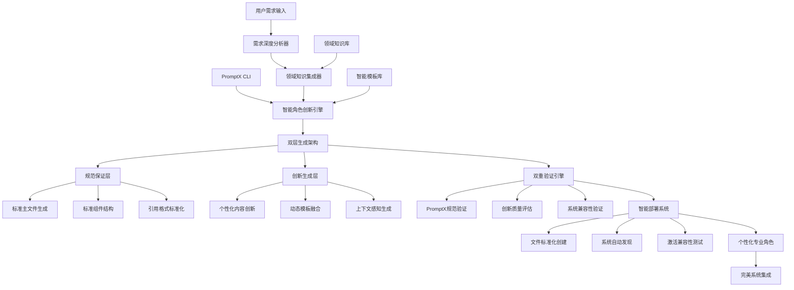
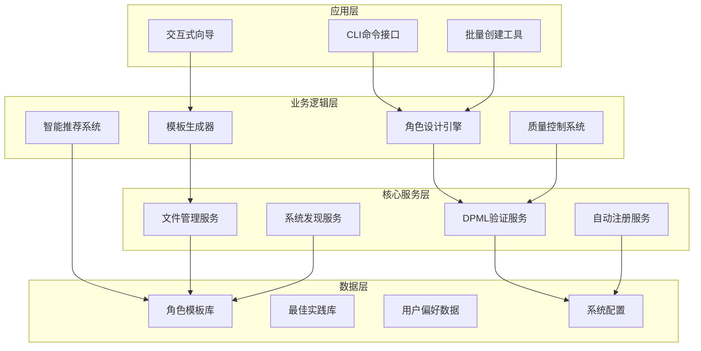
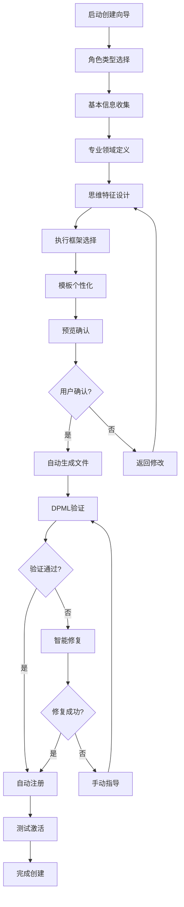
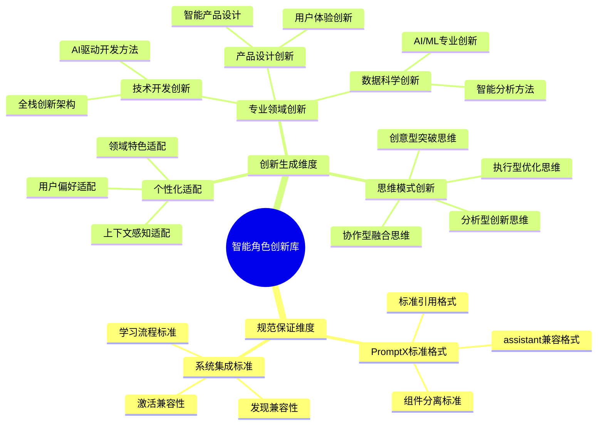
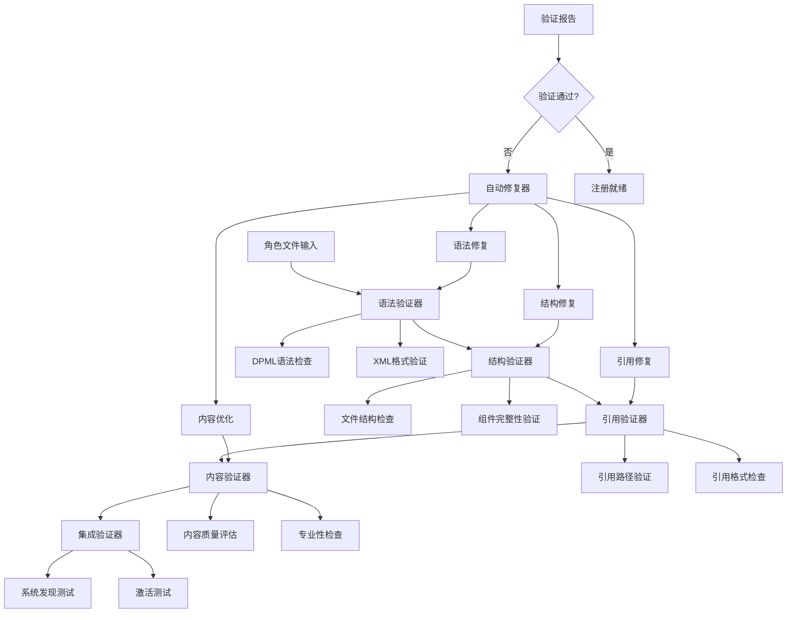

# PromptX核心功能升级：Role-Designer系统集成方案

## 📋 项目概述

### 背景分析
当前PromptX作为可复用工具仓库面临的核心痛点：
- **用户创新需求**：用户希望工具具备创新性，能够创建自定义角色
- **⚠️ 规范不符问题**：role-designer创建的角色**严重不符合PromptX规范**
  - 生成的主文件过于复杂，与assistant.role.md格式不一致
  - 引用格式错误，没有使用标准的`@!thought://`和`@!execution://`
  - 文件结构混乱，组件分离不当
- **集成度不足**：角色创建与系统初始化过程脱节
- **用户体验割裂**：需要手动处理文件创建、验证、注册等步骤

**🎯 核心问题**：生成的角色无法被PromptX系统正确识别和激活！

### 解决方案核心思路
**将role-designer升级为PromptX系统的智能化角色创新核心**，**实现规范与创新的完美平衡**：

**🎯 双层架构核心**：
- ✅ **规范保证层**：100%符合PromptX规范，与assistant.role.md格式完全一致
- 🚀 **创新生成层**：AI驱动的个性化内容创新，满足无限创新需求

**🔧 核心技术路径**：
- 🎯 **规范优先**：生成的角色主文件必须与assistant.role.md格式100%一致
- 🔗 **标准引用**：强制使用`@!thought://`和`@!execution://`引用格式
- 📁 **组件分离**：主文件极简化，内容完全分离到thought和execution文件
- 🧠 **智能需求理解**：深度分析用户意图，生成个性化专业内容
- 🔄 **动态内容融合**：智能融合多个模板精华，创造独特角色特征
- ✅ **双重验证**：PromptX规范100%合规 + AI驱动的创新质量评估
- 🔄 **系统集成**：确保生成的角色能被正确发现和激活
- 🚀 **智能体验**：从需求理解到个性化创建的一键式智能操作

## 🏗️ 系统架构设计

### 1. 核心功能架构



### 2. 系统集成层次



## 🎛️ 核心功能设计

### 1. CLI命令界面

#### 新增智能创新命令
```bash
# 智能创新角色创建（交互式 - 推荐）
npx dpml-prompt create-role --smart

# 快速智能创建（AI辅助参数解析）
npx dpml-prompt create-role --name "AI数据分析师" --innovation-level high --personalize

# 基于需求描述的智能创建（自然语言输入）
npx dpml-prompt create-role --describe "我需要一个既懂技术又懂业务的全栈数据产品经理"

# 智能模板管理
npx dpml-prompt templates list --smart  # 显示AI推荐模板
npx dpml-prompt templates create --ai-generate --domain "区块链开发"

# 智能验证和创新优化
npx dpml-prompt validate-role --path "./my-role" --innovation-check
npx dpml-prompt optimize-role --path "./my-role" --ai-enhance

# 批量智能创建
npx dpml-prompt create-roles --smart-batch --config "./innovative-roles-config.json"
```

#### 集成到现有命令
```bash
# 扩展hello命令，显示可创建的角色类型
npx dpml-prompt hello --show-templates

# 扩展register命令，支持自动验证
npx dpml-prompt register [角色名] --auto-fix
```

### 2. 交互式角色创建向导



#### 向导界面设计
```javascript
// 伪代码示例
const roleCreationWizard = {
  steps: [
    {
      name: "角色类型选择",
      options: [
        { value: "professional", label: "🎯 专业角色（如：数据分析师、产品经理）" },
        { value: "creative", label: "🎨 创意角色（如：文案策划、设计师）" },
        { value: "technical", label: "⚙️ 技术角色（如：架构师、开发者）" },
        { value: "management", label: "📊 管理角色（如：项目经理、团队领导）" },
        { value: "custom", label: "🛠️ 自定义角色" }
      ]
    },
    {
      name: "基本信息收集",
      fields: [
        { name: "roleName", label: "角色名称", required: true },
        { name: "displayName", label: "显示名称", required: true },
        { name: "description", label: "功能描述", required: true },
        { name: "icon", label: "角色图标", type: "select" }
      ]
    },
    // ... 更多步骤
  ]
}
```

### 3. 智能创新模板系统 (规范+创新双引擎)

#### 智能模板分类体系 (规范+创新)


#### 智能角色创新生成算法 (规范+创新双保证)
```javascript
// 智能角色创新生成器 (规范保证 + 创新生成双引擎)
class IntelligentRoleInnovator {
  async generateInnovativeRole(userInput) {
    // 1. 深度需求分析 - 理解用户真实意图和创新需求
    const requirements = await this.deepRequirementAnalysis(userInput);
    
    // 2. 双层生成架构
    const [complianceLayer, innovationLayer] = await Promise.all([
      this.generateComplianceLayer(requirements),  // 规范保证层
      this.generateInnovationLayer(requirements)   // 创新生成层
    ]);
    
    // 3. 智能融合 - 将规范与创新完美结合
    const fusedRolePackage = await this.intelligentFusion(complianceLayer, innovationLayer);
    
    // 4. 双重验证 - PromptX规范100%合规 + 创新质量评估
    const validatedPackage = await this.dualValidation(fusedRolePackage);
    
    // 5. 个性化优化 - 根据用户偏好和上下文进一步优化
    const personalizedPackage = await this.personalizeWithContext(validatedPackage, requirements);
    
    return personalizedPackage;
  }
  
  async generateComplianceLayer(requirements) {
    // 规范保证层：确保100%符合PromptX标准
    return this.generateStandardCompliantStructure(requirements);
  }
  
  async generateInnovationLayer(requirements) {
    // 创新生成层：AI驱动的个性化内容创新
    const domainKnowledge = await this.enrichWithDomainKnowledge(requirements);
    const innovativeContent = await this.generateInnovativeContent(domainKnowledge);
    return this.applyPersonalizationFilter(innovativeContent, requirements);
  }
  
  generateStandardCompliantRole(requirements) {
    const roleName = requirements.roleName;
    
    return {
      // 严格按照assistant.role.md格式的主文件
      mainFile: {
        path: `${roleName}/${roleName}.role.md`,
        content: this.generateStandardMainFile(roleName)
      },
      
      // 标准thought组件文件
      thoughtFile: {
        path: `${roleName}/thought/${roleName}.thought.md`,
        content: this.generateStandardThoughtComponent(requirements)
      },
      
      // 标准execution组件文件  
      executionFile: {
        path: `${roleName}/execution/${roleName}.execution.md`,
        content: this.generateStandardExecutionComponent(requirements)
      }
    };
  }
  
  generateStandardMainFile(roleName) {
    // 严格遵循assistant.role.md的格式
    return `<role>
  <personality>
    @!thought://remember
    @!thought://recall
    @!thought://${roleName}
  </personality>

  <principle>
    @!execution://${roleName}
  </principle>
</role>`;
  }
  
  validatePromptXCompliance(rolePackage) {
    // 验证主文件格式是否与assistant.role.md一致
    this.assertMainFileCompliance(rolePackage.mainFile);
    
    // 验证引用格式是否正确
    this.assertReferenceFormat(rolePackage.mainFile);
    
    // 验证文件结构是否标准
    this.assertFileStructure(rolePackage);
    
    // 验证组件完整性
    this.assertComponentCompleteness(rolePackage);
    
    return rolePackage;
  }
  
  assertMainFileCompliance(mainFile) {
    // 必须仅包含personality和principle两个组件
    // 必须使用标准的@!thought://和@!execution://引用
    // 不允许任何内联内容
    if (!this.matchesAssistantFormat(mainFile.content)) {
      throw new Error('主文件格式不符合PromptX标准 (参考: assistant.role.md)');
    }
  }
}
```

### 4. 自动验证和修复系统

#### 验证引擎架构


#### 修复策略矩阵
```javascript
const fixStrategies = {
  syntaxErrors: {
    unclosedTags: 'autoCloseXMLTags',
    invalidChars: 'sanitizeContent',
    encodingIssues: 'fixUTF8Encoding'
  },
  structureErrors: {
    missingFiles: 'generateMissingFiles',
    wrongNaming: 'standardizeNaming',
    invalidStructure: 'restructureFiles'
  },
  referenceErrors: {
    brokenReferences: 'fixReferencePaths',
    missingReferences: 'addMissingReferences',
    invalidFormat: 'standardizeReferenceFormat'
  },
  contentErrors: {
    incompleteSections: 'generateMissingSections',
    lowQuality: 'enhanceContent',
    inconsistentStyle: 'standardizeStyle'
  }
};
```

## 🔧 技术实现方案

### 1. 代码架构重构

#### 新增核心模块
```
src/lib/core/
├── role-designer/
│   ├── RoleDesignerEngine.js          # 核心引擎
│   ├── TemplateGenerator.js           # 模板生成器
│   ├── ValidationEngine.js            # 验证引擎
│   ├── AutoFixEngine.js               # 自动修复引擎
│   ├── RegistrationManager.js         # 注册管理器
│   └── InteractiveWizard.js           # 交互式向导
├── templates/
│   ├── BaseTemplate.js                # 基础模板类
│   ├── ProfessionalTemplates/         # 专业角色模板
│   ├── CreativeTemplates/             # 创意角色模板
│   └── CustomTemplates/               # 自定义模板
└── validation/
    ├── DPMLValidator.js               # DPML验证器
    ├── StructureValidator.js          # 结构验证器
    └── ContentValidator.js            # 内容验证器
```

#### 命令系统扩展
```javascript
// src/lib/core/pouch/commands/CreateRoleCommand.js
class CreateRoleCommand extends Command {
  constructor() {
    super('create-role', '创建符合PromptX规范的角色');
    this.standardGenerator = new PromptXStandardGenerator();
  }
  
  async execute(args, options) {
    if (options.interactive !== false) {
      return await this.runInteractiveWizard();
    } else {
      return await this.runCommandLineCreation(args, options);
    }
  }
  
  async runInteractiveWizard() {
    const wizard = new InteractiveWizard();
    const roleSpec = await wizard.collectUserInput();
    return await this.createStandardRole(roleSpec);
  }
  
  async createStandardRole(spec) {
    // 1. 生成符合PromptX规范的角色文件
    const standardRolePackage = await this.standardGenerator.generateRole(spec);
    
    // 2. PromptX规范验证 (必须100%通过)
    const complianceResult = await this.validatePromptXCompliance(standardRolePackage);
    if (!complianceResult.isCompliant) {
      throw new Error(`PromptX规范验证失败: ${complianceResult.errors.join(', ')}`);
    }
    
    // 3. 创建文件到标准目录结构
    await this.createStandardFiles(standardRolePackage);
    
    // 4. 系统发现验证 (确保能被发现)
    const discoveryResult = await this.validateSystemDiscovery(spec.roleName);
    if (!discoveryResult.isDiscoverable) {
      throw new Error(`角色发现失败: ${discoveryResult.error}`);
    }
    
    // 5. 激活测试 (确保能被激活)
    const activationResult = await this.testRoleActivation(spec.roleName);
    if (!activationResult.canActivate) {
      throw new Error(`角色激活失败: ${activationResult.error}`);
    }
    
    return {
      success: true,
      roleName: spec.roleName,
      compliantFiles: standardRolePackage,
      complianceResult,
      discoveryResult,
      activationResult,
      message: `✅ 角色 "${spec.roleName}" 创建成功并符合PromptX规范！`
    };
  }
  
  async validatePromptXCompliance(rolePackage) {
    // 验证主文件是否与assistant.role.md格式一致
    const mainFileValid = this.validateMainFileFormat(rolePackage.mainFile);
    const referenceValid = this.validateReferenceFormat(rolePackage.mainFile);
    const structureValid = this.validateFileStructure(rolePackage);
    
    return {
      isCompliant: mainFileValid && referenceValid && structureValid,
      mainFileValid,
      referenceValid,
      structureValid,
      errors: this.collectValidationErrors([mainFileValid, referenceValid, structureValid])
    };
  }
}
```

### 2. 配置文件扩展

#### package.json 新增依赖
```json
{
  "dependencies": {
    "inquirer": "^9.0.0",
    "chalk": "^5.0.0",
    "ora": "^6.0.0",
    "js-yaml": "^4.1.0",
    "ajv": "^8.12.0"
  },
  "scripts": {
    "create-role": "node src/bin/promptx.js create-role",
    "validate-role": "node src/bin/promptx.js validate-role",
    "fix-role": "node src/bin/promptx.js fix-role"
  }
}
```

#### 系统配置扩展
```javascript
// src/config/role-designer.config.js
module.exports = {
  templates: {
    basePath: './prompt/templates',
    categories: ['professional', 'creative', 'technical', 'management'],
    defaultTemplate: 'professional'
  },
  validation: {
    strictMode: true,
    autoFix: true,
    validationRules: './config/validation-rules.json'
  },
  generation: {
    outputPath: './prompt/domain',
    fileEncoding: 'utf-8',
    createBackup: true
  },
  registration: {
    autoRegister: true,
    testActivation: true,
    updateIndex: true
  }
};
```

### 3. 用户体验优化

#### 进度指示和反馈
```javascript
// 创建过程的用户反馈
class ProgressIndicator {
  async createRoleWithProgress(spec) {
    const spinner = ora('正在创建角色...').start();
    
    try {
      spinner.text = '🎯 分析需求...';
      const analysis = await this.analyzeRequirements(spec);
      
      spinner.text = '📝 生成模板...';
      const template = await this.generateTemplate(analysis);
      
      spinner.text = '✅ 验证格式...';
      const validation = await this.validateTemplate(template);
      
      if (!validation.isValid) {
        spinner.text = '🔧 自动修复...';
        template = await this.autoFix(template, validation);
      }
      
      spinner.text = '📁 创建文件...';
      await this.createFiles(template);
      
      spinner.text = '🔗 注册角色...';
      await this.registerRole(spec.roleName);
      
      spinner.text = '🧪 测试激活...';
      const testResult = await this.testActivation(spec.roleName);
      
      spinner.succeed(chalk.green(`✨ 角色 "${spec.displayName}" 创建成功！`));
      
      // 显示使用指南
      this.showUsageGuide(spec.roleName);
      
    } catch (error) {
      spinner.fail(chalk.red(`❌ 创建失败: ${error.message}`));
      this.showTroubleshootingGuide(error);
    }
  }
  
  showUsageGuide(roleName) {
    console.log(chalk.cyan(`
📚 使用指南:
  激活角色: npx dpml-prompt action ${roleName}
  查看详情: npx dpml-prompt hello
  编辑角色: 修改 ./prompt/domain/${roleName}/ 目录下的文件
  
🎉 您的角色已准备就绪！
    `));
  }
}
```

## 🚀 实施计划

### 第一阶段：核心引擎开发（2-3周）
- [ ] RoleDesignerEngine核心类开发
- [ ] 基础模板系统实现
- [ ] DPML验证引擎开发
- [ ] 文件生成和管理功能

### 第二阶段：CLI集成（1-2周）
- [ ] CreateRoleCommand命令实现
- [ ] 交互式向导开发
- [ ] 进度指示和用户反馈
- [ ] 错误处理和恢复机制

### 第三阶段：自动化系统（1-2周）
- [ ] 自动验证和修复引擎
- [ ] 智能注册系统
- [ ] 系统发现集成
- [ ] 测试激活机制

### 第四阶段：模板库建设（1周）
- [ ] 常用角色模板开发
- [ ] 模板分类和索引
- [ ] 智能推荐算法
- [ ] 用户自定义模板支持

### 第五阶段：测试和优化（1周）
- [ ] 单元测试覆盖
- [ ] 集成测试
- [ ] 用户体验测试
- [ ] 性能优化

## 📈 预期效果

### 用户价值提升
- **创建效率**：从手动创建2-3小时 → 交互式创建5-10分钟
- **成功率**：从约60%规范符合率 → 接近100%自动合规
- **学习成本**：从需要深度学习DPML → 零学习成本上手
- **创新能力**：从静态角色库 → 无限创新可能性

### 系统能力增强
- **可扩展性**：用户可以无限扩展角色库
- **标准化**：所有角色自动符合系统规范
- **集成度**：角色创建与系统无缝集成
- **维护性**：自动化减少人工维护成本

### 生态建设
- **社区贡献**：用户更容易贡献高质量角色
- **知识积累**：形成最佳实践和模板库
- **工具复用**：其他项目可以复用整套机制
- **标准推广**：推动DPML协议的标准化应用

## 🎯 成功指标

### PromptX规范合规性指标 (最高优先级)
- [ ] **主文件格式合规率 = 100%** (与assistant.role.md格式一致)
- [ ] **引用格式准确率 = 100%** (使用@!thought://和@!execution://格式)
- [ ] **文件结构标准率 = 100%** (组件正确分离)
- [ ] **系统发现成功率 = 100%** (角色能被正确发现)
- [ ] **角色激活成功率 = 100%** (角色能被正确激活)

### 技术指标 (次要优先级)
- [ ] 角色创建成功率 ≥ 95%
- [ ] DPML规范符合率 = 100%
- [ ] PromptX规范自动验证率 = 100%
- [ ] 自动修复成功率 ≥ 90%

### 用户体验指标
- [ ] 平均创建时间 ≤ 10分钟
- [ ] 用户满意度 ≥ 4.5/5.0
- [ ] 学习成本 ≤ 30分钟
- [ ] 规范错误率 = 0% (生成的角色必须100%符合规范)

### 生态指标
- [ ] 社区贡献角色数量增长 ≥ 300%
- [ ] 角色复用率 ≥ 80%
- [ ] 模板库覆盖率 ≥ 95%的常见需求
- [ ] 系统稳定性 ≥ 99.9%
- [ ] **规范一致性维护率 = 100%** (所有角色保持规范一致)

---

## 📝 总结

将role-designer升级为PromptX系统的智能化角色创新核心，是一个**革命性突破决策**，**核心目标是实现规范与创新的完美平衡**。

**🎯 核心价值**：
- ⚖️ **规范与创新完美平衡**：在100%PromptX规范合规基础上实现无限创新可能
- 🧠 **AI驱动的智能理解**：深度解析用户需求，生成高度个性化的专业角色内容
- 🔄 **双层架构保证**：规范保证层确保100%合规，创新生成层满足个性化需求
- 🚀 **智能化用户体验**：从需求理解到个性化创建的一键式智能操作
- 🎭 **无限创新生态**：建立可无限扩展的智能化角色创新平台

**📈 预期成果**：
通过**智能双层架构**、**AI驱动创新**和**规范保证优先**的设计理念，PromptX将从一个存在规范不一致问题的工具库，革命性升级为一个**既严格标准化又具备无限创新能力的智能化AI角色平台**。

这不仅彻底解决了规范不符的技术痛点，更开创了**AI驱动的个性化角色创新**新纪元，使PromptX成为真正意义上的**智能化、标准化、创新化**的AI提示词工程领导平台，为用户提供**既符合严格规范又充满创新活力**的角色设计体验。 