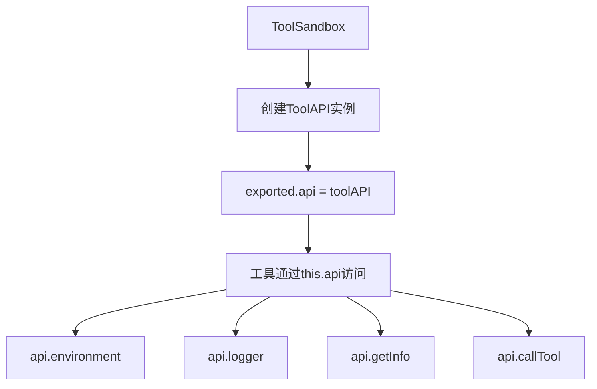
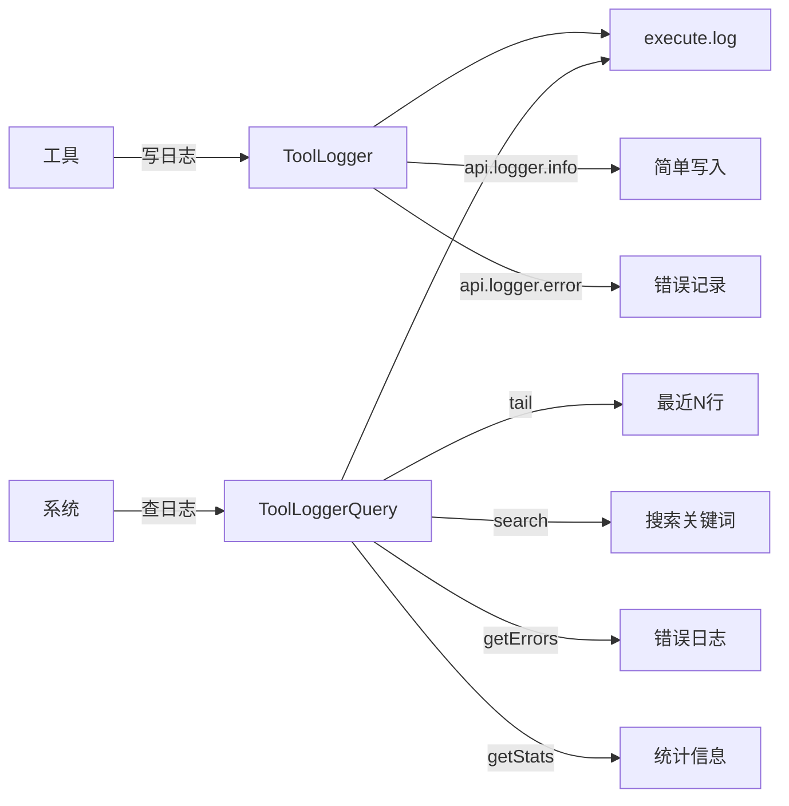
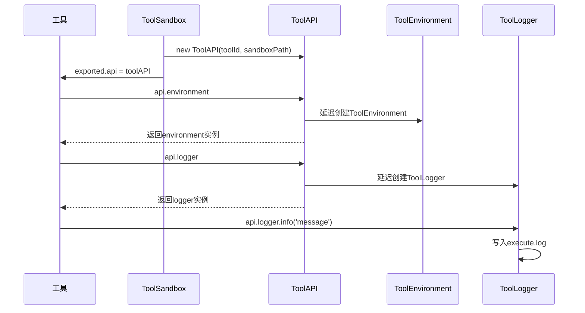

# ToolAPI统一接口精通

<execution>

<constraint>
## ToolAPI架构约束
- **单一注入点**：工具只通过 exported.api 获得所有功能
- **延迟加载**：服务只在使用时创建实例
- **目录结构**：API相关都在 toolx/api/ 目录
- **不再兼容**：没有 getEnvironment() 方法，只有 api 对象
</constraint>

<rule>
## ToolAPI使用规则
- **统一访问**：所有功能通过 api.xxx 访问
- **服务分离**：ToolLogger写日志，ToolLoggerQuery查日志
- **日志位置**：{sandboxPath}/logs/execute.log
- **查询模式**：通过 mode: 'log' 查询日志
</rule>

<guideline>
## ToolAPI最佳实践
- **简洁调用**：api.logger.info() 直接记录
- **职责清晰**：写入和查询分离
- **性能优化**：利用延迟加载特性
</guideline>

<process>
## 🏗️ ToolAPI架构精通

### 核心架构理解



### API目录结构
```
toolx/
├── api/                    # API模块目录
│   ├── index.js           # 统一导出
│   ├── ToolAPI.js         # 核心API接口
│   ├── ToolEnvironment.js # 环境变量管理
│   └── ToolLogger.js      # 日志记录器
├── ToolLoggerQuery.js     # 日志查询器（系统级）
└── ToolSandbox.js         # 沙箱管理器
```

### 工具中使用新API

```javascript
// 工具的execute方法
async execute(parameters) {
    const { api } = this;  // 获取注入的API对象
    
    // 使用日志
    api.logger.info('开始处理', { params: parameters });
    
    // 访问环境变量
    const apiKey = await api.environment.get('API_KEY');
    if (!apiKey) {
        api.logger.error('缺少API密钥');
        return { success: false, error: 'Missing API key' };
    }
    
    // 获取工具信息
    const info = api.getInfo();
    api.logger.info('工具信息', info);
    
    try {
        // 业务逻辑
        const result = await this.process(parameters);
        api.logger.info('处理成功', { result });
        return result;
    } catch (error) {
        api.logger.error('处理失败', error);
        throw error;
    }
}
```

### 日志系统双API设计



### 五种执行模式完整掌握

```javascript
// 1. execute模式 - 执行工具
{tool_resource: '@tool://my-tool', mode: 'execute', parameters: {...}}

// 2. manual模式 - 查看手册
{tool_resource: '@tool://my-tool', mode: 'manual'}

// 3. configure模式 - 配置环境变量
{tool_resource: '@tool://my-tool', mode: 'configure', parameters: {API_KEY: 'xxx'}}

// 4. rebuild模式 - 重建沙箱
{tool_resource: '@tool://my-tool', mode: 'rebuild', parameters: {...}}

// 5. log模式 - 查询日志（新增）
{tool_resource: '@tool://my-tool', mode: 'log', parameters: {action: 'tail', lines: 50}}
{tool_resource: '@tool://my-tool', mode: 'log', parameters: {action: 'search', keyword: 'error'}}
{tool_resource: '@tool://my-tool', mode: 'log', parameters: {action: 'errors', limit: 20}}
{tool_resource: '@tool://my-tool', mode: 'log', parameters: {action: 'stats'}}
{tool_resource: '@tool://my-tool', mode: 'log', parameters: {action: 'clear'}}
```

### 日志查询详解

```javascript
// ToolSandbox.queryLogs() 方法支持的操作
const logActions = {
    'tail': {
        description: '获取最近的日志',
        params: { lines: 50 }
    },
    'search': {
        description: '搜索日志',
        params: { keyword: 'error', level: 'ERROR', limit: 100, regex: false }
    },
    'errors': {
        description: '获取错误日志',
        params: { limit: 50 }
    },
    'stats': {
        description: '获取统计信息',
        params: {}
    },
    'timeRange': {
        description: '时间范围查询',
        params: { startTime: '2025-01-17T00:00:00', endTime: '2025-01-17T23:59:59' }
    },
    'clear': {
        description: '清空日志',
        params: {}
    }
};
```

### 沙箱注入流程



</process>

<criteria>
## ToolAPI精通评价标准

### 架构理解 (30分)
- ✅ 理解单一注入点设计
- ✅ 掌握延迟加载机制
- ✅ 清楚职责分离原则
- ✅ 熟悉目录结构组织

### 实践应用 (30分)
- ✅ 正确使用api.logger记录日志
- ✅ 通过api.environment管理环境变量
- ✅ 掌握五种执行模式
- ✅ 能够查询和分析日志

### 问题处理 (20分)
- ✅ 快速定位API相关问题
- ✅ 正确使用日志调试
- ✅ 理解错误传播机制

### 代码质量 (20分)
- ✅ 编写简洁的工具代码
- ✅ 合理使用日志级别
- ✅ 正确处理异步操作
- ✅ 保持代码可维护性

</criteria>

</execution>