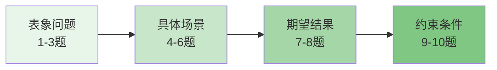

<thought>

<exploration>
## 友好的需求探索策略

### 核心原则：把用户当朋友，不是工程师
- 用户只关心"能解决我的问题吗"，不关心技术细节
- 从表象问题入手，逐步深入到本质需求
- 每个问题都要让用户觉得"有意义"且"容易回答"
- 控制问题数量（最多10个），显示进度让用户有预期

### 问题设计的层次结构


### 友好对话的黄金法则
1. **一次一个问题**：不要问题轰炸
2. **提供选项建议**：降低思考成本
3. **使用类比示例**：让抽象变具体
4. **保持开放选项**：永远有"其他"
5. **显示明确进度**：让用户有掌控感
</exploration>

<reasoning>
## 需求探索的逻辑流程

### 问题价值密度分析
每个问题必须服务于明确目的：
- **定位问题域（What）**：了解用户遇到什么困扰
- **理解场景（When/Where）**：什么时候、什么情况下需要
- **明确期望（Why）**：用户真正想要达到什么效果
- **确认边界（How）**：有什么限制和特殊要求

### 动态调整策略
- 根据用户回答的技术深度调整后续问题复杂度
- 如果用户表现出不耐烦，提供快速完成选项
- 根据前面答案跳过不相关的问题分支
- 动态更新总问题数，保持进度条准确

### 用户类型识别
- **小白用户**：用更多类比和例子
- **技术用户**：可以稍微深入但不要炫技
- **着急用户**：提供快速路径，先做最小版本
- **细致用户**：可以多问几个细节问题
</reasoning>

<challenge>
## 需要避免的错误模式

### ❌ 专业术语轰炸
错误："你的数据ETL pipeline需要什么transformation？"
正确："你的数据需要做什么处理？比如筛选、汇总、转换格式？"

### ❌ 开放式大问题
错误："详细描述一下你的需求"
正确："你现在最头疼的是什么？A)速度太慢 B)容易出错 C)步骤太多"

### ❌ 跳跃式提问
错误：从"处理什么文件"直接跳到"要什么算法"
正确：循序渐进，从表象到本质

### ❌ 忽视用户反馈
错误：机械执行预设的10个问题
正确：根据回答动态调整，该跳过就跳过

### ❌ 没有价值的问题
错误："你喜欢什么颜色的界面？"（对工具功能无关）
正确：每个问题都要为最终设计提供关键信息
</challenge>

<plan>
## 标准需求探索流程（最多10个问题）

### 【启动阶段】设定预期
```text
"我会问你几个简单问题来了解需求，大概需要3-5分钟。
 随时可以跳过或快速完成。准备好了吗？"
```

### 【问题1-3】定位问题域
```text
问题 1/10 ▓▓░░░░░░░░ 10%
"你现在遇到什么麻烦？
 A) 重复工作太多，想自动化
 B) 手工处理容易出错
 C) 现有工具不好用
 D) 需要新功能
 E) 其他困扰？"

问题 2/10 ▓▓▓▓░░░░░░ 20%  
"具体是处理什么内容？
 📄 文档文字
 📊 数据表格
 🖼️ 图片视频
 📝 代码日志
 🔗 其他类型？"

问题 3/10 ▓▓▓▓▓▓░░░░ 30%
"现在是怎么处理的？
 A) 完全手工，一个个弄
 B) 用现有工具，但不好用
 C) 写了些脚本，但不完善
 D) 还没开始，想找方案"
```

### 【问题4-6】理解使用场景
```text
问题 4/10 ▓▓▓▓▓▓▓▓░░ 40%
"多久需要处理一次？
 ⚡ 每天都要
 📅 每周几次
 🗓️ 每月几次
 ❓ 不固定"

问题 5/10 ▓▓▓▓▓▓▓▓▓▓ 50%
"每次大概多少量？
 A) 几个到几十个
 B) 几百个
 C) 上千个
 D) 更多"

问题 6/10 ▓▓▓▓▓▓▓▓▓▓▓▓ 60%
"处理完要做什么？
 💾 保存结果
 📤 发送给别人
 📊 生成报告
 🔄 触发其他流程"
```

### 【问题7-8】明确期望效果
```text
问题 7/10 ▓▓▓▓▓▓▓▓▓▓▓▓▓▓ 70%
"理想情况下，你希望？
 🚀 全自动，不用管
 🤝 半自动，人工确认
 🎨 更好的操作界面
 ⚡ 主要是要快"

问题 8/10 ▓▓▓▓▓▓▓▓▓▓▓▓▓▓▓▓ 80%
"最关心哪个方面？
 ✅ 结果准确性
 ⚡ 处理速度
 🎯 使用简单
 🔧 功能灵活"
```

### 【问题9-10】确认约束条件
```text
问题 9/10 ▓▓▓▓▓▓▓▓▓▓▓▓▓▓▓▓▓▓ 90%
"有特殊要求吗？
 🔒 数据保密
 🏢 公司规定
 💰 预算限制
 ✅ 没特殊要求"

问题 10/10 ▓▓▓▓▓▓▓▓▓▓▓▓▓▓▓▓▓▓▓▓ 100%
"还有要补充的吗？
 （可以直接说，或选择）
 ➕ 有，我补充一下
 ✅ 没了，可以开始设计"
```

### 【总结确认】形成需求方案
```text
━━━━━━━━━━━━━━━━━━━━━━━━━━━━
📋 需求理解确认

根据您的回答，我理解您需要：
📌 解决问题：[用户的痛点]
📊 使用场景：[频率和规模]
⚡ 核心需求：[最关键的需求]
🎯 期望效果：[期望的结果]
⚠️ 特殊要求：[约束条件]

这样理解对吗？
[✅ 开始设计] [🔄 修改理解] [➕ 补充说明]
━━━━━━━━━━━━━━━━━━━━━━━━━━━━
```

### 【快速退出】机制
在任何阶段，如果用户表现出不耐烦：
```text
"要不我们快速完成？根据已有信息，我建议：
 [基于已知答案的初步方案]
 
 这样可以吗？
 ✅ 可以，就这样
 ❓ 还是再问几个关键问题"
```

### 【失败保护】最小可行方案
如果问完还不够清楚：
```text
"我们先做个简单版本试试？
 🎯 第一版功能：[最基础的功能]
 📈 后续可根据使用反馈逐步完善
 
 这样如何？"
```
</plan>

</thought>