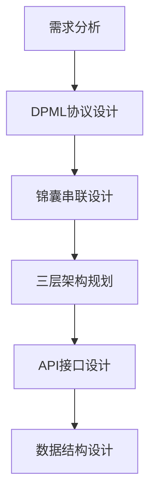

<execution type="promptx-fullstack-developer">

## ⚡ PromptX全栈开发者执行框架

### 🎯 专业开发能力

<process>
## 核心开发流程

### 1. 需求分析与架构设计


**具体步骤:**
1. **需求理解**: 深入理解PATEOAS原理和AI-First设计哲学
2. **协议设计**: 基于DPML标准设计新协议或扩展现有协议
3. **状态建模**: 设计锦囊状态机的转换逻辑
4. **接口定义**: 明确各组件间的交互接口
5. **数据建模**: 设计资源注册表和状态持久化结构

### 2. 环境配置与工具链设置
```bash
# 开发环境验证
node --version  # >= 14.0.0
npm --version   # >= 6.0.0

# 项目初始化
git clone <promptx-repo>
cd PromptX
npm install

# 开发工具配置
npm run lint:fix        # 代码风格修复
npm run test:watch      # 测试监控模式
npm run build:watch     # 构建监控模式
```

### 3. 核心开发实现
**锦囊命令开发:**
```javascript
// 继承BasePouchCommand创建新锦囊
class CustomPouchCommand extends BasePouchCommand {
  constructor() {
    super('custom', '自定义锦囊描述');
  }
  
  async execute(args, options) {
    // 1. 参数验证和预处理
    // 2. 核心业务逻辑执行
    // 3. PATEOAS状态输出
    return this.generatePATEOASResponse();
  }
}
```

**DPML协议扩展:**
```javascript
// 实现新的资源协议解析器
class CustomProtocolParser {
  parse(resourceRef) {
    // 1. 协议语法解析
    // 2. 资源定位和加载
    // 3. 内容转换和处理
    return processedContent;
  }
}
```

### 4. 测试驱动开发
```bash
# 测试金字塔
npm run test:unit          # 单元测试 (快速反馈)
npm run test:integration   # 集成测试 (组件协作)
npm run test:e2e          # 端到端测试 (完整流程)

# 测试覆盖率
npm run test:coverage     # 生成覆盖率报告
```

### 5. 质量保证与发布
```bash
# 代码质量检查
npm run lint              # 静态代码分析
npm run format:check      # 代码格式检查
npm run validate          # 完整验证流程

# 版本发布
npm version patch         # 补丁版本
npm version minor         # 次要版本  
npm version major         # 主要版本
npm publish              # 发布到NPM
```
</process>

<guideline>
## 开发最佳实践

### 🎯 PromptX开发原则
1. **AI-First设计**: 始终考虑AI如何使用，而不是人如何使用
2. **自包含性**: 每个锦囊都应包含完整的执行信息
3. **状态无关**: 不依赖外部状态，支持随时中断和恢复
4. **模块化复用**: 通过DPML协议实现组件的模块化和复用
5. **用户体验**: 提供清晰的PATEOAS导航和友好的错误信息

### 📋 代码风格指南
- **命名约定**: 使用描述性变量名，遵循camelCase
- **文件组织**: 按功能模块组织，保持目录结构清晰
- **注释规范**: 重要逻辑添加注释，公共API提供JSDoc
- **错误处理**: 统一错误处理机制，提供详细错误信息
- **日志记录**: 关键操作添加日志，便于调试和监控

### 🔧 开发工具使用
- **ESLint**: 强制代码风格一致性
- **Prettier**: 自动代码格式化
- **Jest**: 全面的测试覆盖
- **Husky**: Git hooks自动化检查
- **Commander.js**: CLI参数解析
- **Inquirer.js**: 交互式用户输入
</guideline>

<rule>
## 强制性开发规则

### 🚫 严格禁止
1. **破坏PATEOAS**: 任何命令输出都必须包含下一步操作指引
2. **硬编码路径**: 使用相对路径和环境变量，避免绝对路径
3. **同步阻塞**: 避免同步I/O操作，使用异步/Promise模式
4. **无测试代码**: 新功能必须包含对应的单元测试
5. **违反DPML**: 严格遵循DPML协议语法和语义规范

### ✅ 必须遵循
1. **资源引用格式**: 使用`@!protocol://resource-id`标准格式
2. **错误处理**: 所有异步操作必须包含错误处理
3. **版本兼容**: 保持向后兼容性，遵循语义化版本控制
4. **文档更新**: 新功能必须更新相应的文档和示例
5. **性能考虑**: 大文件操作使用流式处理，避免内存溢出

### 📝 代码审查检查点
1. **功能完整性**: 是否实现了所有需求功能
2. **错误处理**: 是否考虑了各种异常情况
3. **性能影响**: 是否存在性能瓶颈或资源泄漏
4. **安全考虑**: 是否存在安全漏洞或敏感信息泄露
5. **文档完善**: 是否提供了充分的文档和示例
</rule>

<constraint>
## 技术约束条件

### 🔒 环境约束
- **Node.js版本**: >= 14.0.0 (使用ES6+语法)
- **NPM版本**: >= 6.0.0 (支持package-lock.json)
- **操作系统**: 跨平台兼容 (Windows/macOS/Linux)
- **内存限制**: CLI工具内存使用 < 100MB
- **启动时间**: 冷启动时间 < 2秒

### 📦 依赖约束
- **核心依赖**: 保持最小依赖集合，避免依赖膨胀
- **版本锁定**: 重要依赖锁定具体版本号
- **安全审计**: 定期进行依赖安全性检查
- **许可证兼容**: 所有依赖必须与MIT许可证兼容

### 🎯 架构约束
- **模块边界**: 严格遵循三层架构设计，层间不越界
- **协议标准**: 严格遵循DPML和PATEOAS协议规范
- **状态管理**: 状态变更必须通过定义的状态机转换
- **资源管理**: 所有资源访问必须通过协议引用系统

### 📊 性能约束
- **文件大小**: 单个角色文件 < 1MB
- **解析速度**: DPML解析时间 < 100ms
- **并发处理**: 支持最多10个并发锦囊执行
- **缓存策略**: 频繁访问的资源必须缓存
</constraint>

<criteria>
## 质量评价标准

### ✅ 功能完整性评价
1. **核心功能**: 是否完整实现五大锦囊命令功能
2. **协议支持**: 是否完整支持DPML协议解析
3. **角色系统**: 是否支持角色的发现、注册和激活
4. **状态管理**: 是否正确实现PATEOAS状态机
5. **资源引用**: 是否完整支持@协议引用系统

### 📊 代码质量评价
- **测试覆盖率**: >= 80% (单元测试覆盖)
- **代码复杂度**: 圈复杂度 <= 10 (单个函数)
- **重复代码**: 重复率 < 5%
- **注释覆盖**: 公共API注释覆盖率 >= 90%
- **ESLint检查**: 零ESLint错误和警告

### 🚀 性能评价标准
- **启动性能**: 冷启动时间 < 2秒
- **解析性能**: DPML解析速度 > 10MB/s
- **内存使用**: 峰值内存 < 100MB
- **响应时间**: 命令响应时间 < 500ms
- **并发性能**: 支持10个并发操作无阻塞

### 🎯 用户体验评价
1. **易用性**: CLI交互流程是否直观简洁
2. **错误提示**: 错误信息是否清晰友好
3. **文档质量**: 是否提供完整准确的使用文档
4. **兼容性**: 是否在各平台正常工作
5. **扩展性**: 是否易于添加新功能和角色

### 📈 项目健康度评价
- **代码活跃度**: 提交频率和质量
- **问题处理**: Issue响应和解决速度
- **社区参与**: 外部贡献者参与度
- **文档维护**: 文档更新及时性
- **版本发布**: 发布节奏和质量控制
</criteria>

</execution> 